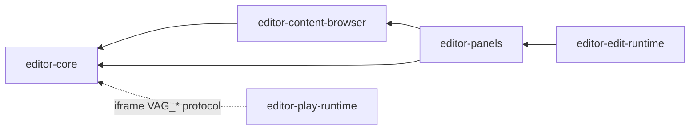
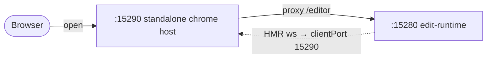

<!-- LANG-SWITCH -->
**Language**: **English** · [简体中文](README.zh-CN.md)

> [!IMPORTANT]
> README is maintained in two languages ([`README.md`](README.md) canonical · [`README.zh-CN.md`](README.zh-CN.md) mirror). **Any change must update both in the same commit.**

---

# forgeax-editor

> forgeax editor monorepo — 5 workspace packages composing the full forgeax editor (Edit / Play dual-mode).

## Packages

| Package | Purpose |
|:--|:--|
| [`@forgeax/editor-core`](./packages/core/) | Core logic layer — EditSession, EditorBus, undo/redo, schema, store, entity ops, context menu, dock bridge, panel manifest SSOT, i18n, assets, presets |
| [`@forgeax/editor-content-browser`](./packages/content-browser/) | Content Browser sub-application — grid/list/column views, filter/sort/nav hooks, import pipeline. Lazy-loaded by the Assets panel |
| [`@forgeax/editor-panels`](./packages/panels/) | Business panels (Hierarchy, Inspector, Assets, History, Capabilities, Material, Mesh, Launcher, AssetInspector, Systems) + panel-component injection |
| [`@forgeax/editor-edit-runtime`](./packages/edit-runtime/) | Edit-mode entry — engine boot + camera + dock shell + EditorApp |
| [`@forgeax/editor-play-runtime`](./packages/play-runtime/) | Play-mode thick host — FPS capture, physics gate, pack-index, diagnostics overlay, VAG_CONSOLE bridge |

## Dependency structure



The DAG is `core ← content-browser ← panels ← edit-runtime`; `play-runtime` is a
separate thick host that talks to `core` only over the `VAG_*` iframe protocol.
`bun run lint:dep` (dependency-cruiser) fails the build if any import breaks it.

## Quick start

> [!IMPORTANT]
> First-time clone must fetch submodules — the editor vendors **engine** and
> **interface** as git submodules under `packages/`, and the root bun workspace
> glob (`packages/*`) resolves `@forgeax/interface@workspace:*` from the
> `packages/interface` checkout. An uninitialized (empty) submodule dir makes
> `bun install` fail with `Workspace dependency "@forgeax/interface" not found`.

```bash
git submodule update --init --recursive   # fetch engine + interface submodules
bun install                               # install workspace deps
bun run typecheck                         # tsc --noEmit across all packages
bun run lint:dep                          # dependency-cruiser — assert no cycle
```

> [!TIP]
> Cloning fresh? `git clone --recurse-submodules <url>` does the submodule fetch
> in one step.

> [!NOTE]
> **"clone 即跑" is gated, not a slogan.** CI ([`.github/workflows/ci.yml`](./.github/workflows/ci.yml))
> re-proves every push/PR that a fresh `clone → bun install → bun scripts/selfcheck-standalone-b2.mjs`
> reaches **self-boot level B2** — the standalone editor reads **and writes** a
> game with **no studio server**, by reusing `@forgeax/platform-io` as its game
> backend (see [`standalone/game-backend.ts`](./standalone/game-backend.ts)).
> Run it yourself: `bun run selfcheck:b2`.

> [!IMPORTANT]
> **Full standalone stack** (`bun fx setup` → `bun fx start --game <dir>`) also
> builds the engine's two gitignored wasm artefacts (zero-binary invariant — the
> compiled binaries are never committed, always rebuilt):
> - **wgpu-wasm** — needs Rust + [`wasm-pack`](https://rustwasm.github.io/wasm-pack/).
> - **fbx-wasm** (browser FBX import) — needs **Emscripten `emcc`**
>   (`brew install emscripten`, or [emsdk](https://emscripten.org/docs/getting_started/downloads.html)).
>
> `bun fx setup` builds both and errors with the exact install command if a
> toolchain is missing. A bare `bun install` does **not** build them — that path
> only covers the lightweight dev/B2 flow above. Missing `emcc` disables browser
> FBX import only (glTF unaffected).

## Run

The editor runs in two contexts. **Standalone** (this repo on its own) is the
everyday dev loop; **embedded** is how studio actually ships it.

### Standalone editor (recommended) — `:15290`

The standalone editor is a self-rendered React + DockShell chrome served by vite
with `root=standalone/`. It needs **two** servers wired together:



| Port | Server | Role |
|:--|:--|:--|
| **`:15290`** | standalone chrome host (vite, `root=standalone/`) | The page you open. Renders the dock shell; **proxies `/editor` → `:15280`** |
| **`:15280`** | `@forgeax/editor-edit-runtime` | Source of the panel + viewport iframes the shell injects |

One command starts both, wired correctly:

```bash
bun run dev:standalone        # → open http://localhost:15290
```

Then open **http://localhost:15290**.

> [!IMPORTANT]
> The crucial wiring is `FORGEAX_INTERFACE_PORT=15290`. edit-runtime's vite HMR
> `clientPort` defaults to `18920` (the studio-embed host). In standalone the
> host is `:15290`, so without this override the HMR websocket hammers a dead
> `:18920` and floods the console with `ERR_CONNECTION_REFUSED`.
> `bun run dev:standalone` (see [`scripts/dev-standalone.ts`](./scripts/dev-standalone.ts))
> sets it for you. Anchors: edit-runtime `vite.config.ts` `hmr.clientPort`,
> standalone `vite.config.ts` `server.proxy['/editor']`.

Need the two halves separately (e.g. to attach a debugger)?

```bash
bun run dev:edit-runtime      # :15280, HMR→15290 (FORGEAX_INTERFACE_PORT=15290 baked in)
bun run dev                   # :15290 standalone host only (expects :15280 already up)
```

### Play mode — `:15173`

```bash
bun -F @forgeax/editor-play-runtime dev        # → http://localhost:15173
```

`FORGEAX_ENGINE_PORT` overrides the port (default `15173`). Note: the `bun fx start
--play` dev-stack CLI runs play-runtime on **`:15273`** instead (it sets
`FORGEAX_ENGINE_PORT=15273`) so it never collides with — or kills — the studio
superrepo stack, which owns `:15173`. See the port map note below.

### Embedded in studio — `:18920`

When consumed by the studio monorepo (editor is a git submodule at studio's
`packages/editor`), the editor renders inside the studio host on `:18920` and
the edit-runtime HMR `clientPort` default (`18920`) is already correct. **Do not
start the standalone stack for this** — start the full studio stack instead
(`bash scripts/deploy.sh` once for environment, then `bash start.sh`).

### Port map

| Port | Who | When |
|:--|:--|:--|
| `15290` | standalone chrome host | `bun run dev:standalone` / `bun run dev` |
| `15280` | edit-runtime (Edit mode) | `bun run dev:standalone` / `bun run dev:edit-runtime` |
| `15173` | play-runtime (Play mode, **raw** path) | `bun -F @forgeax/editor-play-runtime dev` (vite default) |
| `15273` | play-runtime (Play mode, **`bun fx` stack**) | `bun fx start --play` (see note) |
| `18920` | studio-embed host | full studio stack (studio repo) |
| `18900` | forgeax-server | full studio stack (studio repo) |

> [!NOTE]
> **Why two play-runtime ports.** The studio superrepo stack (`forgeax-studio
> scripts/run.ts`) launches _this package's_ play-runtime on `:15173` (its
> `PORT_ENGINE` default, relying on the `vite.config.ts` default). So the editor's
> own `bun fx` dev-stack pins its play-runtime to `:15273` and keeps `15173` out of
> its port-based cleanup — an editor-stack start/stop never SIGTERMs studio's engine,
> and both stacks coexist. The raw `bun -F …play-runtime dev` path keeps the `15173`
> default (studio depends on it). Enforced by `scripts/lint-fx-no-studio-port.mjs`.

> [!NOTE]
> forgeax-editor is a standalone git repo (`https://github.com/ForgeaXGame/forgeax-editor`)
> consumed by the studio repo as a git submodule at `packages/editor`. All 5
> packages point their `exports` directly at source entries (`./src/index.ts`)
> with no tsup build step — the consumer's bundler (vite) compiles them on the
> spot.

## known limitations (baseline as of 2026-06-13)

These capabilities carry over from P2 and are explicitly documented as
**not passing under the current sandbox/standalone test environment**.
They are tracked for a future full-studio regression sweep.

| Capability | What it tests | Status | Constraint |
|:--|:--|:--|:--|
| AC-15B panel-mount e2e (P2 G-4) | panel mount on standalone chrome surface | deferred — `test.skip` in `standalone-chrome.spec.ts` | requires full studio harness with `ANTHROPIC_API_KEY` and running `forgeax-server` on :18900; unreachable under standalone/sandbox |
| AC-16 producer-side z.infer fixup | producer-call-site strong type equivalence | deferred — P2 AC-16 carry-over from implement R3 reviewer accept-risk | requires `protocol.ts` SSOT relocation + full `z.infer` re-application across all producer call sites; tracked as OQ-1 for P3 |

These are not regressions — they were never green in the standalone
configuration. They will be re-validated once a `forgeax-server` instance
with valid credentials is available in the test environment, or when the
P3 SSOT-relocation loop closes the OQ-1 gap.

## troubleshooting

| Symptom | Cause | Fix |
|:--|:--|:--|
| Console floods with `ERR_CONNECTION_REFUSED` to `:18920` on `:15290` | started the standalone host without `FORGEAX_INTERFACE_PORT=15290`, so edit-runtime HMR targets the studio-embed port | use `bun run dev:standalone` (or `bun run dev:edit-runtime`), not a bare `bun -F …edit-runtime dev` |
| `:15290` viewport / panels are blank | `:15280` edit-runtime not running; the `/editor` proxy has nothing to hit | start both servers — `bun run dev:standalone` |
| `bun install`: `Workspace dependency "@forgeax/interface" not found` | the `packages/interface` submodule dir is empty (uninitialized) | `git submodule update --init --recursive`, then `bun install` |
| `bun install`: `simple-git-hooks` postinstall `ENOENT … package.json` | first-extract race on the engine submodule's git-hook dep | just re-run `bun install` — the file is in place on the retry |
| `bun install` reports `unresolved workspace` | engine submodule not fetched or `workspace:*` pin broken | `git submodule update --init --recursive`; stacks resolve via the parent repo's bun workspaces glob |
| `bun run typecheck` fails | a package's deps aren't installed or types mismatch | run `bun install` first, then `bun run typecheck` |
| `bun run lint:dep` reports no-circular | a new cross-package import broke the DAG | check `.dependency-cruiser.cjs` rules; keep the DAG `core ← content-browser ← panels ← edit-runtime` |
| port `15290` / `15280` / `15273` in use | another vite instance wasn't stopped | `bun fx stop`, `bash stop.sh` (studio repo), or manually `kill` the PID |
| studio's `:15173` play-runtime keeps dying / studio browser floods with `:15173 ERR_CONNECTION_REFUSED` | an **old** editor build managed `:15173` in its `bun fx` cleanup and killed studio's engine | fixed: the editor `bun fx` stack now runs play-runtime on `:15273` and leaves `:15173` alone — update the editor submodule past this fix |
