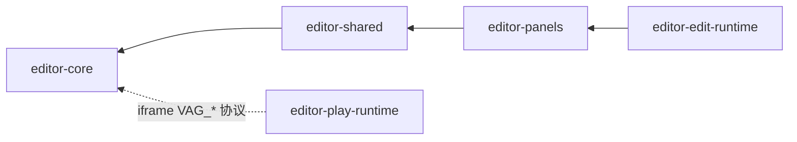
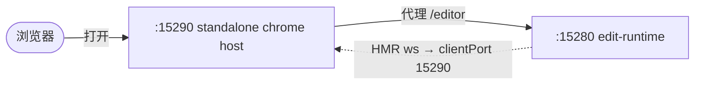

<!-- LANG-SWITCH -->
**Language**: **简体中文** · [English](README.md)

> [!IMPORTANT]
> README 维护两份语言版本（[`README.md`](README.md) 主版本 · [`README.zh-CN.md`](README.zh-CN.md) 镜像），**任何改动须同时同步两份**。

---

# forgeax-editor

> forgeax editor monorepo — 5 个 workspace 包，构成完整的 forgeax editor（Edit / Play 双模式）。

## 包列表

| 包 | 用途 |
|:--|:--|
| [`@forgeax/editor-core`](./packages/editor-core/) | 核心逻辑层 — SceneDocument、EditorBus、undo/redo、schema、sync-channel、动画、材质图、资源、预设 |
| [`@forgeax/editor-shared`](./packages/editor-shared/) | 跨层共享运行时 — zustand store、实体操作、右键菜单、dock 桥接、面板 manifest SSOT |
| [`@forgeax/editor-panels`](./packages/editor-panels/) | 8 个业务面板（Hierarchy、Inspector、Assets、History、Capabilities、Material、Timeline、MaterialGraph）+ 面板组件注入 |
| [`@forgeax/editor-edit-runtime`](./packages/edit-runtime/) | Edit 模式主入口 — 引擎 boot + 相机 + dock shell + EditorApp |
| [`@forgeax/editor-play-runtime`](./packages/play-runtime/) | Play 模式厚 host — FPS 捕获、physics gate、pack-index、诊断遮罩、VAG_CONSOLE 桥接 |

## 依赖结构



DAG 为 `core ← shared ← panels ← edit-runtime`；`play-runtime` 是独立厚 host，仅通过
`VAG_*` iframe 协议与 `core` 通信。`bun run lint:dep`（dependency-cruiser）会在任何
import 打破该 DAG 时让构建失败。

## 快速开始

> [!IMPORTANT]
> 首次 clone 必须拉取 submodule —— editor 以 git submodule 形式 vendor 了 **engine**
> 和 **interface**（都在 `packages/` 下），根 bun workspace glob（`packages/*`）从
> `packages/interface` checkout 解析 `@forgeax/interface@workspace:*`。submodule 目录
> 未初始化（空）会导致 `bun install` 报 `Workspace dependency "@forgeax/interface" not found`。

```bash
git submodule update --init --recursive   # 拉取 engine + interface submodule
bun install                               # 安装 workspace 依赖
bun run typecheck                         # 全包 tsc --noEmit
bun run lint:dep                          # dependency-cruiser — 断言 DAG 无环
```

> [!TIP]
> 全新 clone？`git clone --recurse-submodules <url>` 一步搞定 submodule 拉取。

## 启动

editor 有两种运行场景：**standalone**（本仓单独跑）是日常开发主循环；**embedded**
（嵌入 studio）才是 studio 实际发布的形态。

### Standalone editor（推荐）— `:15290`

standalone editor 是一套自渲染的 React + DockShell chrome，由 vite 以
`root=standalone/` 提供。它需要**两个**服务协同：



| 端口 | 服务 | 角色 |
|:--|:--|:--|
| **`:15290`** | standalone chrome host（vite，`root=standalone/`） | 你打开的页面。渲染 dock shell；**代理 `/editor` → `:15280`** |
| **`:15280`** | `@forgeax/editor-edit-runtime` | shell 注入的面板 + viewport iframe 的来源 |

一条命令把两者正确接好：

```bash
bun run dev:standalone        # → 打开 http://localhost:15290
```

然后访问 **http://localhost:15290**。

> [!IMPORTANT]
> 关键接线是 `FORGEAX_INTERFACE_PORT=15290`。edit-runtime 的 vite HMR
> `clientPort` 默认是 `18920`（studio-embed host）。standalone 下 host 是
> `:15290`，不覆盖这个值的话 HMR websocket 会一直怼向死掉的 `:18920`，把控制台
> 刷满 `ERR_CONNECTION_REFUSED`。`bun run dev:standalone`
> （见 [`scripts/dev-standalone.sh`](./scripts/dev-standalone.sh)）已替你设好。
> 锚点：edit-runtime `vite.config.ts` `hmr.clientPort`、standalone
> `vite.config.ts` `server.proxy['/editor']`。

想分开起两半（比如挂调试器）？

```bash
bun run dev:edit-runtime      # :15280，HMR→15290（已内置 FORGEAX_INTERFACE_PORT=15290）
bun run dev                   # 仅 :15290 standalone host（需 :15280 已在跑）
```

### Play 模式 — `:15173`

```bash
bun -F @forgeax/editor-play-runtime dev        # → http://localhost:15173
```

`FORGEAX_ENGINE_PORT` 可覆盖端口（默认 `15173`）。

### 嵌入 studio — `:18920`

被 studio monorepo 消费时（editor 以 git submodule 形式接入 studio 的
`packages/editor`），editor 在 studio host `:18920` 内渲染，此时 edit-runtime 的
HMR `clientPort` 默认值（`18920`）正好正确。**这种场景别起 standalone 栈**——改起
完整 studio 栈（先 `bash scripts/deploy.sh` 做一次环境准备，再 `bash start.sh`）。

### 端口表

| 端口 | 谁 | 何时 |
|:--|:--|:--|
| `15290` | standalone chrome host | `bun run dev:standalone` / `bun run dev` |
| `15280` | edit-runtime（Edit 模式） | `bun run dev:standalone` / `bun run dev:edit-runtime` |
| `15173` | play-runtime（Play 模式） | `bun -F @forgeax/editor-play-runtime dev` |
| `18920` | studio-embed host | 完整 studio 栈（studio 仓） |
| `18900` | forgeax-server | 完整 studio 栈（studio 仓） |

> [!NOTE]
> forgeax-editor 是独立 git 仓（`https://github.com/ForgeaXGame/forgeax-editor`），
> 以 git submodule 形式接入 studio 仓的 `packages/editor`。5 个包均通过 `exports`
> 直接指向源入口（`./src/index.ts`），无 tsup build 步骤——由消费方的 bundler
> （vite）当场编译。

## known limitations（基线截至 2026-06-13）

以下能力沿袭自 P2，明确记录为 **当前 sandbox/standalone 测试环境下不通过**，
留待未来完整 studio 回归扫描时复验。

| 能力 | 测什么 | 状态 | 约束 |
|:--|:--|:--|:--|
| AC-15B panel-mount e2e (P2 G-4) | standalone chrome surface 上的面板挂载 | deferred — `standalone-chrome.spec.ts` 里 `test.skip` | 需完整 studio harness 带 `ANTHROPIC_API_KEY` 且 `forgeax-server` 在 :18900 运行；standalone/sandbox 下不可达 |
| AC-16 producer-side z.infer fixup | producer 调用点的强类型等价 | deferred — P2 AC-16 从 implement R3 reviewer accept-risk 沿袭 | 需 `protocol.ts` SSOT 迁移 + 全 producer 调用点重新套 `z.infer`；作为 OQ-1 追踪到 P3 |

这些不是 regression——它们在 standalone 配置下从未绿过。待测试环境提供带有效凭证的
`forgeax-server` 实例后，或 P3 SSOT 迁移闭环补上 OQ-1 缺口后，会重新验证。

## troubleshooting

| 症状 | 原因 | 解决 |
|:--|:--|:--|
| `:15290` 控制台刷满指向 `:18920` 的 `ERR_CONNECTION_REFUSED` | 起 standalone host 时没带 `FORGEAX_INTERFACE_PORT=15290`，edit-runtime HMR 怼向 studio-embed 端口 | 用 `bun run dev:standalone`（或 `bun run dev:edit-runtime`），别裸跑 `bun -F …edit-runtime dev` |
| `:15290` viewport / 面板空白 | `:15280` edit-runtime 没起，`/editor` 代理无处可达 | 两个服务都起——`bun run dev:standalone` |
| `bun install` 报 `Workspace dependency "@forgeax/interface" not found` | `packages/interface` submodule 目录是空的（未初始化） | `git submodule update --init --recursive`，再 `bun install` |
| `bun install` 报 `simple-git-hooks` postinstall `ENOENT … package.json` | engine submodule 的 git-hook 依赖首次解压竞态 | 直接重跑 `bun install` —— 重试时文件已就位 |
| `bun install` 报 `unresolved workspace` | engine submodule 未拉取或 `workspace:*` pin 失效 | `git submodule update --init --recursive`；stacks 通过父仓的 bun workspaces glob 解析 |
| `bun run typecheck` 失败 | 某个包的依赖未安装或类型不匹配 | 先 `bun install`，再 `bun run typecheck` |
| `bun run lint:dep` 报 no-circular | 新增了跨包 import 打破 DAG | 检查 `.dependency-cruiser.cjs` 规则；确保 DAG 为 `core ← shared ← panels ← edit-runtime` |
| 端口 `15290` / `15280` / `15173` 被占用 | 另一个 vite 实例未停止 | `bash stop.sh`（studio 仓）或手动 `kill` 对应 PID |
