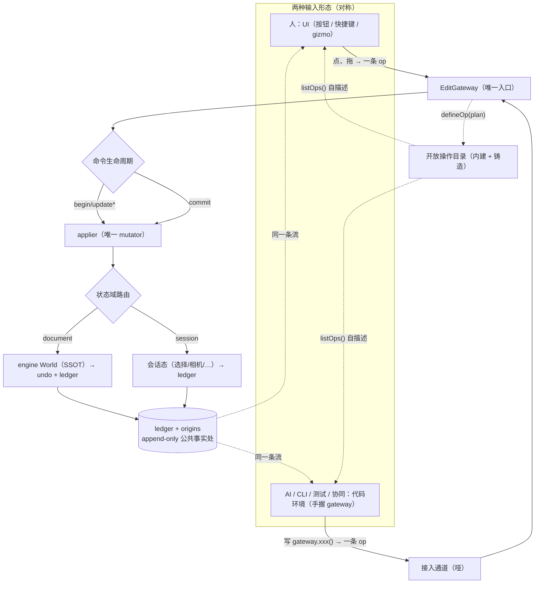

# 设计文档：EditGateway —— 编辑器操作单一入口（人 + AI 平等调用方）

> **状态**：**草案（DRAFT）· 非权威** · 2026-07-05 · 待用户复审
> **北极星**：`.forgeax-harness/knowledge-base/wiki/editor-operation-ssot-north-star.md`
> **背景债务地图**：同库 `wiki/editor-architecture.md`（§2.2 病根 B、§4 模范）
> **推导证据链**：同库 `sources/2026-07-05-editor-operation-ssot-north-star.md`

> [!CAUTION]
> **本文是脑暴产出的草案，不是权威规范。实践才是检验真理的唯一标准。**
>
> 本文的所有结论都产自「读代码 + 推理」，尚未经过真实实现的检验。真正动手实现时：
> - **遇到矛盾、别扭、或「感觉不对」，以实际为准，大胆推翻本文**——不要因为「spec 这么写的」而屈从一个错误的设计。本文档一路是通过「用户觉得别扭 → 推翻重想」迭代出来的（tier→状态域、scratch→命令生命周期、只读封印→不给句柄，都是推翻前一版的结果），这个「实践反驳设计」的过程本身就该在实现阶段继续。
> - 本文标注的「诚实标出的开放点 / 未决 / 开放问题」（§6.3、§7.6、§9、§15）是**已知会在实践中受冲击的地方**，优先在那里预期偏差。
> - 若实现中发现某个核心判断（状态域路由、defineOp 契约、信任分层、query 转发）在真实代码里站不住，**回来改本文、并记录为什么**（append 一节「实践修正」），而不是硬套。
> - 本文的价值是「一个自洽的出发点 + 完整的推导理由」，不是「必须照做的命令」。理由比结论重要——理解了理由，就有资格反驳结论。

---

## 0. 一句话

把编辑器的每一个操作（数据的 + 视图的）收敛成经唯一 `EditGateway` 的、有生命周期的命令；**人的接口是 UI，AI 的接口是「手握 gateway 的代码环境」——同一个 gateway 的两种输入形态**。gateway 的操作集是开放的：同一个代码环境里，接入方既能**调用**操作、也能用基元契约**铸造**新操作，铸造出的操作诞生即一等、即人 AI 对等。

---

## 1. 动机与问题

### 1.1 核心命题

编辑器本质是 **engine 之上的操作平台**。以前用户只有人；在 AI-native 语境下，**AI 是第一用户**——AI 才是最需要使用编辑器的。由此推出两条必须成立的不变量：

1. **操作 SSOT / 单一入口**：能改变编辑器状态的操作，有且只有一个入口；人和 AI 是这个入口的**平等调用方（peer）**，不是「人拥有全集、AI 拥有被注册的子集」。
2. **公共事实处**：该入口天然产出一条 append-only 的账本（ledger），人和 AI 从同一条流看见彼此做了什么（协同的基础）。

### 1.2 现状债（editor 今天的「两套人格」）

| 维度 | 数据操作（改持久 doc） | 视图 / 会话操作（改编辑器视图态） |
|:--|:--|:--|
| 例子 | spawn / setComponent / reparent / rename …（9 个 `EditorCommand`，`core/src/types.ts:20`） | setSelection / setGizmoMode / requestFrame / save / import / play·stop / setSceneId …（`core/src/store/store.ts` 散落导出函数） |
| 入口 | **单一** `bus.dispatch(cmd, origin)`（`core/src/io/bus.ts:80`） | **散落** store 独立函数，UI 直调 |
| 谁能做 | 人 **+ AI**（`origin: 'human' \| 'ai'`） | **只有人**，AI 无路径 |
| 公共事实 | ✅ `ledger` + `origins` append-only（`bus.ts:61-63`） | ❌ 无 |

**结论**：正确形态（`EditorBus`）已存在一半——只有数据操作走了这扇门，视图操作全从窗户跳出去。本设计 = 把窗户封掉、逼回门里，**是收敛不是重写**。

### 1.3 为什么不是 registry（#31 / studio surface 的白名单轴）

已有尝试（editor #31 `registerPanelAction` / `VAG_ACTION_*`；studio `exposedToAI`）选的是**登记副本**轴：功能本体在别处（人的 onClick），再登记一份给 AI。本质区别：

> **两者都「写了才有」，区别不在要不要写，而在写的是本体还是副本。** registry 写的是**副本**（会与本体漂移、漏写、过期）；单一入口写的是**能力本身**（不存在「与谁不一致」，因为只有它自己）。

失败方向也相反：registry 下开发者忘处理 AI → **AI 静默退化**（熵默认漂向人类专用，靠纪律对抗）；单一入口下漏一个 → **人自己先炸**（对齐是默认，偏离做不出来）。

---

## 2. 核心概念（本设计引入 / 收敛的全部概念）

> 概念数是本设计的第一评判标准（Δ-concept-count）。以下是**全部**新概念；不在此表者一律不引入。

| 概念 | 定义 | 替代 / 收敛了什么 |
|:--|:--|:--|
| **EditGateway** | 编辑器唯一的操作入口。所有改状态的操作经它 → applier。承载命令生命周期、状态域路由、undo、ledger、操作目录。 | 收敛 `EditorBus`（改名）+ `store.ts` 散落 mutator（收编） |
| **EditorOp（操作）** | 一条有生命周期的操作，非瞬间点。阶段：`begin / update* / commit / cancel`。即时操作是 `begin=commit` 的退化情形。 | 取代 `EditorCommand`（原只有即时形态） |
| **状态域（domain）** | 每个 op 写的目标域：`document`（engine World，进 undo + ledger）或 `session`（选择/相机/gizmo/play，只进 ledger）。**由 op 调用的 applier 路径结构性决定，不是手贴标签。** | 取代原方案的 `tier` 标签（tier 可贴错、是新词汇；domain 由代码路径决定，贴不错） |
| **开放操作目录** | gateway 持有的操作集合，**开放可扩**。内建操作 + 运行时 `defineOp` 铸造的操作同列。自描述（`listOps()`）。 | 取代「固定 N 个命令」的封闭集 |
| **操作契约（defineOp）** | 铸造新操作的方式：提供 `plan(query, args) → 基元操作序列`。**plan 只读、只能吐基元**，故铸造出的操作 by construction 合规（可撤销 / 进 ledger / 人 AI 对等）。 | 取代 registry「登记 AI 副本」 |
| **接入通道（channel）** | 把 gateway 暴露给外部的哑管子。收「一段调用 gateway 的代码」、执行、回结果。不认识 AI。照 engine-remote 三形态（in-process 主 / WS 预留 / CLI 预留）。 | —— |
| **信任分层 scope** | 通道执行代码时注入的 scope 分两档：**① 操作层**（`gateway` + 只读 `query` + `_import`，默认，含 defineOp）；**② 裸机层**（额外递可写 `world`，dev-only 逃生舱，显式解锁）。 | 澄清「万能 eval」——万能 = 代码表达力（①已有），≠ 裸写 world（隔离到②） |

---

## 3. 架构

### 3.1 全景



### 3.2 层与包边界（沿用现有 DAG，不新增包）

- **`@forgeax/editor-core`**：`EditGateway`（收敛自 `io/bus.ts`）、`EditorOp` 类型、applier、operation catalog、defineOp、query 转发、channel（in-process）。核心机制全部在此。
- **`query` 只读视图**：薄转发 engine `@forgeax/engine-ecs` 的 `createQueryState` / `queryRun`（见 §6）。不新建查询系统。
- **AI 接入说明书 = skill**：editor 领域 skill（拟名 `forgeax-editor-gateway`），放 editor skill 源目录，经 **forgeax-install** 分发 mount 进各 AI CLI 的 `.{claude,cursor,agents,workbuddy,codebuddy,claude-internal}/skills/`。**机制在 core，说明书在 skill，两层解耦**（对齐 engine `packages/engine/skills/forgeax-engine-*` 先例）。

> 不新增 workspace 包；不改 DAG 方向（`engine ← core ← content-browser ← panels ← edit-runtime`）。

---

## 4. 命令生命周期（EditorOp）

### 4.1 生命周期

一个操作是一段有始有终的过程，**不是瞬间点**：

```
begin(op)      手势开始 / 操作起点。快照初值（用于 inverse / cancel）
  update(op)   每帧：实时改状态（物体真的在动），供渲染
  update(op)   …
commit(op)     落定：算一条 inverse（from→to）压 undo（若 document 域）+ 追加 ledger
   或
cancel(op)     回滚到 begin 前，不留痕
```

即时操作（今天的 9 个 + 选择 / play 等）是 `begin=commit` 同一瞬间的退化形式，用便捷 `dispatch(op)` 表达。

### 4.2 update 轻量路径（关键性能与洁净保证）

`update` 阶段：**实时写状态 + 请求重绘**；**不** append ledger、**不** 算 inverse、**不** 广播快照。只有 `commit` 落一条。

- 满足 DCC 手感：拖 gizmo 时物体实时动、相机实时转（`update` 真的写 World / 会话态）。
- undo / ledger 不被淹：几百个中间帧 → undo 栈上只有 `commit` 的一条。
- 不撞门禁：`update` 仍经 gateway → applier，**唯一 mutator 铁律禁的是「绕过 gateway」，不是「高频写」**（§7）。
- 每帧成本 ≈ 今天直接改 store：一次函数派发 + 一次状态写 + 重绘。

### 4.3 人 / AI 对称

| | 人 | AI / CLI |
|:--|:--|:--|
| 连续操作 | 鼠标驱动 `begin`（mousedown）/ `update`（拖动）/ `commit`（松手）/ `cancel`（Esc） | 代码驱动同一套 `begin/update/commit/cancel`（如做平滑演示），或直接 `dispatch`（退化） |
| 即时操作 | 点按钮 → `dispatch(op)` | `dispatch(op)` |
| 最终到哪 | **同一 gateway → applier** | **同一 gateway → applier** |
| 留痕 | ledger（origin: human） | ledger（origin: ai / cli / …） |

---

## 5. 状态域与路由（取代 tier）

### 5.1 两种状态域（editor 本就存在的事实）

| 域 | 内容 | 存哪 | 进 undo? | 进 ledger? | 存盘? |
|:--|:--|:--|:--:|:--:|:--:|
| **document** | 实体 name / transform / 层级 / 组件 | engine World（SSOT） | ✅ | ✅ | ✅ pack |
| **session** | 选择 / 相机 / gizmo 模式 / play·stop / 当前场景 | editor 会话态 | ❌ | ✅ | ❌ |

### 5.2 路由规则（结构决定，非声明）

- **进不进 undo** = 由操作写的是哪个域**结构性决定**（document → 进；session → 不进）。不靠 op 手贴 `tier` 标签，也不靠「有没有 inverse」派生（选择可逆但不该进 undo，派生规则有洞）。
- **进不进 ledger** = **铁律：凡进 gateway 的 op 都进 ledger，写侧零例外**。
- **三层次辨析**（只有第一层进 gateway）：

| 层次 | 例子 | 进 gateway? | 进 ledger? | 判据 |
|:--|:--|:--:|:--:|:--|
| 操作 | spawn·setComponent（doc）、选择·相机结果·play（session） | ✅ | ✅ | 离散、有意义的状态跃迁；快照重载需保留 |
| 输入机制 | gizmo/相机拖拽中间帧、字段 scrub 中 | ❌（是某 op 的 update 阶段） | ❌ | 人瞄准数值的过程，AI 不需要，松手才产一条操作 |
| 纯视图 | hover 高亮 | ❌ | ❌ | 连状态都不是（光标态），快照重载不需要 |

### 5.3 选择（setSelection）的判定：进 ledger，写侧零例外

- 选择是 session 操作，进 ledger。**不开「这条不记」的例外**——那正是要堵死的逃逸舱。
- 协同价值 > 密度代价：「谁在关注 / 操作哪个实体」是 AI-native 协同的一等公共事实。
- 密度问题推给**读侧**：History 面板可折叠连续选择展示，**不影响写侧事实完整性**（append-only 不破）。

---

## 6. 只读 query（AI / 代码环境的读接口）

### 6.1 来源：转发 engine，不自建

engine 的 ECS 早已**读写分离**：`queryRun(state, world, cb)` 只把匹配实体的数据摊平给 `bundle`（typed-array 视图），**没有写语义**；写在 `world.set`（不在 query 里）。因此：

```
// gateway 内，注入 scope 的 query = 薄转发 engine
query = (descriptor) => {
  const state = ecs.createQueryState(descriptor);
  const out = [];
  ecs.queryRun(state, world, (bundle) => { /* 摊平 typed-array 列 → 普通对象 push */ });
  return out;   // 值快照，非活引用
};
```

### 6.2 为什么这不是 registry 式维护面

- 查询逻辑 **100% 是 engine 的**（零维护）。
- `queryRun` 摊平的是 **typed-array 里的数**（`position.x[i]` 是 number），push 进普通对象即**值快照**，不是活引用 → 天然无「读了顺藤摸瓜改回 world」的漏洞。
- query **不是某真相的副本**，而是**读 engine SSOT 的视图**（Derive 原则）——world 变了下次 query 自然读到新值，无第二份要同步。**这正是它与 registry「本体 + 副本要同步」的本质不同。**

### 6.3 诚实标出的两处真维护点（均为一次性 / 已存在，非持续）

1. **typed-array bundle → 友好对象的摊平层**：需写、覆盖各组件类型，但可按 engine 组件 schema 泛型化，为**一次性通用转换**，非「每加操作就同步」。
2. **实体 handle 标识对齐**：query 返回的 handle 要能被 `gateway.setComponent(handle, …)` 接住，需与 gateway 侧用同一实体标识。editor 现有 `_e2h/_h2e` 投影层（`wiki/editor-architecture.md` backlog①）——**已存在复杂度**，本设计要点名对齐、不新增。

---

## 7. 开放操作目录与铸造契约（defineOp）

### 7.1 目录

gateway 持有一个**开放**的操作集合：内建操作（收编后的 document + session 全集）+ 运行时铸造的操作，同列。提供自描述：

```
gateway.listOps() → [{ id, argsSchema, domain, source: 'builtin' | 'defined' }, …]
```

`listOps()` **一份自描述，两个消费者**：命令面板渲染（人）+ AI 查询可用操作（代码环境）。人 AI 共用，非为 AI 特制。

### 7.2 铸造契约

```
gateway.defineOp({
  id: 'align-to-grid',
  domain: 'document',
  argsSchema: { /* JSON Schema：给 UI 表单渲 + 参数校验 */ },
  plan: (query, args) => [                 // 只读 query + args → 基元操作序列
    setComponent(e1, 'Transform', { … }),
    setComponent(e2, 'Transform', { … }),
  ],
});
```

**契约的强制力来自结构，非检查**：`plan` 手里只有 `query`（只读）和基元构造器，**没有可写 world 句柄**——想绕都没有句柄可绕。故它只能吐基元操作序列，而基元的逆运算 gateway 本就会算 → 铸造出的操作**by construction** 满足：可撤销（逆 = 基元逆的逆序，整体一条 undo）、进 ledger、人 AI 对等。**无法产出不合规操作。**

### 7.3 为什么这不是 registry

| | registry（#31，坏） | defineOp（本设计，好） |
|:--|:--|:--|
| 注册的是 | 已存在能力的一份 **AI 副本** | 一个此前**不存在**的新操作 |
| 存在几份 | 两份（人本体 + AI 登记），要同步、会漂 | 一份，诞生即人 / AI 共有 |
| 谁能用 | 只有被登记的对 AI 开放 | 诞生即同时进命令面板（人）+ 操作目录（AI） |

**registry 是复制已有能力；defineOp 是铸造新能力，铸出即对等。** 这是北极星「操作集如何保持开放又不漂移」的答案。

### 7.4 操作集自生长

铸造出的操作**加入目录**，后续操作可调用它（`layout-scene` 可调 `align-to-grid`）。操作集是开放、递归自生长的，非固定集。

### 7.5 生命周期（scope 决策：session 级）

铸造的操作**活一个 session**，重启即无，为运行时宏。持久化成「项目专属动词」（存进项目、跨会话、团队共享）**列为明确的未来扩展**（需定义存储格式 + 加载 + 来源信任），第一版不做。

### 7.6 基元 vs 能力边界

- **场景变更**走基元（spawn/despawn/set·add·removeComponent/reparent）——对场景状态**完备**，任何场景变换是其组合。
- **异步能力**（import glTF / cook / bake / save）：要么本就是内建 gateway 操作（import/save 已是），要么作为**显式声明的 capability** 暴露给 `plan` await 调用。**被挡在外的只有「非编辑器副作用」（乱发网络 / 写 FS），而那本就不属于这层。**
- **未决**（spec 实现阶段细化）：异步能力嵌入操作时的 undo 语义（如 import 是否可逆）。

---

## 8. 接入通道与信任分层

### 8.1 哑通道（照 engine-remote）

通道**不认识 AI**，只收「一段调用 gateway 的代码」、执行、回结果。谁接入通道不关心：

| 接入方 | 用法 |
|:--|:--|
| 编辑器内建 AI | in-process 直连 |
| 外部 AI（claude-code 等） | 经 skill 学会协议 → 连上发代码 |
| CLI / 脚本 / 测试 / 协同 | 同一通道 |

形态：**in-process 必做**；WS（照 engine :5732）、CLI **预留架构、第一版不实现**。

**AI 怎么知道能干啥**：不给每操作包 tool schema（那是副本）。AI 读一份 **skill 说明书**（协议 + 如何写 gateway 调用 + 如何 defineOp）+ 运行时 `gateway.listOps()` 自描述即可。**机制哑、说明书按接入方各写**。

### 8.2 信任分层 scope（澄清「万能 eval」）

「万能」有两个被混淆的含义，本设计拆开：

| | **代码表达力的万能** | **写权限的万能** |
|:--|:--|:--|
| 指 | 循环 / 条件 / 批量 / 图灵完备 | 裸写 world（绕过 gateway） |
| 落在 | **① 操作层（默认）** | **② 裸机层（dev 逃生舱）** |
| 与契约 | **共存** | 互斥 |

```js
// ① 操作层 scope：{ gateway, query, _import }  —— 无 world 句柄
const targets = query({ with: [Transform, MeshRenderer] });  // 只读查
gateway.begin('bulk-move');
for (const e of targets)
  if (query.get(e).Transform.position.y < 0)                 // 任意逻辑（万能表达力）
    gateway.setComponent(e, 'Transform', { position: [...] });// 写必经门
gateway.commit();                                            // 一条 undo
```

- **① 操作层已经是万能代码环境**（有查询/循环/条件/批量），只是**写有一扇门**——这扇门正是它自动获得 undo/ledger/对等的原因。`defineOp` 只存在于①（scope 无 world → 契约保证为真）。
- **② 裸机层**：额外递可写 `world`，可裸写、绕过 gateway。**dev-only、显式解锁、后果自负、不产合规操作**。仅用于「gateway 出 bug 要绕过勘查」这类救火。①②**永不在同一 scope 混**（否则 world 在场，defineOp 契约崩塌）。

> **要点**：不是「define 与万能二选一」，而是把万能拆成「表达力」（留①）与「裸写」（隔离②）。①②同一通道、两档 scope，请求时声明 / 按环境决定给哪档。

---

## 9. 安全模型

安全在 **gateway 层**做（对所有接入方一致），不在通道层特制：

| 机制 | 说明 | 出处 |
|:--|:--|:--|
| 危险操作确认闸门 | op 可声明 `requireConfirm: 'destructive'`（删除 / 覆盖）；执行前弹确认 | 复用 studio surface 原语 |
| 全局「🛑 暂停 AI」 | caller≠human 的操作在 gateway 入口 reject | studio |
| AI 操作可见 | caller=ai 的操作在 UI 高亮 / toast（「像看队友打游戏」）+ 进 ledger | studio §9.2 + 本设计 ledger |
| caller 分级 | ledger `origins` 记 human/ai/cli/…；可按来源限权（如「AI 只读」） | 扩 `bus.ts` 现有 origin |
| 通道默认关 / 本地绑定 | 通道 dev / 受控环境才开，prod 默认不存在；WS 绑 localhost | engine-remote「唯一边界是 host 起不起 server」 |

**诚实标注（不吹沙箱）**：① 层不给可写 world 句柄，但接入方仍可 `_import('@forgeax/engine-ecs')` 自取 world 引用绕过——**JS 做不到真沙箱**（engine README 自认）。故 ② 裸机绕过靠 **dev / 受控边界 + 门禁扫明面 `world.set` + 后果自负**，与 engine 纪律模型一致。安全性来自「无正当理由绕过 + 环境边界」，非技术封印。

---

## 10. 命名订正

`EditorBus` **名不副实**（它是命令网关 + 撤销栈 + 账本，不是 pub/sub 事件总线；真事件总线是 studio `interface/src/lib/bus.ts`）。

- `EditorBus` → **`EditGateway`**（首选，直说「唯一入口」宪法地位；undo/ledger 是其内部设施，不进名字）。
- `EditorCommand` → **`EditorOp`**（涵盖 begin/update/commit 生命周期，比 command 中性）。
- `dispatch` 动词保留（退化即时操作用）；连续操作用 `begin/update/commit/cancel`。

**时序**：本设计是全量重构，rename 跟随「引入命令生命周期 + 收编视图操作」**一次改净**（Optimal > compatible，不留 compat / 双路径）。名实同刻到位。

---

## 11. 迁移 / 收编（从现状到目标）

增量、非重写（模范 `EditorBus` 已在，本质是「封窗逼回门里」）：

1. `EditorCommand` → `EditorOp` 判别联合 + 生命周期（`begin/update/commit/cancel`，即时 = 退化）；applier 按状态域路由（document 算 inverse 进 undo + ledger；session 只 ledger）。
2. `EditorBus` → `EditGateway` rename（全仓 `bus`/`bus.ts` 引用）。
3. 把 `store/store.ts` 的 `setSelection` / `setGizmoMode` / `requestFrame` / `save` / `import` / `play·stop` / `setSceneId` 逐个改成 session 域 op 经 gateway；**函数体基本不动，只改「从哪扇门进」**。
4. UI handler 全改 `dispatch(op)` / `begin…commit`；store 裸 mutator 降为 applier 私有（外部 import 不到）。
5. viewport 的 gizmo / 相机拖拽改为 `begin/update*/commit`（update 走轻量路径实时写、commit 落一条）。
6. 建 operation catalog + `listOps()` + `defineOp`；命令面板与（未来）AI 目录共用自描述。
7. 建 in-process channel + ① 操作层 scope（`gateway` + `query` 转发 + `_import`）；② 裸机层 dev-only 显式解锁。
8. 写 `forgeax-editor-gateway` skill（协议 + gateway 用法 + defineOp），经 forgeax-install 分发。
9. 上 CI 门禁（§12）。

**收编顺序约束**：踩 `store.ts` / `core/index.ts` 等大文件的步骤集中、避免与在建 feature 冲突（参照 `wiki/editor-architecture.md` §3.3 文件足迹零相交原则）。

---

## 12. CI 门禁（诚实化不变量）

| 门禁 | 断言 | 实现 | 强度 |
|:--|:--|:--|:--|
| **A 唯一 mutator** | 除 applier 外，任何文件直接 mutate 编辑器状态（裸 `world.set` / 裸调 store setter）= 报错。**禁绕过 gateway，不禁高频写。** | diff-scoped grep，照 `scripts/lint-no-second-world.mjs` 先例 | 正则级（挡直觉违规，不挡蓄意绕过——如实标注） |
| **B 操作必经 gateway** | 新增会改状态的操作，必须落成经 `EditGateway` 的 op（声明 document/session 域），不得新开散落 store 函数。 | diff-scoped lint | 正则级 |

> 取代原北极星「op 必声明 tier」——已用状态域路由替代 tier，改为「必经 gateway」，这才是真正要守的。

---

## 13. 非目标（本设计明确不做）

1. **铸造操作持久化成「项目专属动词」**——列为未来扩展（§7.5），需存储格式 + 加载 + 来源信任。
2. **WS / CLI 通道形态实现**——架构预留，第一版仅 in-process（§8.1）。
3. **② 裸机层的沙箱化**——JS 做不到真沙箱，不追求；靠环境边界 + 纪律（§9）。
4. **`_e2h/_h2e` 投影层收敛 / EntityId 统一**——已存在复杂度，本设计对齐使用、不重构（`wiki/editor-architecture.md` backlog①）。
5. **studio 侧 host / VAG_ACTION 的处置**——#31 的产品意图由本设计承接，但 studio 分支代码的迁移属跨仓协调，不在本 spec。
6. **异步能力嵌入操作的 undo 语义细化**——实现阶段处理（§7.6）。

---

## 14. 验收标准

1. 人在 UI 点「保存」/ 拖 gizmo 移动物体 vs AI / 代码环境发同一条 op → **两条路径进入同一 gateway、同一 ledger entry、同一 applier**；物体拖拽实时动，undo 栈只落一条。
2. 视图操作（选择 / 相机 / gizmo 模式 / play）AI 可经 gateway 发起，且进 ledger（协同可见）。
3. `gateway.listOps()` 返回内建 + 铸造操作，命令面板与代码环境读同一份。
4. `defineOp` 铸造的操作：可撤销（一条 undo）、进 ledger、命令面板出现、AI 可调——无需为 AI 另写任何登记。
5. ① 操作层 scope 内可写图灵完备的批量脚本（查询 + 循环 + 条件 + 批量 op），写全部经 gateway；scope 内无可写 world 句柄。
6. CI 门禁 A/B 生效：diff 中裸 mutate / 新开散落 store 函数被拦。
7. `EditorBus`/`EditorCommand` 全仓无残留（已 rename 为 `EditGateway`/`EditorOp`）。
8. `forgeax-editor-gateway` skill 经 forgeax-install 分发，各 AI CLI 的 `.{…}/skills/` 可见。

---

## 15. 开放问题（实现阶段敲定，不阻塞本设计）

1. 异步 capability（import/cook/bake）嵌入操作时的 undo 语义与 `plan` await 形态。
2. `query` 摊平层对复杂 / 嵌套组件 schema 的泛型化边界。
3. 实体 handle 标识在 query ↔ gateway 间的统一表达（与 `_e2h/_h2e` 对齐点）。
4. editor skill 源目录的确立位置（顶层 `skills/` vs 其他），与 forgeax-install IR 对接。
5. `requireConfirm` / 「暂停 AI」/ caller 限权的具体 UI 与 gateway 入口实现。
