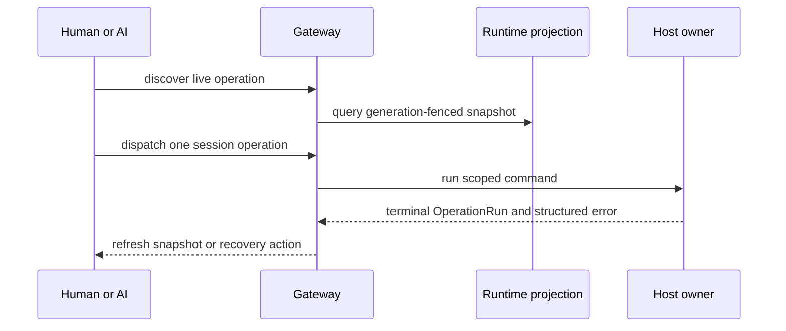

# `@forgeax/editor-core`

> forgeax editor 核心逻辑层 — EditSession 单一真相源（scene-as-asset）、EditorBus 命令总线、undo/redo、组件 schema 注册表、跨窗同步、动画、材质图、资源、预设。

## Project authoring transaction boundary

The material, mesh, and VFX operations are installed by the Engine Tool Runtime
contribution. Core owns the producer transaction seam:
read a fresh Project revision, merge a serialized draft, CAS-write with
`expectedRevision`, and expose terminal/error evidence. The Gateway remains a
thin UI projection and does not become a second authoring executor.

| Terminal | Project fact | Recovery |
| --- | --- | --- |
| `succeeded` | New revision and project-file artifact are published | Refresh projections |
| `authoring-revision-conflict` | No partial write | Keep `draft`, refresh, retry |
| producer write failure | No in-memory promotion | Use structured `recoveryActions` |

> [!WARNING]
> Do not treat an EditSession or panel snapshot as the Project authority after
> a failed terminal. Re-read the Project files before retrying.

## Material publication inspection and parameter contract

`MaterialPublicationInspection` is the single read-only shape for a cooked
MaterialAsset publication. Query it by authored `materialGuid`; compare
`publicationGeneration`, `specializationKey`, `sourceClosure`,
`artifactDigest`, and `parameterContract` across hosts. `transport` records
where the projection was read and is provenance only: it never participates in
publication tuple equality.

`resolveMaterialParamSchema` reads `parameterContract.parameters` first. The
retained built-in schema is only an offline fallback; the deleted game
manifest and its `materialShaders[].paramSchema` entries are not an Editor
authority. Inspector values and diagnostics remain read projections and use
the existing Gateway/provider seams.

Failure projections use the stable kebab-case codes
`shader-module-not-found`, `material-reflection-binding-mismatch`,
`material-specialization-not-cooked`, `asset-artifact-missing`,
`asset-artifact-integrity-mismatch`, and `material-cook-record-invalid`.
Callers branch on `code`, identity fields, `expected`/`actual`, `hint`,
`retryable`, and `recoveryActions`; they do not parse `message`.

## Version-control evidence index

The version-control surface is a read projection plus four Gateway session operations.
It does not create a second catalog, undo ledger, Runtime, or Git owner.



| Evidence | Source | Consumer rule |
|:--|:--|:--|
| AC-17 | `packages/core/src/io/version-control-schema.ts` and Gateway operation tests | Human and AI use the same descriptor, args, confirmation, ledger, and run |
| AC-18 | `src/io/__tests__/version-control-error-contract.test.ts` | Branch on `code`, `stage`, `expected`, `actual`, `requestId`, and `recoveryActions`; never parse message/stderr |
| AC-15/20 | `src/io/__tests__/version-control-snapshot.test.ts` and `edit-runtime` generation tests | Snapshot generation is authoritative; old projections are stale after switch |

The indexed path is `discover -> query -> dispatch -> wait -> refresh`. Accepted or
running is not terminal success. A stale snapshot, stale target, dirty worktree,
recovery freeze, or generation change must remain an explicit structured state.

## 版本控制最短成功路径

版本控制能力与 Human UI 共用一个 Gateway live catalog。AI 或 UI 应按以下顺序操作：

```ts
const operations = gateway.listOps();
const snapshot = await queryViewportRuntimeProjection({ kind: 'version-control.snapshot' });
const accepted = gateway.dispatch({
  kind: 'publishGameVersion',
  tag: 'release/one',
  expectedSnapshotId: snapshot.value.snapshotId,
  requestId: 'publish-release-one',
}, 'ai');
const terminal = await gateway.waitOperationRun('publish-release-one');
```

四个 session operation 是 `configureGitExecutable`、`initializeGameRepository`、
`publishGameVersion` 与 `switchGameVersion`。`version-control.snapshot` 是只读、按
Runtime generation 隔离的状态投影；它不会进入 undo ledger。`dispatch` 的 accepted/running
不是成功，必须读取 `OperationRun` 的 terminal 状态。retry 必须生成新的 `requestId`。

| 状态 | 恢复动作 |
|:--|:--|
| `unavailable` / `uninitialized` | 重新 discover，等待 Host 绑定后 query snapshot |
| `version-control-snapshot-stale` | 刷新 snapshot，重新确认 `expectedSnapshotId` |
| `version-control-worktree-dirty` | 处理文件变化后重新预览，不静默提交 |
| `version-control-recovery-required` | 按 `recoveryActions` 请求外部检查，再 reconcile |

## Viewport grid preference

The Edit main viewport grid is editor chrome. It is not scene-pack data, a document undo
entry, or a Play-world component. Human View and Settings controls, plus AI callers, use
the existing Gateway session operation:

```ts
gateway.dispatch({
  kind: 'setViewportPreferences',
  patch: { gridVisible: true },
}, 'ai');
```

The minimal discoverable schema is `patch.gridVisible: boolean`. The default is `true`;
the value is a session preference and does not create a grid-specific action, catalog, or
shadow store. `gateway.listOps()` is the live discovery surface, so callers should read
the current `setViewportPreferences` descriptor before dispatching and use the same
operation from View, Settings, or AI.

If the argument is invalid, the renderer is unavailable, or the carrier is recovering,
the Gateway returns the existing structured error envelope (`code`, `expected`, `actual`,
`hint`, `retryable`, and `recoveryActions`). Recovery is to rediscover the live operation,
read the diagnostics snapshot, wait for the published ready state, and retry through the
same operation. Do not infer readiness from a screenshot or create a second operation
catalog.

## Minimal AI path

Asset capabilities flow through one discoverable path: producer token →
`assetCatalog({ compatibleWith })` → `describeComponent('ParticleEffectPlayer')`
→ generic `bindAssetRef`. Callers neither inspect source nor guess concrete asset kinds:

```ts
const component = gateway.describeComponent('ParticleEffectPlayer');
const candidates = gateway.assetCatalog({ compatibleWith: 'ParticleEffectAsset' });
if (component.ok && candidates.ok) {
  await gateway.dispatch({
    kind: 'bindAssetRef',
    entity,
    component: component.name,
    field: 'effect',
    assetType: 'ParticleEffectAsset',
    guids: candidates.assets.map((asset) => asset.guid),
    requestId: 'bind-particle-1',
  }, 'ai');
}
```

The authored `ParticleEffectPlayer` schema contains `effect`, `playing`, `seed`, and
`timeScale`. `gateway.listOps()` exposes the generic bind's `assetType`, `guids`, and
`requestId`; `runtime-ui-diagnostics.schema.json` defines machine-readable readiness
and structured error fields. A successful import terminal result reports only
`committed-awaiting-reload`, together with `requestId`, `assetGuid`,
`committedRevision`, `residentRevision`, and `hint`; it never presents a commit as
visible-ready.

`gateway.listOps()` is a live capability projection, not a static promise. Every
descriptor joins its catalog contract with the currently registered applier and
reports `availability`; downstream Runtime registrations publish a monotonically
increasing revision through `operationCapabilitySnapshot()` and
`subscribeOperationCapabilities()`. Unmounting an owner removes its executor from
the projection. Consumers must rediscover after a revision change instead of caching
boot-time operation availability.

Described downstream appliers may also declare `operationRun` metadata. When
such an executor returns a Promise, the canonical Gateway derives the
`requestId` from the live descriptor, creates the one authoritative
`OperationRun`, and does not report success until the downstream completion is
terminal. This is the generic seam used by replaceable preview executors; it is
not a VFX-specific allowlist and downstream hosts must not create a second run
journal.

<details>
<summary>Errors, recovery, and boundaries</summary>

- `asset-compatibility-token-unknown` means no producer schema declared the token. Read `describeComponent` first; do not treat an empty array as success.
- Loader, revision, render, and stale-handle failures return stable `code`, `expected`, `actual`, `hint`, and `retryable` fields. Follow recovery actions to re-query, retry, Stop/Play, or reopen.
- Readiness is a bounded projection for one `requestId + assetGuid + revision`. Edit- and Play-world handles are not interchangeable, and background work never rewrites a terminal run.
- Visual evidence belongs to verification. Core exposes machine-readable facts instead of substituting toasts, console output, or screenshots for state.
</details>

## Asset impact reads

`EditGateway.assetImpact({ operation, guid })` or `assetImpact({ operation, sourcePath })` is the
read-only, AI-usable preview for asset `delete`, `move`, and `reimport`. It derives direct and
transitive referencers from the engine producer catalog's `relations` on every call; it does not
create a second dependency index. A catalog row with no producer relations falls back to its legacy
`refs` field. Pass exactly one selector, inspect `resolution`, `targets`, `directReferencers`,
`transitiveReferencers`, `blocking`, and `confirmation.required`, then invoke the existing Gateway
write operation. The preview itself never mutates the document, catalog, or source files.

## 导入示例

```ts
import {
  EditorBus,
  createEditSession,
  applyCommand,
  childrenOf,
  type EditSession,
  type EditorCommand,
  type EntityId,
} from '@forgeax/editor-core';
```

## exports 子入口

| 入口 | 说明 |
|:--|:--|
| `.` | 所有核心类型与函数（见上方 import 示例） |
| `./diagnostics` | Diagnostics snapshot/query types and the pure bounded query projection |
| `./package.json` | 包元信息 |

## Asset source workflow

AI and UI callers share the same Gateway path: `listOps()` → `previewAssetSourceMutation` →
`saveAssetSourceOverride` or `reimportAsset` → `waitOperationRun(requestId)`. Use
`discardSourceOverridesAndReimport` only after preflight returns the impact set and its
`confirmationToken`. The stable identity tuple is `guid` + `scope.sourceKey` + `expectedRevision`;
the Catalog is the read SSOT and no caller reads DDC or edits Meta files directly.

Operation runs expose `accepted`/`running`, terminal `succeeded`/`failed`/`cancelled`, and Gateway
read methods `getOperationRun`, `waitOperationRun`, and `subscribeOperationRun`. Recovery actions are
`asset.preflight`, `run.get`, `run.wait`, `run.retry`, and `catalog.reconcile`. Branch on the public
error `code`, `phase`, `expected`, `actual`, `retryable`, and `recoveryActions`; never parse `hint` or
`message`.

| Error index | Recovery |
|:--|:--|
| `asset-source-key-*`, `asset-meta-revision-conflict`, `asset-confirmation-*` | Re-run preflight with the current Catalog fact |
| `asset-validation-failed`, `asset-cook-failed`, `run-cancelled-before-cas` | Retry with a new request id when `retryable` |
| `asset-publish-observation-timeout`, `asset-catalog-subscription-gap` | Reconcile Catalog, then read the existing run |
| `asset-operation-cas-committed` | Read the terminal run; do not duplicate the mutation |

## Carrier evidence and phase isolation

The grid is projected only by the authoritative Edit Viewport Runtime. Game display,
Clean Preview, Play, and asset preview derive a hidden grid phase without changing
`gridVisible`; returning to Edit reuses the user's preference. Play uses a fresh Play World
and Stop returns to the persistent Edit World, so the grid never enters authored content.

Carrier evidence is independent per product path. The standalone hard gate is
`http://localhost:15290`; its authoritative runtime is the visible shell's
`iframe[title="ForgeaX Viewport Runtime"]`, with the `/editor/` frame owning Gateway,
World, Registry, and canvas. The Studio hard gate is `http://localhost:18920`; its
evidence must resolve the same kind of authoritative `/editor/` runtime frame inside the
Studio shell and must not reuse standalone artifacts. Each report records the candidate
Editor SHA, Engine pin, operation schema, diagnostics, visible action trace, and separate
PNG/log/metrics paths. A reachable port or a raw preview is not carrier evidence.

The M0 Engine seam is conditional: only a reproducible public no-vertex seam failure
authorizes an Engine-owned generic fix, Engine remote-main reachability, and then an
Editor pin update. When M0 passes, Engine remains unchanged. The Editor must not add a
backend-specific or raw-device workaround for either carrier.

## troubleshooting

Gateway failures expose the shared structured envelope from
`@forgeax/editor-product`: stable `code`, `hint`, `retryable`, recovery actions,
operation/request correlation, and payload-derived object references. Branch on
those fields; the human-readable hint is never a protocol discriminator. Entity
references may include a world-bound locator, but locating must go through the
exported `validateEntityObjectRef()` gate so stale handles cannot silently
resolve to a recycled or cross-world entity.

The read-only `gateway.diagnostics.snapshot()` projection joins existing facts
without making console output authoritative: bounded trace roots, ledger-owned
scan diagnostics, the asset-error bus, and the Gateway `OperationRun` snapshot.
Each source reports its retention and latest-wins dedupe policy, including
producer eviction counts where the owner exposes them. Consumers should read
the source-specific arrays and branch on structured fields rather than scrape
logs.

For one AI-friendly bounded list, use `gateway.diagnostics.query({ query,
sources, severities, limit })`. It is a pure projection over the same snapshot,
returns stable item IDs plus `subjectRef`/`objectRefs`, retryability, recovery
actions, and explicit `matched`/`truncated` facts. The Capabilities panel uses
the same query helper; it does not maintain a parallel diagnostic index.

| 症状 | 原因 | 解决 |
|:--|:--|:--|
| `Module '"@forgeax/editor-core"' has no exported member 'X'` | 导出未从子模块 re-export 到 `src/index.ts` | 检查 `src/index.ts` 是否缺该导出的 re-export 行 |
| 使用了 `EditorPanelId` 但此处不导出 | `EditorPanelId` 的 SSOT 在 `@forgeax/editor-panels/panels` | 改为 `import { type EditorPanelId } from '@forgeax/editor-panels/panels'` |
