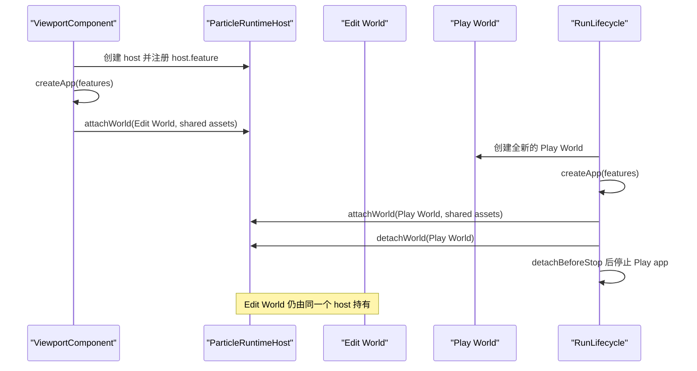

# `@forgeax/editor-edit-runtime`

> ForgeaX 编辑模式运行时：在同一进程内启动引擎 viewport，装配相机、天光、seed、host 会话和引擎拥有的 VFX 粒子运行时。Edit 与 Play 共享一个物理 canvas，但使用不同的 ECS World。

> [!IMPORTANT]
> Runtime 服务（zustand store、实体操作、右键菜单、dock 桥接、面板 manifest）已迁移至 `@forgeax/editor-shared`。如需使用 `bus`、`dispatch`、`useSelection` 等，应从 `@forgeax/editor-shared` 导入。

## 导入示例

```ts
// UI 组件与引擎集成
import {
  ViewportBar,
  createViewport,
  applyScriptChange,
  initHotReload,
} from '@forgeax/editor-edit-runtime';

// 单 realm 装配：viewport 入口与 host 会话入口
import { ViewportComponent } from '@forgeax/editor-edit-runtime/viewport/viewport-component';
import { initHostSession, configureHostSession } from '@forgeax/editor-edit-runtime/host-boot';

// Runtime 服务从 shared 导入
import { bus, dispatch, useSelection } from '@forgeax/editor-shared';
```

## exports 子入口

| 入口 | 说明 |
|:--|:--|
| `.` | UI 组件（`ViewportBar`）、引擎集成（`createViewport`）、热重载（`applyScriptChange`、`initHotReload`） |
| `./host-boot` | host 会话装配（`initHostSession`、`configureHostSession`），复用单 realm host 入口 |
| `./viewport/viewport-component` | `ViewportComponent`：in-process 引擎 viewport（canvas、World、renderer、camera） |
| `./package.json` | 包元信息 |

## VFX 生命周期契约

Edit 侧由 `ViewportComponent` 创建且只创建一个 `ParticleRuntimeHost`。这个 host 的 `feature` 在 `createApp` 前注入；`createApp` 成功后，它先绑定持久的 Edit World 与共享 `AssetRegistry`，再在每次 Play 中绑定一个全新的 Play World。粒子模拟、观测、资源 registry 和实体身份仍由 engine 所有，编辑器只提供 camera 读取和生命周期委托。



### World 与身份边界

| 对象 | 所有者 | 生命周期 | 约束 |
|:--|:--|:--|:--|
| Edit World | Edit viewport / `WorldManager` | viewport 会话 | 持久编辑世界；Play 期间不被 Play handle 替换 |
| Play World | `RunLifecycle` / `assemblePlayWorld` | 单次 Play | 每次 Play 新建，Stop 后丢弃；不写回 Edit World |
| `ParticleRuntimeHost` | `ViewportComponent` | viewport 会话 | Edit 与每次 Play 复用同一个实例；`attachWorld` / `detachWorld` 必须幂等 |
| `AssetRegistry` | renderer / engine | host 会话 | Edit 与 Play 使用同一个 renderer assets 事实，不在编辑器侧复制 registry |
| `EntityHandle` | 对应的 ECS World | 对应 World / epoch | 不跨 World、Play/Stop 边界复用；失效后必须重新查询 active World |

> [!WARNING]
> Stop 的顺序是固定契约：先 `detachBeforeStop`，再清理 Play 投影、停止 Play app、释放 assembly。禁止在 Play app 停止后才让 VFX host 读取或 detach 已失效的 Play World。

### 错误与恢复

跨 World 使用 handle 时，core 必须返回结构化 `world-mismatch`，其中包含 `detail.expectedWorldRef`、`detail.actualWorldRef`、带 locator 的 `objectRefs.entity` 和路由修复提示。Play handle 在 Stop 后使用会被拒绝；不要把它静默映射到恰好具有相同数字值的 Edit handle。

恢复路径只有重新查询当前 active World 或重新读取 selection，得到新的 world-bound handle。`stale-entity-handle` 的 `hint` 是人和 AI 共用的自恢复入口。

## Play dirty policy

`play` 是 Gateway session operation。可选的 `dirtyPolicy` 为 `last-saved`、`save-then-play` 或 `cancel`；人类 UI 投影和 AI dispatch 使用同一个 operation，以及 persistence 所有的 `gateway.hasPendingDiskSave()` 读取。`save-then-play` 会等待 canonical Gateway save 完成后，再加载最新的 `SceneAsset`。

## Source publication and Play barrier

Edit Runtime observes imported source publication through the Gateway operation run and Catalog
projection. The shortest path is discover → preview → submit → wait → reconcile/retry; the runtime
does not become a second Meta, DDC, Catalog, or run owner. A failed cook preserves the Catalog's
last-known-good projection, and a publication timeout is recoverable only after reading the existing
run and reconciling the Catalog.

After a successful current projection is observed, a fresh Edit reopen and Play must expose the same
`guid`, `sourceKey`, and revision. Instance-only overrides and Promote remain separate authored
semantics; source reimport must not promote or rewrite them. All source errors are structured
(`code`, `phase`, `expected`, `actual`, `retryable`, `recoveryActions`) and are not decoded from UI
messages.

## troubleshooting

| 症状 | 原因 | 解决 |
|:--|:--|:--|
| `useDocVersion` 返回不更新 | store listener 未注册到 bus | 确认调用了 `onSelectionChange` / `onGizmoModeChange` 等注册函数；这些函数均来自 `@forgeax/editor-shared` |
| `Cannot find module 'bus' from '@forgeax/editor-edit-runtime'` | Runtime 服务已迁移至 shared | 改为从 `@forgeax/editor-shared` 导入 `bus` |
| VFX readiness 显示不可用 | host 没有绑定当前 World，或 renderer assets 尚未就绪 | 检查 `createApp(features)`、Edit `attachWorld` 和 Play `attachWorld` 的诊断结果；不要在 UI 侧创建第二个 host |
| Stop 后出现 stale/cross-world handle | 代码保存了旧的 Play handle | 重新查询 `gateway.activeWorld` / selection；不要尝试把数字 handle 转换成另一个 World 的实体 |
| 剪贴板操作报错 `undefined` | `copySelected` 依赖 DOM `navigator.clipboard` | 确保在安全上下文（HTTPS 或 localhost）中运行 |
