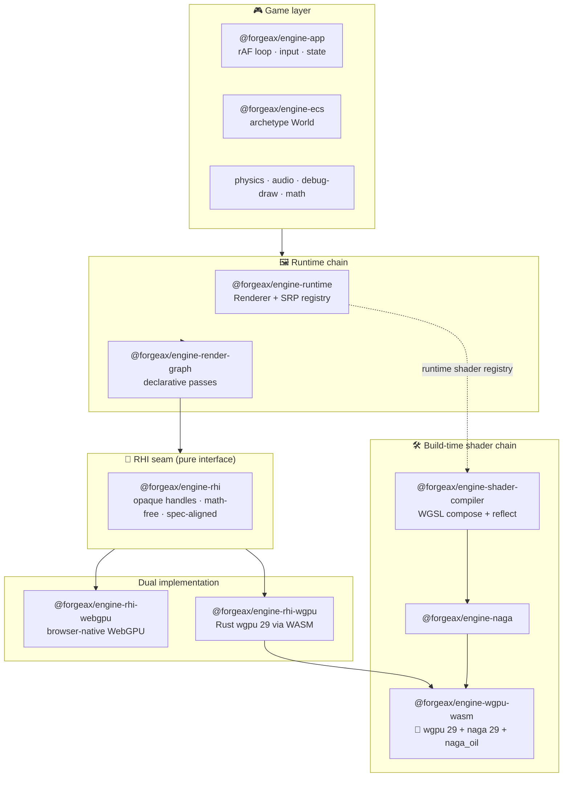
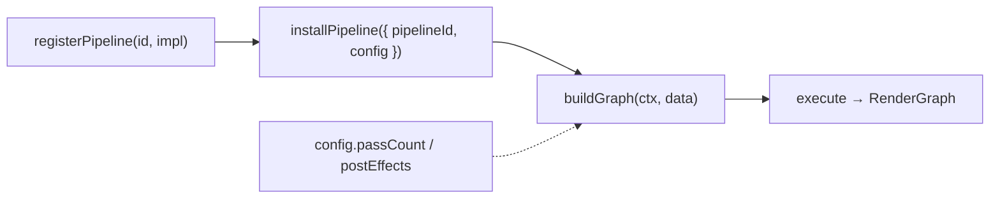

<!-- LANG-SWITCH -->
**Language**: **English** · [简体中文](README.zh-CN.md)

> [!IMPORTANT]
> README is maintained in two languages ([`README.md`](README.md) canonical · [`README.zh-CN.md`](README.zh-CN.md) mirror). **Any change must update both in the same commit.**

---

# forgeax-engine

[](./LICENSE)
[](./tsconfig.base.json)
[](./packages/rhi)
[](./packages/wgpu-wasm)
[](./AGENTS.md)
[](./packages)

> **AI-first TypeScript game engine, built to surpass Three.js.**

The primary user of this engine is not a human developer — it is an **AI agent**. Every API is a machine-readable contract: schema-typed, `Result`-returning, self-describing. Whenever AI-friendly and human-friendly conflict, **AI wins**. See the [AI User Charter](.claude/skills/forgeax-closed-loop/agents/ai-user-charter.md).

---

## ✨ Why forgeax

- 🤖 **AI-first, not AI-retrofitted** — every surface is a machine-readable contract (schema / manifest / typed union). An agent calls it correctly without reading a tutorial.
- 🧊 **Native WebGPU, twice over** — a single spec-aligned RHI with **two independent backends**: browser-native WebGPU *and* a Rust `wgpu 29` core compiled to WebAssembly.
- 🦀 **Rust + WASM shader core** — merged `wgpu 29 + naga 29 + naga_oil 0.22` wasm-bindgen crate in **one ~1.17 MB gzip artefact**.
- 🧩 **Declarative RenderGraph** — resources + passes as data; the graph owns lifetime and barrier insertion. No hand-written `beginRenderPass` bookkeeping.
- 🎬 **Scriptable Render Pipelines (SRP)** — register a named pipeline, drive it with config; the engine's own forward pipeline is written in the *same public vocabulary* it exposes to you (true dogfood).
- 🖌️ **WGSL "ShaderLab" composition** — Bevy-convention `#import namespace::path` module graph, `#ifdef` variants, 16 engine-shipped composable modules (PBR / IBL / tonemap).
- 🎞️ **RenderDoc-inspired RHI debugger** — record a frame to tape, replay it deterministically on a fresh device, inspect per-draw bindings + render-target PNGs offline.
- 🧮 **Archetype ECS** — SoA columns, declarative systems, deferred commands, relationships, three-layer reflection.
- ⚙️ **Batteries included** — Rapier 2D/3D physics, Web Audio, glTF/FBX/image/font import, typed state machines, immediate-mode debug draw, a kubectl-style live inspector.
- 🛡️ **Structured failure everywhere** — `Result<T, E>` with closed `.code` unions, `.expected` / `.hint` / `.detail`; no thrown surprises, no `err.message.match()`.

## Design creed

| Principle | Meaning |
|---|---|
| **Machine-readable > prose** | API self-describes via schema / manifest / structured types; an AI can call it correctly without reading a tutorial |
| **Explicit failure > silent behavior** | `Result<T, E>` with `.code` / `.expected` / `.hint`; no string-encoded semantics, no swallowed errors |
| **Uniform abstraction > leaked internals** | One interface up front, performance knobs opt-in |
| **Context economy** | Small API surface, self-explanatory names, types are the documentation |

> Compression == intelligence. The metric is not lines of code — it is **the number of concepts a reader must hold to follow any single piece**. See [`architecture-principles.md`](../forgeax-harness/rules/architecture-principles.md).

---

## 🗺️ Architecture at a glance

Two independent dependency chains meet at the **RHI seam** — the pure interface every backend implements.



---

## 🔬 Feature deep-dive

<details>
<summary><b>🧊 RHI — the pure rendering seam</b></summary>

A **spec-aligned, math-free interface** shaped after `@webgpu/types`, exposing 14 opaque handle types and a capability-gated op-set (a wgpu superset). It is deliberately **implementation-free** so two backends can co-exist byte-for-byte:

| Backend | Path | Runs on |
|---|---|---|
| `rhi-webgpu` | thin shim over the browser's `GPUDevice` | native WebGPU browsers |
| `rhi-wgpu` | TS shell over the Rust `wgpu 29` WASM core | anywhere WASM runs |
| `rhi-null` | headless no-op | structural unit tests (zero GPU/DOM) |

Every call returns `Result<T, RhiError>`; capabilities are queried via `device.caps`, never assumed.
</details>

<details>
<summary><b>🦀 WASM — Rust wgpu + naga in one artefact</b></summary>

`@forgeax/engine-wgpu-wasm` is a merged **`wgpu 29` + `naga 29` + `naga_oil 0.22`** wasm-bindgen crate. One `~1.17 MB gzip` artefact carries **two independent surfaces**:

- **RHI raw bindings** (`rhi.rs`) → 14 opaque handles + 17 descriptors + queue/command-encoder segments, wrapped by `rhi-wgpu`.
- **Shader pipeline bindings** → `parse` / `validate` / `emit_reflection` + a `naga_oil::Composer`, wrapped by `naga` + `shader-compiler`.

AI users never import it directly — the two thin TS shells above are the public surface.
</details>

<details>
<summary><b>🧩 RenderGraph — declarative frames</b></summary>

Replace *"open a 2000-line record file, copy texture lazy-alloc templates, hand-write `beginRenderPass` + bind groups"* with a handful of declarations:

```ts
graph.addPass({ reads, writes, execute });
```

`compile()` resolves resource lifetimes and **inserts barriers automatically**; your `execute` closure is the only custom logic. The package is RHI-pure — it depends on `@forgeax/engine-rhi` + `@forgeax/engine-math` only, never the runtime.
</details>

<details>
<summary><b>🎬 SRP — Scriptable Render Pipelines</b></summary>



One logic id + different `config` → different pass topology. The engine's built-in forward pipeline `forgeax::urp` (a 9-pass chain: shadow → skybox → main → 4× bloom → tonemap → fxaa) is written through the **exact same public vocabulary** (`addScenePass` / `addShadowPass` / `addBloomPasses` / `addTonemapPass` …) it hands you. To write a custom pipeline, copy the dogfood.
</details>

<details>
<summary><b>🖌️ Shader authoring — WGSL "ShaderLab" composition</b></summary>

You write your own `.wgsl`; the engine ships **16 composable modules** (PBR BRDF, IBL, lighting, tonemapping, helpers). Composition follows Bevy's convention so you can paste Bevy shader snippets unmodified:

```wgsl
#import forgeax_pbr::brdf::{specular_ggx}
#import forgeax_view::common::{View}
```

The build-time `compileShader(source, options)` is a **pure function** returning `Result<CompileResult, ShaderError>` — a 7-member error taxonomy with typed `.detail` (import-not-found, circular-import pre-detected via DFS, …). Runtime materials register via `ShaderRegistry.registerMaterialShader`, the single source of truth for wgsl source + param schema + binding layout.
</details>

<details>
<summary><b>🎞️ RHI-debug — a RenderDoc for the web engine</b></summary>

Record → replay → inspect, driven first by an AI subagent (exposed over `WS:5732` JSON-RPC, CLI, and direct import):

- **Record** an RHI frame to a self-contained tape.
- **Replay** it deterministically on a fresh device.
- **Inspect** offline: per-draw bindings, draw-call params, and render-target PNG readback — to localize black-screen / wrong-texture / wrong-binding symptoms.
</details>

---

## 📦 Package family

37 packages under the discoverable `@forgeax/engine-` prefix. AI users find them via IDE autocomplete.

| Cluster | Packages | Role |
|:--|:--|:--|
| **RHI seam** | `rhi` · `rhi-webgpu` · `rhi-wgpu` · `rhi-null` · `wgpu-wasm` | Pure interface + dual impl + headless + 🦀 WASM core |
| **Rendering** | `runtime` · `render-graph` · `shader` · `shader-compiler` · `naga` | Renderer, SRP, RenderGraph, WGSL compose + reflect |
| **Core** | `ecs` · `app` · `input` · `math` · `types` · `state` · `plugin` | Archetype World, game loop, math, `Result` SSOT, FSM |
| **Simulation** | `physics` · `physics-rapier2d` · `physics-rapier3d` · `audio` · `audio-webaudio` | Rapier 2D/3D, Web Audio |
| **Assets** | `pack` · `import` · `gltf` · `fbx` · `image` · `font` · `engine-project` | GUID sidecar pipeline, importers, `forge.json` manifest |
| **Tooling** | `rhi-debug` · `debug-draw` · `remote` · `console` · `vite-plugin-*` | Frame debugger, live inspector, Vite integration |

> [!NOTE]
> Public packages share the `@forgeax/engine-` prefix; bare `@forgeax/engine` is a placeholder — install **`@forgeax/engine-runtime`**. Each `packages/<pkg>/README.md` is the SSOT for its API, error codes, and capability gates.

## Layout

| Path | Contents |
|:--|:--|
| [`packages/`](packages/) | Engine packages (runtime / build-time chains, RHI dual-impl, inspector, Rust wasm crate) |
| [`apps/`](apps/) | Demo + smoke + parity-bench applications |
| [`.forgeax-harness/knowledge-base/wiki/`](.forgeax-harness/knowledge-base/wiki/) | Design baselines (RHI / shader strategy, vs-threejs roadmap SSOT) |
| [`.claude/skills/`](.claude/skills/) | Agentic collaboration skills (charter + closed-loop workflows) |
| [`.forgeax-harness/`](.forgeax-harness/) | Closed-loop artefacts (plan / research / verify per feat/bug) |
| `forgeax-engine-assets/` | Git submodule — binary evidence (private, artefact sidecar) |

Package-level contracts, error unions, RHI form rules, metric registry, smoke gate, and evolution rules all live in [AGENTS.md](./AGENTS.md). The README is intentionally thin.

---

## 🚀 Quick start

> [!IMPORTANT]
> Requires **Node ≥ 22.13.0**, **pnpm ≥ 11.1.3**, **Bun ≥ 1.2.0** (SSOT: `.nvmrc` / `.pnpm-version` / `.bun-version`). First-time clone: `git clone --recurse-submodules <url>`.

```bash
pnpm install && pnpm build            # tsup (.mjs) + tsc -b (.d.ts)
pnpm test
pnpm dev                              # → http://localhost:5173
```

Commands, smoke gate, Bun pipeline, Rust toolchain — see [AGENTS.md §Commands](./AGENTS.md#commands).

## License

Apache-2.0. See [LICENSE](./LICENSE).
