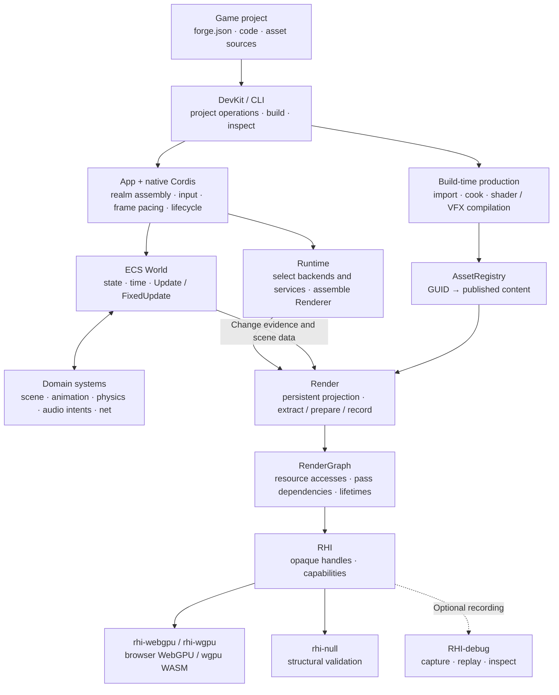
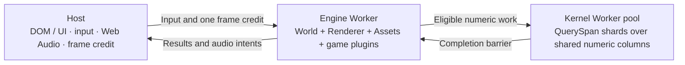
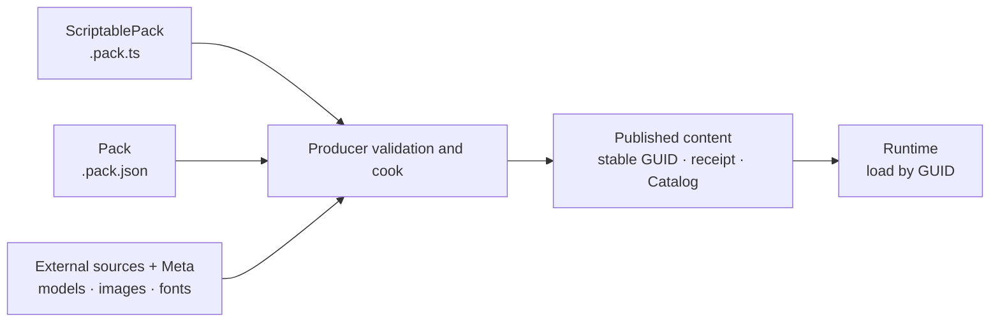

<!-- LANG-SWITCH -->
**Language**: **English** · [简体中文](README.zh-CN.md)

# ForgeaX Engine

**An AI-native game engine designed to maximize AI efficiency.**

ForgeaX is a TypeScript game engine with **AI agents as its primary users**. Data, lifecycles, APIs, and tools serve one goal: help AI understand the system, act precisely, inspect results, and repair failures.

> [!IMPORTANT]
> **Efficiency is the goal; design is the method.** Complete more verified game-development work with less context, fewer failed attempts, and shorter feedback cycles.

[AI efficiency](#ai-efficiency) · [Design principles](#design) · [Architecture](#architecture) · [Get started](#start) · [Explore](#explore)

<a id="ai-efficiency"></a>
## AI efficiency

Efficiency means **verified useful work**, accounting for diagnosis and rework, context, and tool round trips.

| Capability | How it improves AI efficiency |
|:--|:--|
| **Transparent rendering** | [RHI-debug](packages/rhi-debug/README.md) records and replays self-contained frames, exposing draw/dispatch work, bindings, resources, and pixels to locate incorrect inputs |
| **Transparent runtime logic and data** | [ECS](packages/ecs/README.md) makes components, queries, and schedules explicit; [Remote](packages/remote/README.md) queries live instances to locate failures from actual state |
| **Authorable, traceable assets** | [ScriptablePack / Pack](packages/pack/README.md) generate content in TypeScript or declare it in JSON; stable GUIDs connect sources and artifacts, with repair routed through the producer |
| **Reversible plugin changes** | [Native Cordis](packages/plugin/README.md) unifies dependencies, activation, and cleanup; failed configuration updates can restore the last working Fiber |
| **Measurable performance and results** | [Profiler](packages/profiler/README.md) provides bounded CPU captures and offline comparison; [Preview](packages/preview/README.md), browser captures, and project tests supply runtime evidence |
| **CLI-first operation** | [DevKit](packages/devkit/README.md) unifies `forgeax` discovery, JSON input/output, and persistent instances for repeatable, composable operations |
| **Context on demand** | [Skills](skills/), package contracts, and tool descriptions reveal only the knowledge needed for the task |
| **Structured failure and recovery** | [`Result` and closed error unions](packages/types/README.md) provide codes, expectations, hints, and details; capabilities, execution tiers, and recovery state are explicit |

> [!NOTE]
> Screenshots, structural checks, and real GPU execution answer different questions. CPU captures cannot substitute for GPU performance measurements.

<a id="design"></a>
## Design principles

**Compression is intelligence: reduce the concepts needed to understand local behavior.** Avoid duplicate state, extra lifecycles, and implicit branches.

| Design principle | How ForgeaX applies it |
|:--|:--|
| **AI is the primary user** | Prioritize discoverable, callable, verifiable machine contracts; AI usability takes precedence over human convention |
| **One source of truth** | World owns game state, Renderer owns render projections, and source assets plus Meta own author facts; other layers consume or derive |
| **Derive from declarations** | Material `paramSchema` derives layouts; RenderGraph derives dependencies and lifetimes from accesses; project declarations generate the Catalog |
| **Compose within domain boundaries** | Physics, rendering, assets, and audio own their execution data; plugins assemble capabilities and ECS schedules frame work |
| **Native lifecycle and unified cleanup** | Cordis `Context / Entry / Fiber` manage capability existence; `inject / provide / effect` express dependencies, services, and cleanup |
| **Explicit states and failures** | Closed unions, structured errors, and reported capability absence and fallback reduce hidden branches |
| **Prepare at build time, consume at runtime** | Import, WGSL composition and reflection, and VFX compilation produce published content for runtime loading |

See the [AI-first design axiom](AGENTS.md#design-axiom--compression--intelligence) and [module ownership map](AGENTS.md#module-design-map--cognitive-injection) for the full constraints.

<a id="architecture"></a>
## Architecture

**One authoritative World.** Runtime assembles services, Render maintains render projections, and build tools produce resources.


```mermaid
flowchart TB
    PROJECT["Game project<br/>forge.json · code · asset sources"]
    DEVKIT["DevKit / CLI<br/>project operations · build · inspect"]
    COOK["Build-time production<br/>import · cook · shader / VFX compilation"]
    ASSETS["AssetRegistry<br/>GUID → published content"]
    APP["App + native Cordis<br/>realm assembly · input · frame pacing · lifecycle"]
    WORLD["ECS World<br/>state · time · Update / FixedUpdate"]
    DOMAINS["Domain systems<br/>scene · animation · physics · audio intents · net"]
    RUNTIME["Runtime<br/>select backends and services · assemble Renderer"]
    RENDER["Render<br/>persistent projection · extract / prepare / record"]
    GRAPH["RenderGraph<br/>resource accesses · pass dependencies · lifetimes"]
    RHI["RHI<br/>opaque handles · capabilities"]
    GPU["rhi-webgpu / rhi-wgpu<br/>browser WebGPU / wgpu WASM"]
    NULL["rhi-null<br/>structural validation"]
    DEBUG["RHI-debug<br/>capture · replay · inspect"]
    PROJECT --> DEVKIT
    DEVKIT --> COOK
    COOK --> ASSETS
    DEVKIT --> APP
    APP --> WORLD
    APP --> RUNTIME
    WORLD <--> DOMAINS
    RUNTIME --> RENDER
    WORLD -->|"Change evidence and scene data"| RENDER
    ASSETS --> RENDER
    RENDER --> GRAPH
    GRAPH --> RHI
    RHI --> GPU
    RHI --> NULL
    RHI -.->|"Optional recording"| DEBUG
```

### Rendering and GPU

| Subsystem | Key design and responsibility | Read more |
|:--|:--|:--|
| **Render / RenderGraph** | Persistent CPU projection and capability-gated GPU Scene; programmable pipelines and RenderFeatures; derived dependencies, usages, and lifetimes with raster / compute / copy passes executed in declaration order | [Render](packages/render/README.md) · [RenderGraph](packages/render-graph/README.md) |
| **Shader / Material** | Schema-derived parameter and binding layouts; WGSL composition, Naga validation and reflection; runtime lookup of content-addressed compiled artifacts | [Shader](packages/shader/README.md) · [Compiler](packages/shader-compiler/README.md) |
| **GPU VFX** | GPU simulation and indirect rendering; code authoring and build-time compilation; particles, ribbons, trails, beams, billboards, and meshes | [VFX](packages/vfx/README.md) · [VFX render](packages/vfx-render/README.md) |
| **RHI / Backends** | Capability-gated operations across browser WebGPU, wgpu WASM, and null backends; a spec-aligned, math-free interface with opaque handles | [RHI](packages/rhi/README.md) · [wgpu](packages/rhi-wgpu/README.md) |

### ECS and multiple Workers

[ECS World](packages/ecs/README.md) owns entities, components, relationships, resources, and time. Systems declare access and scheduling in `Update` / `FixedUpdate`. [Scene](packages/scene/README.md) owns hierarchy and transforms; [State](packages/state/README.md) owns state-scoped entity lifetimes. Renderer consumes World changes into a persistent projection.


```mermaid
flowchart LR
    HOST["Host<br/>DOM / UI · input · Web Audio · frame credit"]
    ENGINE["Engine Worker<br/>World + Renderer + Assets + game plugins"]
    KERNEL["Kernel Worker pool<br/>QuerySpan shards over shared numeric columns"]
    HOST -->|"Input and one frame credit"| ENGINE
    ENGINE -->|"Results and audio intents"| HOST
    ENGINE -->|"Eligible numeric work"| KERNEL
    KERNEL -->|"Completion barrier"| ENGINE
```

| Execution tier | Placement | Constraints and scope |
|:--|:--|:--|
| `shared` | Engine Worker plus persistent Kernel Worker pool | Requires cross-origin isolation, SharedArrayBuffer, and related capabilities; only eligible numeric work runs in parallel |
| `engine-worker` | World, Renderer, assets, and game plugins in one Worker | Host retains DOM, input, and audio; requires Worker rendering capabilities |
| `main-serial` | World and Renderer on the main thread | The direct serial execution path |
| `auto` | Selects an available tier from capabilities | Reports the actual selection and reason; explicitly requesting an unavailable tier returns an error |

> [!NOTE]
> Multiple Workers preserve **one logical World** with serial structural changes, no live-object transfer, and no split RenderGraph. Partial shared writes require World rebuild. See [App execution](packages/app/README.md#execution-tiers) and the [multithreaded example](apps/hello/multithreaded-execution/README.md).

### Text and scripted assets

**Procedural generation and parameter reuse bring content into the code workflow.** AI can generate assets in batches, edit text directly, review diffs, and validate automatically.

| Authoring form | Purpose |
|:--|:--|
| **ScriptablePack · `.pack.ts`** | Generate asset collections with functions, loops, and composition; reuse scene and geometry logic |
| **Parameterized instances** | Independent package identity, parent source, and sparse overrides for reusable variants |
| **Pack · `.pack.json`** | Declare assets, references, and instance parameters for direct field editing and diff review |
| **Imported assets and sidecars** | External glTF / FBX / image sources and metadata share the identity and cooking path |


```mermaid
flowchart LR
    SCRIPT["ScriptablePack<br/>.pack.ts"]
    TEXT["Pack<br/>.pack.json"]
    IMPORT["External sources + Meta<br/>models · images · fonts"]
    COOK["Producer validation and cook"]
    PUBLISH["Published content<br/>stable GUID · receipt · Catalog"]
    RUNTIME["Runtime<br/>load by GUID"]
    SCRIPT --> COOK
    TEXT --> COOK
    IMPORT --> COOK
    COOK --> PUBLISH
    PUBLISH --> RUNTIME
```

> [!IMPORTANT]
> **Sources and artifacts are separate.** `.pack.ts` executes at build time; runtime loads cooked content by stable GUID. Textures, models, and audio can still use binary sources. Repair source inputs, then cook again. See the [Pack authoring contract](packages/pack/README.md).

### Game and engine plugins

Game and engine plugins share native Cordis dependencies, activation, updates, and disposal.

| Plugin layer | Typical responsibility | Composition |
|:--|:--|:--|
| Project assembly | Installed plugins, configuration, and realm placement | `forge.json.plugins[]` declares Entries; DevKit generates a static Catalog for native Loader activation |
| Engine plugins | Scene, input, physics, audio, and ECS capabilities | Native `inject / provide` declare dependencies and services; `effect` registers contributions and their inverses |
| Game plugins | Player movement, camera, game UI, and gameplay systems | The reference template combines children through `definePluginGroup` / `usePlugin` in `assets/plugin.ts` |

Effects unwind when their Fiber exits. ECS schedules frame work; plugin assembly stays outside hot paths. See the [plugin contract](packages/plugin/README.md) and [`game-3d` root plugin](templates/game-3d/assets/plugin.ts).

### Simulation and interaction

| Subsystem | Key design and responsibility | Read more |
|:--|:--|:--|
| **Networking** | Sessions own replication, ACKs, retries, baselines/deltas, and connection recovery; WebSocket supplies transport | [Net](packages/net/README.md) · [WebSocket](packages/net-websocket/README.md) |
| **Physics** | ECS physics contracts separated from Rapier 2D / 3D backends; input synchronization, simulation stepping, and state writeback | [Physics](packages/physics/README.md) |
| **Animation / Skinning** | Renderer-independent animation graphs, clips, and playback; Skin binding and joint-path resolution | [Animation](packages/animation/README.md) · [Skinning](packages/skinning/README.md) |
| **Runtime intelligence** | Optional provider-neutral Activity / Session; bounded output, cancellation, and polling; asynchronous services stay outside the ECS frame loop | [Intelligence](packages/intelligence/README.md) |
| **Input / UI / Audio** | Frozen frame-start input snapshots; Shadow DOM UI; realm-neutral audio intents played by Host Web Audio | [Input](packages/input/README.md) · [UI](packages/ui/README.md) · [Audio](packages/audio/README.md) |

<a id="start"></a>
## Get started

Install **`@forgeax/engine`**, use focused subpaths such as `/ecs` and `/app`, and operate through `forgeax`.

```bash
pnpm dlx @forgeax/engine project new my-game --template game-3d
cd my-game
pnpm exec forgeax help --tree --json
pnpm exec forgeax project check
pnpm exec forgeax dev start --headless false --json
```

`game-3d` is a third-person reference; `empty` is a minimal start. Read the generated README and skills. See [Engine](packages/engine/README.md) and the [CLI guide](skills/forgeax-engine-cli/SKILL.md).

<details>
<summary>Run and verify</summary>

```bash
pnpm exec forgeax dev status --json
pnpm exec forgeax dev capture --json
pnpm exec forgeax dev stop --json
pnpm exec forgeax project test
pnpm exec forgeax project package --format web-zip
```

Observations carry a `revision`; captures return PNG and report references. For entity lookup, camera control, and runtime identity constraints, see [persistent live control](packages/devkit/README.md#persistent-live-control).

</details>

<details>
<summary>Source and SDK</summary>

Toolchain versions are defined in [`.nvmrc`](.nvmrc), [`.pnpm-version`](.pnpm-version), and [`.bun-version`](.bun-version).

```bash
pnpm install
pnpm build:engine
pnpm test
```

| Scenario | Entry |
|:--|:--|
| Install the SDK | `pnpm dlx @forgeax/engine sdk install ./forgeax-sdk` |
| SDK `source/engine/` | Independent public source with `.forgeax-public-distribution` and prebuilt WASM; run the install/build commands above without private submodules |
| Full contributor checkout | Clone with `--recurse-submodules` for authorized private asset access; run `pnpm build` for the complete application fleet |
| Single demo iteration | `pnpm build:app hello/triangle`; broader acceptance follows the [Smoke gate](AGENTS.md#smoke-gate) |

The SDK includes built packages, templates, skills, and Engine source. See the [SDK guide](skills/forgeax-engine-sdk/SKILL.md) for release and acceptance contracts.

</details>

<a id="explore"></a>
## Explore

| Entry | Purpose |
|:--|:--|
| [AGENTS.md](AGENTS.md) | Design axioms, module ownership, errors, source-work rules, and verification constraints |
| [Packages](packages/) | Package READMEs defining APIs, lifecycles, and capability contracts |
| [Schemas](schemas/) / [CI guide](scripts/ci/README.md) | Machine-readable contracts and verification workflows |
| [Engine skills](skills/) | Task-oriented capability discovery and operating paths |
| [Apps](apps/) / [Templates](templates/) | Examples, regression scenarios, and game starting points |
| [Forbidden City showcase](apps/showcase/palace/README.md) | `pack.ts` architecture, lighting, and continuous CLI inspection; visual quality remains a work in progress |

> [!NOTE]
> This README has an [English canonical version](README.md) and a [Simplified Chinese mirror](README.zh-CN.md). Update both in the same commit. Linked package contracts define precise capabilities and limitations.

## License

[Apache-2.0](LICENSE).
