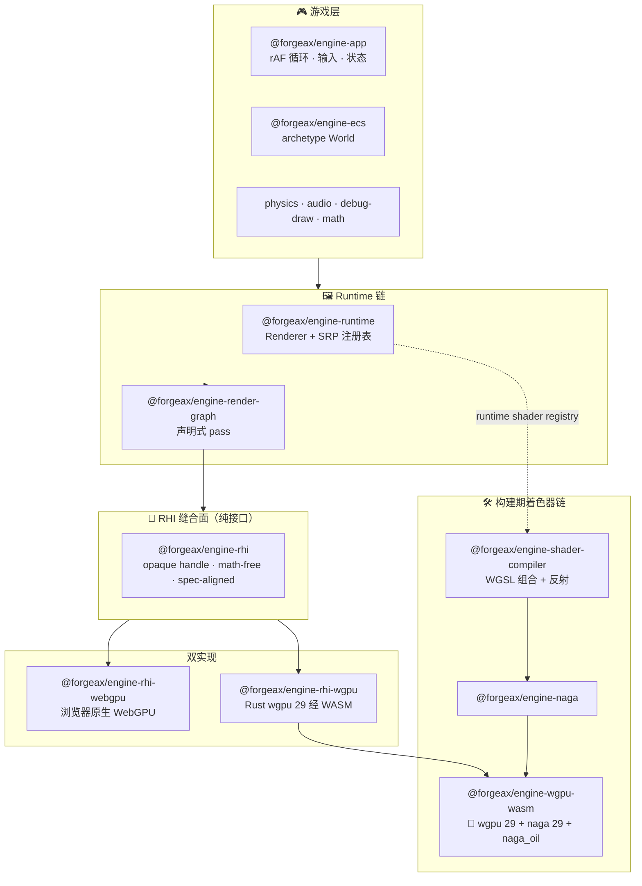
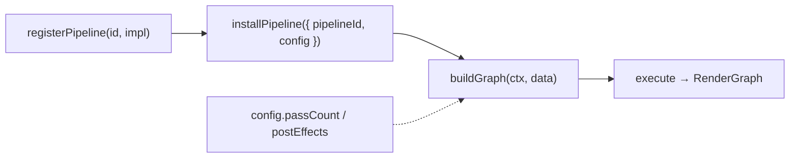

<!-- LANG-SWITCH -->
**Language**: **简体中文** · [English](README.md)

> [!IMPORTANT]
> README 维护两份语言版本（[`README.md`](README.md) 主版本 · [`README.zh-CN.md`](README.zh-CN.md) 镜像），**任何改动须同时同步两份**。

---

# forgeax-engine

[](./LICENSE)
[](./tsconfig.base.json)
[](./packages/rhi)
[](./packages/wgpu-wasm)
[](./AGENTS.md)
[](./packages)

> **AI-first TypeScript 游戏引擎，目标超越 Three.js。**

引擎的第一用户不是人类开发者——是 **AI agent**。每一处 API 都是可机读契约：schema 类型化、返回 `Result`、自描述。AI-friendly 与 human-friendly 冲突时，**AI 胜出**。详见 [AI 用户宪章](.claude/skills/forgeax-closed-loop/agents/ai-user-charter.md)。

---

## ✨ 为什么是 forgeax

- 🤖 **AI-first，而非事后改造** — 每个接口都是可机读契约（schema / manifest / 类型 union），AI 不读教程也能正确调用。
- 🧊 **原生 WebGPU，双份实现** — 一套 spec-aligned RHI，两个独立后端：浏览器原生 WebGPU 与编译为 WebAssembly 的 Rust `wgpu 29` 内核。
- 🦀 **Rust + WASM 着色器内核** — `wgpu 29 + naga 29 + naga_oil 0.22` 合并 wasm-bindgen crate，**单一 ~1.17 MB gzip 产物**。
- 🧩 **声明式 RenderGraph** — 资源 + pass 即数据，graph 自己管生命周期与 barrier 插入。告别手写 `beginRenderPass` 簿记。
- 🎬 **可编程渲染管线（SRP）** — 登记具名管线，用 config 驱动；引擎自带前向管线用的是它暴露给你的**同一套公开词汇**（真 dogfood）。
- 🖌️ **WGSL "ShaderLab" 组合** — Bevy 约定的 `#import namespace::path` 模块图、`#ifdef` 变体、16 个引擎内建可组合模块（PBR / IBL / tonemap）。
- 🎞️ **RenderDoc 思想的 RHI 调试器** — 录一帧到 tape，在全新 device 上确定性 replay，离线 inspect 每个 draw 的 bindings + render-target PNG。
- 🧮 **Archetype ECS** — SoA 列、声明式系统、延迟命令、关系、三层反射。
- ⚙️ **开箱即用** — Rapier 2D/3D 物理、Web Audio、glTF/FBX/image/font 导入、类型化状态机、immediate-mode 调试绘制、kubectl 式活体 inspector。
- 🛡️ **处处结构化失败** — `Result<T, E>` + 闭合 `.code` union + `.expected` / `.hint` / `.detail`；无意外抛错，无 `err.message.match()`。

## 设计宗旨

| 原则 | 含义 |
|---|---|
| **可机读 > 散文叙述** | API 通过 schema / manifest / 结构化类型自描述，AI 不读教程也能正确调用 |
| **显式失败 > 静默行为** | `Result<T, E>` + `.code` / `.expected` / `.hint`，禁止字符串传语义、禁止静默吞错 |
| **一致抽象 > 暴露实现** | 统一接口优先，性能 opt-in |
| **上下文经济** | API 表面积小、命名自解释、类型即文档 |

> 压缩即智能。度量不是代码行数，而是**读者理解任意一处代码所需持有的概念数**。详见 [`architecture-principles.md`](../forgeax-harness/rules/architecture-principles.md)。

---

## 🗺️ 架构总览

两条独立依赖链在 **RHI 缝合面** 交汇——那是每个后端都实现的纯接口。



---

## 🔬 特性详解

<details>
<summary><b>🧊 RHI — 纯渲染缝合面</b></summary>

一套按 `@webgpu/types` 塑形的 **spec-aligned、math-free 接口**，暴露 14 个 opaque handle 类型与 capability-gated 的 op-set（wgpu 超集）。它刻意**不含实现**，以便两个后端字节级共存：

| 后端 | 路径 | 运行于 |
|---|---|---|
| `rhi-webgpu` | 浏览器 `GPUDevice` 之上的薄 shim | 原生 WebGPU 浏览器 |
| `rhi-wgpu` | Rust `wgpu 29` WASM 内核之上的 TS 壳 | 任何跑 WASM 的地方 |
| `rhi-null` | headless no-op | 结构性单测（零 GPU/DOM） |

每次调用返回 `Result<T, RhiError>`；能力经 `device.caps` 查询，从不假设。
</details>

<details>
<summary><b>🦀 WASM — Rust wgpu + naga 单产物</b></summary>

`@forgeax/engine-wgpu-wasm` 是合并的 **`wgpu 29` + `naga 29` + `naga_oil 0.22`** wasm-bindgen crate。单一 `~1.17 MB gzip` 产物承载**两条独立 surface**：

- **RHI raw bindings**（`rhi.rs`）→ 14 opaque handle + 17 描述符 + queue/command-encoder 段，由 `rhi-wgpu` 包装。
- **着色器管线 bindings** → `parse` / `validate` / `emit_reflection` + `naga_oil::Composer`，由 `naga` + `shader-compiler` 包装。

AI 用户从不直接 import 它——上述两个 TS 薄壳才是公开面。
</details>

<details>
<summary><b>🧩 RenderGraph — 声明式帧</b></summary>

把*「打开 2000 行 record 文件、复制 texture lazy-alloc 模板、手写 `beginRenderPass` + bind group」*换成寥寥几条声明：

```ts
graph.addPass({ reads, writes, execute });
```

`compile()` 解析资源生命周期并**自动插入 barrier**；你的 `execute` 闭包是唯一自定义逻辑。本包是 RHI-pure 的——只依赖 `@forgeax/engine-rhi` + `@forgeax/engine-math`，绝不 import runtime。
</details>

<details>
<summary><b>🎬 SRP — 可编程渲染管线</b></summary>



同一 logic id + 不同 `config` → 不同 pass 拓扑。引擎自带前向管线 `forgeax::urp`（9-pass 链：shadow → skybox → main → 4× bloom → tonemap → fxaa）用的是它交给你的**同一套公开词汇**（`addScenePass` / `addShadowPass` / `addBloomPasses` / `addTonemapPass` …）。要写自定义管线，照着 dogfood 抄。
</details>

<details>
<summary><b>🖌️ 着色器创作 — WGSL "ShaderLab" 组合</b></summary>

你写自己的 `.wgsl`；引擎提供 **16 个可组合模块**（PBR BRDF、IBL、光照、tonemapping、helper）。组合遵循 Bevy 约定，Bevy 着色器片段可原样粘贴：

```wgsl
#import forgeax_pbr::brdf::{specular_ggx}
#import forgeax_view::common::{View}
```

构建期 `compileShader(source, options)` 是**纯函数**，返回 `Result<CompileResult, ShaderError>`——7 成员错误分类 + 类型化 `.detail`（import-not-found、DFS 预检的 circular-import …）。运行期材质经 `ShaderRegistry.registerMaterialShader` 登记，那是 wgsl 源码 + 参数 schema + binding layout 的唯一真源。
</details>

<details>
<summary><b>🎞️ RHI-debug — Web 引擎的 RenderDoc</b></summary>

record → replay → inspect，第一用户是 AI subagent（经 `WS:5732` JSON-RPC、CLI、直接 import 暴露）：

- **Record** 一帧 RHI 到自洽 tape。
- **Replay** 在全新 device 上确定性重放。
- **Inspect** 离线查：每个 draw 的 bindings、draw-call 参数、render-target PNG 回读——定位黑屏 / 错贴图 / 错 binding 症状。
</details>

---

## 📦 包家族

37 个包，统一前缀 `@forgeax/engine-`，AI 用户经 IDE 自动补全发现。

| 簇 | 包 | 角色 |
|:--|:--|:--|
| **RHI 缝合面** | `rhi` · `rhi-webgpu` · `rhi-wgpu` · `rhi-null` · `wgpu-wasm` | 纯接口 + 双实现 + headless + 🦀 WASM 内核 |
| **渲染** | `runtime` · `render-graph` · `shader` · `shader-compiler` · `naga` | Renderer、SRP、RenderGraph、WGSL 组合 + 反射 |
| **核心** | `ecs` · `app` · `input` · `math` · `types` · `state` · `plugin` | Archetype World、游戏循环、数学、`Result` SSOT、状态机 |
| **仿真** | `physics` · `physics-rapier2d` · `physics-rapier3d` · `audio` · `audio-webaudio` | Rapier 2D/3D、Web Audio |
| **资产** | `pack` · `import` · `gltf` · `fbx` · `image` · `font` · `engine-project` | GUID sidecar 管线、导入器、`forge.json` manifest |
| **工具** | `rhi-debug` · `debug-draw` · `remote` · `console` · `vite-plugin-*` | 帧调试器、活体 inspector、Vite 集成 |

> [!NOTE]
> 公共包统一前缀 `@forgeax/engine-`；裸 `@forgeax/engine` 是 placeholder——安装 **`@forgeax/engine-runtime`**。每个 `packages/<pkg>/README.md` 是其 API、错误码、能力门的 SSOT。

## 布局

| 路径 | 内容 |
|:--|:--|
| [`packages/`](packages/) | 引擎包（runtime / build-time 双链、RHI dual-impl、inspector、Rust wasm crate） |
| [`apps/`](apps/) | Demo / smoke / parity-bench 应用 |
| [`.forgeax-harness/knowledge-base/wiki/`](.forgeax-harness/knowledge-base/wiki/) | 设计基线（RHI / shader 策略、vs-threejs 路线 SSOT） |
| [`.claude/skills/`](.claude/skills/) | AI 协作 skill 集（charter + 闭环工作流） |
| [`.forgeax-harness/`](.forgeax-harness/) | 闭环工件（每个 feat/bug 的 plan / research / verify） |
| `forgeax-engine-assets/` | git submodule——二进制证据（private，工件旁挂仓） |

包级契约、错误 union、RHI 形态约束、度量登记、smoke gate、演进规则统一落在 [AGENTS.md](./AGENTS.md)。README 刻意保持精简。

---

## 🚀 快速开始

> [!IMPORTANT]
> 需要 **Node ≥ 22.13.0**、**pnpm ≥ 11.1.3**、**Bun ≥ 1.2.0**（SSOT：`.nvmrc` / `.pnpm-version` / `.bun-version`）。首次 clone 使用 `git clone --recurse-submodules <url>`。

```bash
pnpm install && pnpm build            # tsup (.mjs) + tsc -b (.d.ts)
pnpm test
pnpm dev                              # → http://localhost:5173
```

命令清单、smoke gate、Bun 管线、Rust toolchain 详见 [AGENTS.md §Commands](./AGENTS.md#commands)。

## License

Apache-2.0，完整文本见 [LICENSE](./LICENSE)。
