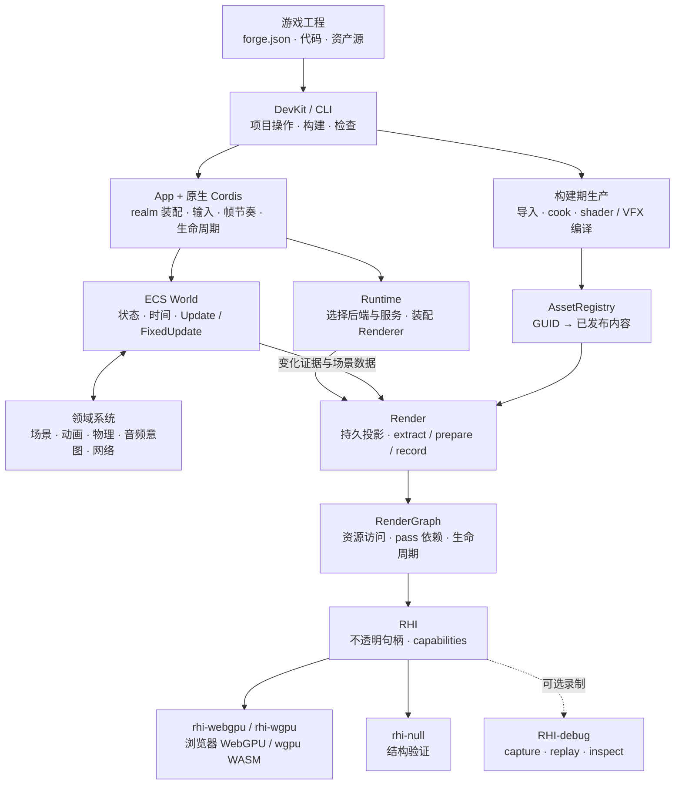
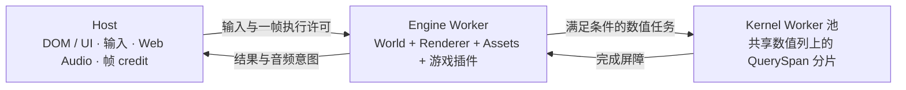
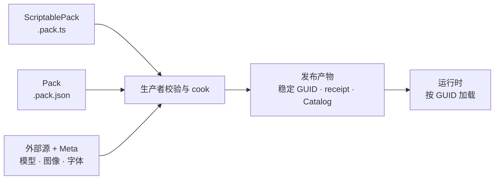

<!-- LANG-SWITCH -->
**Language**: **简体中文** · [English](README.md)

# ForgeaX Engine

**AI 原生：为最大化 AI 能效而设计的游戏引擎。**

ForgeaX 是以 **AI agent 为第一用户**的 TypeScript 游戏引擎。数据、生命周期、API 与工具围绕同一目标设计：让 AI 理解系统、准确操作、检查结果并完成修复。

> [!IMPORTANT]
> **能效是目标，设计是方法。** 让 AI 用更少上下文、更少试错和更短反馈时间，完成更多经过验证的游戏开发工作。

[AI 能效](#ai-efficiency) · [设计原则](#design) · [引擎架构](#architecture) · [开始使用](#start) · [深入阅读](#explore)

<a id="ai-efficiency"></a>
## AI 能效

能效关注**经过验证的结果**，同时考虑错误定位与返工、上下文和工具往返成本。

| 能力 | 如何提高 AI 能效 |
|:--|:--|
| **渲染透明** | [RHI-debug](packages/rhi-debug/README.md) 录制并重放自包含帧，检查 draw/dispatch、binding、资源与像素，定位异常输入 |
| **运行时逻辑与数据透明** | [ECS](packages/ecs/README.md) 显式描述组件、查询和调度；[Remote](packages/remote/README.md) 查询活实例，依据真实状态定位逻辑错误 |
| **资产可编写、可溯源** | [ScriptablePack / Pack](packages/pack/README.md) 以 TypeScript 生成或 JSON 声明内容；稳定 GUID 连接源与产物，修复沿 producer 返回源输入 |
| **插件变更可撤销** | [原生 Cordis](packages/plugin/README.md) 统一依赖、激活与清理；配置更新失败可回到上一个工作的 Fiber |
| **性能与结果可验证** | [Profiler](packages/profiler/README.md) 提供有界 CPU capture 与离线比较；[Preview](packages/preview/README.md)、浏览器截图和项目测试提供运行证据 |
| **CLI 优先操作** | [DevKit](packages/devkit/README.md) 统一 `forgeax` 命令发现、JSON 输入输出和持久实例，使操作可组合、可重复 |
| **按需获取上下文** | [Skills](skills/)、包契约与工具描述逐层展开，只加载当前任务需要的知识 |
| **结构化失败与恢复** | [`Result` 与闭合错误 union](packages/types/README.md) 提供 code、预期、提示与详情；能力、执行层级和恢复状态显式可查 |

> [!NOTE]
> 截图、结构检查和真实 GPU 执行回答不同问题；CPU capture 也不能替代 GPU 性能测量。

<a id="design"></a>
## 设计原则

**压缩即智能：减少理解局部行为所需的概念数。** 避免重复状态源、额外生命周期和隐式分支。

| 设计原则 | 在 ForgeaX 中的落实 |
|:--|:--|
| **AI 是第一用户** | 优先机器可发现、可调用、可验证的契约；与人类使用习惯冲突时，优先服务 AI |
| **单一事实来源** | World 拥有游戏状态，Renderer 拥有渲染投影，源资产与 Meta 拥有作者事实；其他层读取或推导 |
| **从声明推导，避免手动同步** | 材质 `paramSchema` 推导布局；RenderGraph 从访问声明推导资源依赖与生命周期；Catalog 从项目声明生成 |
| **组合能力，保持领域边界** | 物理、渲染、资产、音频各自拥有执行数据；插件负责装配，ECS 负责帧内逻辑 |
| **原生生命周期，统一撤销** | Cordis 的 `Context / Entry / Fiber` 管理能力存在性，`inject / provide / effect` 表达依赖、服务与清理 |
| **显式状态与失败** | 闭合 union、结构化错误、明确的能力缺失与 fallback 报告，减少隐藏分支 |
| **构建期准备，运行时消费** | 导入、WGSL 组合与反射、VFX 编译在构建期完成；运行时加载已发布内容 |

完整约束见 [AI-first 设计公理](AGENTS.md#design-axiom--compression--intelligence) 与 [模块职责地图](AGENTS.md#module-design-map--cognitive-injection)。

<a id="architecture"></a>
## 架构

**一个权威 World。** Runtime 装配服务，Render 维护渲染投影，构建工具生产资源。


```mermaid
flowchart TB
    PROJECT["游戏工程<br/>forge.json · 代码 · 资产源"]
    DEVKIT["DevKit / CLI<br/>项目操作 · 构建 · 检查"]
    COOK["构建期生产<br/>导入 · cook · shader / VFX 编译"]
    ASSETS["AssetRegistry<br/>GUID → 已发布内容"]
    APP["App + 原生 Cordis<br/>realm 装配 · 输入 · 帧节奏 · 生命周期"]
    WORLD["ECS World<br/>状态 · 时间 · Update / FixedUpdate"]
    DOMAINS["领域系统<br/>场景 · 动画 · 物理 · 音频意图 · 网络"]
    RUNTIME["Runtime<br/>选择后端与服务 · 装配 Renderer"]
    RENDER["Render<br/>持久投影 · extract / prepare / record"]
    GRAPH["RenderGraph<br/>资源访问 · pass 依赖 · 生命周期"]
    RHI["RHI<br/>不透明句柄 · capabilities"]
    GPU["rhi-webgpu / rhi-wgpu<br/>浏览器 WebGPU / wgpu WASM"]
    NULL["rhi-null<br/>结构验证"]
    DEBUG["RHI-debug<br/>capture · replay · inspect"]
    PROJECT --> DEVKIT
    DEVKIT --> COOK
    COOK --> ASSETS
    DEVKIT --> APP
    APP --> WORLD
    APP --> RUNTIME
    WORLD <--> DOMAINS
    RUNTIME --> RENDER
    WORLD -->|"变化证据与场景数据"| RENDER
    ASSETS --> RENDER
    RENDER --> GRAPH
    GRAPH --> RHI
    RHI --> GPU
    RHI --> NULL
    RHI -.->|"可选录制"| DEBUG
```

### 渲染与 GPU

| 子系统 | 关键设计与职责 | 深入阅读 |
|:--|:--|:--|
| **Render / RenderGraph** | 持久 CPU 投影与能力门控的 GPU Scene；可编程管线与 RenderFeature；图推导依赖、资源使用与生命周期，按声明顺序执行 raster / compute / copy pass | [Render](packages/render/README.md) · [RenderGraph](packages/render-graph/README.md) |
| **Shader / Material** | 材质 schema 推导参数和绑定布局；WGSL 组合、Naga 验证与反射；运行时查询内容寻址的已编译产物 | [Shader](packages/shader/README.md) · [Compiler](packages/shader-compiler/README.md) |
| **GPU VFX** | GPU 模拟与间接绘制；代码定义、构建期编译；粒子、ribbon、trail、beam、billboard 与 mesh 效果 | [VFX](packages/vfx/README.md) · [VFX render](packages/vfx-render/README.md) |
| **RHI / 后端** | 按 capability 统一浏览器 WebGPU、wgpu WASM 与 null 后端；接口规范对齐，采用不透明句柄且无数学依赖 | [RHI](packages/rhi/README.md) · [wgpu](packages/rhi-wgpu/README.md) |

### ECS 与多 Worker

[ECS World](packages/ecs/README.md) 统一管理实体、组件、关系、资源和时间；`Update` / `FixedUpdate` 系统声明访问与调度。[Scene](packages/scene/README.md) 管理层级与变换，[State](packages/state/README.md) 管理状态所属实体；Renderer 消费 World 变化，维护持久渲染投影。


```mermaid
flowchart LR
    HOST["Host<br/>DOM / UI · 输入 · Web Audio · 帧 credit"]
    ENGINE["Engine Worker<br/>World + Renderer + Assets + 游戏插件"]
    KERNEL["Kernel Worker 池<br/>共享数值列上的 QuerySpan 分片"]
    HOST -->|"输入与一帧执行许可"| ENGINE
    ENGINE -->|"结果与音频意图"| HOST
    ENGINE -->|"满足条件的数值任务"| KERNEL
    KERNEL -->|"完成屏障"| ENGINE
```

| 执行层级 | 放置方式 | 约束与适用边界 |
|:--|:--|:--|
| `shared` | Engine Worker 加持久 Kernel Worker 池 | 需要跨源隔离、SharedArrayBuffer 等能力；仅符合条件的数值任务并行 |
| `engine-worker` | World、Renderer、资产与游戏插件共置于一个 Worker | Host 保留 DOM、输入与音频；需要对应 Worker 渲染能力 |
| `main-serial` | World 与 Renderer 在主线程 | 最直接的串行执行路径 |
| `auto` | 根据能力选择可用层级 | 报告实际选择和原因；显式指定不可用层级则返回错误 |

> [!NOTE]
> 多 Worker 保持**一个逻辑 World**，结构变更串行，不传递活对象或拆分 RenderGraph；共享写入部分失败须重建 World。详见 [App 执行契约](packages/app/README.md#execution-tiers) 与 [多线程示例](apps/hello/multithreaded-execution/README.md)。

### 文本化与脚本化资产

**程序生成与参数复用，让内容创作进入代码工作流。** AI 能批量生成资产，也能直接编辑文本、审查 diff 和自动验证。

| 创作形式 | 用途 |
|:--|:--|
| **ScriptablePack · `.pack.ts`** | 用函数、循环与组合生成资产集合，复用场景和几何生成逻辑 |
| **参数化实例** | 独立包身份、父源与稀疏覆盖，复用定义生成变体 |
| **Pack · `.pack.json`** | 声明资产、引用与实例参数，直接编辑字段、审查差异 |
| **导入资产与 sidecar** | glTF / FBX / 图像等外部源与元数据，共享身份和 cook 路径 |


```mermaid
flowchart LR
    SCRIPT["ScriptablePack<br/>.pack.ts"]
    TEXT["Pack<br/>.pack.json"]
    IMPORT["外部源 + Meta<br/>模型 · 图像 · 字体"]
    COOK["生产者校验与 cook"]
    PUBLISH["发布产物<br/>稳定 GUID · receipt · Catalog"]
    RUNTIME["运行时<br/>按 GUID 加载"]
    SCRIPT --> COOK
    TEXT --> COOK
    IMPORT --> COOK
    COOK --> PUBLISH
    PUBLISH --> RUNTIME
```

> [!IMPORTANT]
> **源与产物分离。** `.pack.ts` 在构建期执行，运行时按稳定 GUID 加载 cook 产物；纹理、模型、音频仍可使用二进制源。修复回到源输入，再重新 cook。详见 [Pack 创作契约](packages/pack/README.md)。

### 游戏插件与引擎插件

游戏插件与引擎插件共享原生 Cordis 的依赖、激活、更新与退出机制。

| 插件层次 | 典型职责 | 组合方式 |
|:--|:--|:--|
| 项目装配 | 选择安装哪些插件、配置与所在 realm | `forge.json.plugins[]` 声明 Entry；DevKit 生成静态 Catalog，由原生 Loader 激活 |
| 引擎插件 | 场景、输入、物理、音频等服务与 ECS 能力 | 原生 `inject / provide` 声明依赖与服务，通过 `effect` 注册贡献及其逆操作 |
| 游戏插件 | 角色移动、镜头、游戏 UI 与玩法系统 | 参考模板在 `assets/plugin.ts` 用 `definePluginGroup` / `usePlugin` 组合子插件 |

`effect` 的逆操作随 Fiber 退出执行；帧内逻辑由 ECS 调度，插件装配不进入热路径。参考 [插件契约](packages/plugin/README.md) 与 [`game-3d` 根插件](templates/game-3d/assets/plugin.ts)。

### 模拟与交互

| 子系统 | 关键设计与职责 | 深入阅读 |
|:--|:--|:--|
| **网络** | Session 拥有复制、ACK、重试、baseline / delta 与连接恢复；WebSocket 只提供传输 | [Net](packages/net/README.md) · [WebSocket](packages/net-websocket/README.md) |
| **物理** | ECS 物理契约与 Rapier 2D / 3D 后端分离；同步输入、推进模拟、写回状态 | [Physics](packages/physics/README.md) |
| **动画 / 蒙皮** | 动画图、clip 与播放系统独立于 Renderer；Skin 负责骨骼绑定与关节路径解析 | [Animation](packages/animation/README.md) · [Skinning](packages/skinning/README.md) |
| **运行时智能服务** | 可选的 provider 无关 Activity / Session；有界输出、取消与轮询；异步服务不阻塞 ECS 帧循环 | [Intelligence](packages/intelligence/README.md) |
| **输入 / UI / 音频** | 帧起点冻结输入快照；Shadow DOM UI；realm 无关的音频意图交给 Host Web Audio 播放 | [Input](packages/input/README.md) · [UI](packages/ui/README.md) · [Audio](packages/audio/README.md) |

<a id="start"></a>
## 开始使用

安装 **`@forgeax/engine`**，通过 `/ecs`、`/app` 等子路径使用聚焦能力，统一命令为 `forgeax`。

```bash
pnpm dlx @forgeax/engine project new my-game --template game-3d
cd my-game
pnpm exec forgeax help --tree --json
pnpm exec forgeax project check
pnpm exec forgeax dev start --headless false --json
```

`game-3d` 是第三人称参考工程，`empty` 是最小起点。先读生成的 README 与技能；操作入口见 [Engine](packages/engine/README.md) 与 [CLI 使用指南](skills/forgeax-engine-cli/SKILL.md)。

<details>
<summary>运行与验证</summary>

```bash
pnpm exec forgeax dev status --json
pnpm exec forgeax dev capture --json
pnpm exec forgeax dev stop --json
pnpm exec forgeax project test
pnpm exec forgeax project package --format web-zip
```

观察结果携带 `revision`，截图返回 PNG 与报告引用。实体查找、摄像机控制和实例身份约束见 [持久运行实例](packages/devkit/README.md#persistent-live-control)。

</details>

<details>
<summary>源码与 SDK</summary>

工具链版本以 [`.nvmrc`](.nvmrc)、[`.pnpm-version`](.pnpm-version)、[`.bun-version`](.bun-version) 为准。

```bash
pnpm install
pnpm build:engine
pnpm test
```

| 场景 | 入口 |
|:--|:--|
| 获取 SDK | `pnpm dlx @forgeax/engine sdk install ./forgeax-sdk` |
| SDK 的 `source/engine/` | 独立公开源码面，带 `.forgeax-public-distribution` 标记与预构建 WASM；运行上述 install / build，无需私有子模块 |
| 完整贡献者 checkout | 首次 clone 使用 `--recurse-submodules` 获取有权限访问的私有资产；完整应用构建运行 `pnpm build` |
| 单个示例迭代 | `pnpm build:app hello/triangle`；更大范围验收遵循 [Smoke gate](AGENTS.md#smoke-gate) |

SDK 包含构建产物、模板、技能与 Engine 源码。详见 [SDK 指南](skills/forgeax-engine-sdk/SKILL.md)。

</details>

<a id="explore"></a>
## 深入阅读

| 入口 | 用途 |
|:--|:--|
| [AGENTS.md](AGENTS.md) | 设计公理、模块职责、错误模型、源码工作与验证约束 |
| [Packages](packages/) | 各包 README 的 API、生命周期与能力契约 |
| [Schemas](schemas/) / [CI 指南](scripts/ci/README.md) | 机器可读契约与验证流程 |
| [Engine skills](skills/) | 按任务发现引擎能力与操作路径 |
| [Apps](apps/) / [Templates](templates/) | 示例、回归场景与游戏起点 |
| [故宫建筑示例](apps/showcase/palace/README.md) | `pack.ts` 建筑、灯光和持续 CLI 观察示例；视觉效果仍在迭代 |

> [!NOTE]
> 本 README 维护[英文主版本](README.md)与[简体中文镜像](README.zh-CN.md)，内容变更须在同一提交中同步。具体能力和限制以链接的包契约为准。

## License

[Apache-2.0](LICENSE).
