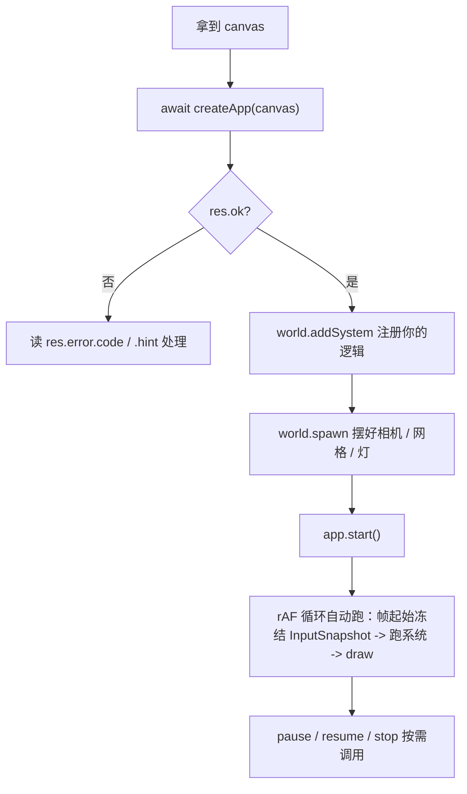

# forgeax-engine-app

> 基线: [`5c8c90f1`](../../commit/5c8c90f1) (2026-06-03) · 同步至: [`358592eb`](../../commit/358592eb) (2026-06-09)

> 把"一块 canvas"变成"一个在跑的游戏"。引导 + 主循环 + 输入，三件事一个 skill。聚合 `@forgeax/engine-app` · `@forgeax/engine-input` · `@forgeax/engine-runtime`（引导面）。

## 心智模型

两个引导入口：

| 入口 | 给你 | 谁驱动循环 |
|:--|:--|:--|
| `createApp(canvas, opts?, bundler?)` | `App`——rAF 循环 / dt 钳制 / 输入 attach / 错误 fan-out 已接好 | 引擎 |
| `createRenderer(canvas, opts?, bundler?)` | `Renderer`——只渲染 | 你自己拿 rAF 调 `draw(world)` |

绝大多数游戏从 `createApp` 起步。`App` 是状态机：`start → (pause ⇄ resume) → stop`。输入不轮询——引擎在**帧起始**冻结成只读 `InputSnapshot` 资源，系统在 `world` 里读它。

参数面分三层：`canvas`（必选）/ `opts?: CreateAppOptions`（app 行为：`input` / `audio` / `physics` / `maxDt`）/ `bundler?: BundlerOptions`（构建层：`shaderManifestUrl` + `importTransport`）。`clearColor` 不在参数里——已搬到 `Camera.clearR/G/B/A`：渲染表现归 `Camera`，构建通道归 `bundler`，app 行为归 `opts`，三关注面分离。

## 核心 API 速查

| 入口 | 形态 | 用途 |
|:--|:--|:--|
| `createApp(canvas, opts?, bundler?)` | `async => Result<App, CanvasAppError>` | 一行起飞：自动装配 Renderer + World + input + rAF 循环。第三参数 `bundler` 携带构建层注入（`shaderManifestUrl` + `importTransport`），典型传 `forgeaxBundlerAdapter()` |
| `createApp({ renderer, world, input?, audio?, physics?, ... })` | `async => Result<App, AssembleAppError>` | assemble 形态：显式注入已有 Renderer / World（参见 `packages/app/README.md` §Assemble form） |
| `createRenderer(canvas, opts?, bundler?)` | `async => Renderer` | 低层：只要渲染器，自己驱动循环（失败 throw `EngineEnvironmentError`） |
| `Engine.create(canvas, opts?, bundler?)` | `createRenderer` 的命名空间别名 | 与 `createRenderer` 同一函数，喜欢 `Engine.create({...})` 写法时用 |
| `forgeaxBundlerAdapter()` | `() => BundlerOptions` | 由 `virtual:forgeax/bundler` 虚拟模块导出，标准第三参数——聚合 `shaderManifestUrl` + `importTransport` |
| `App.start() / stop() / pause() / resume()` | `() => Result<void, AppError>` | 主循环状态机；返回结构化 `Result` |
| `world.getResource<InputSnapshot>('InputSnapshot')` | `=> InputSnapshot` | 在系统里取帧起始输入快照 |
| `createInputSnapshot()` | `() => InputSnapshot` | headless 测试 / 预启动的空快照（held/edge 全 `false`） |

> [!IMPORTANT]
> `createApp` / `createRenderer` / `Engine.create` 都接受三个位置参数 `(canvas, opts?, bundler?)`。`createApp` 走 `Result`（查 `.ok`），`createRenderer` / `Engine.create` 在拿不到后端时 throw `EngineEnvironmentError`（`try/catch`）。别混。

## 规范调用顺序



## idiom 代码骨架

```ts
import { createApp } from '@forgeax/engine-app';
import { forgeaxBundlerAdapter } from 'virtual:forgeax/bundler';
import type { InputSnapshot } from '@forgeax/engine-input';

const res = await createApp(canvas, {}, forgeaxBundlerAdapter());
if (!res.ok) {
  console.error(res.error.code, res.error.hint);
  throw new Error(res.error.code);
}
const app = res.value;
const world = app.world;

// Per-frame clear color 在 Camera 组件上，不在 createApp 参数里
world.spawn(
  new Camera({
    clearR: 0.1, clearG: 0.1, clearB: 0.1, clearA: 1.0,
    // ... projection + transform 字段
  })
);

world.addSystem({
  name: 'move-player',
  queries: [{ with: [Transform] }],
  fn: (queryResults) => {
    const input = world.getResource<InputSnapshot>('InputSnapshot');
    const dx = (input.keyboard.down('d') ? 1 : 0) - (input.keyboard.down('a') ? 1 : 0);
    for (const bundle of queryResults[0]) {
      const xs = bundle.Transform.posX;
      for (let i = 0; i < bundle.entityCount; i++) xs[i] = (xs[i] ?? 0) + dx;
    }
  },
});

app.start();   // arms the rAF loop
// app.pause(); app.resume(); app.stop();
```

`InputSnapshot` 表面（4 方法）：`keyboard.down(key)` / `keyboard.up(key)`（上一帧释放的 up-edge）/ `mouse.button(0|1|2)` / `mouse.movementDelta` + `mouse.wheelDelta`。未按下的键返回 `false`，不 throw（charter P3：空信号即信号）。

## 踩坑

- **canvas 起飞失败别吞**：`createApp` 失败回 `Result`，`res.error` 带结构化 `.code` / `.hint`；按属性消费，别 `String(err)` 解析。后端拿不到时是 `createRenderer` throw `EngineEnvironmentError`，不是 `Result`。
- **预启动读 InputSnapshot 全 false 是预期**：`app.start()` 之前 / headless 下，held-key 与 edge 都报 `false` / `0`，不是 bug——空信号本身是信号。
- **`clearColor` 不在 `createApp` 参数里**：已搬到 `Camera` 组件的 `clearR/G/B/A` 字段（`packages/runtime/README.md` §Camera clear color）。零 Camera 场景 fallback 为 `[0,0,0,1]`。
- **`shaderManifestUrl` 不在 `opts` 里**：已搬到第三参数 `BundlerOptions`。零配置场景省略第三参数即可（引擎 fallback `'/shaders/manifest.json'`）；显式注入用 `forgeaxBundlerAdapter()`（`virtual:forgeax/bundler`）。
- **内置网格不需要 `registerWithGuid`**：`cube` / `triangle` / `quad` / `sphere` 四种内置网格的 GUID→handle 映射已在 `AssetRegistry` 构造时预注册（Tier 0, feat-20260604）。手动再 `registerWithGuid` 会抛 GUID 碰撞错误。自定义资产仍需显式注册。
- **渲染 / 循环类症状**（白屏、demo 不动、CI 断言全过却 exit 1）先查 [`forgeax-engine-debug`](../forgeax-engine-debug/SKILL.md) 的症状索引，再回溯引擎层；别在 app 里塞手动 rAF mutation 绕过。

## 深入

- 引导 / 主循环状态机 / AppError 5 成员 / onError fan-out：见 `packages/app/README.md` §One-screen takeoff · §AppError 5-member closed union · §onError multi-listener；源码 SSOT `packages/app/src/create-app.ts` + `packages/app/src/errors.ts`
- 低层渲染器 / `Renderer.draw` / `Renderer.ready` 屏障：见 `packages/runtime/README.md` §API 索引；源码 `packages/runtime/src/createRenderer.ts`
- 输入 4 步 recipe / 形态铁律 / PointerLock 后端：见 `packages/input/README.md` §4 步 recipe · §4 方法表面；源码 `packages/input/src/input-snapshot.ts`
- 蒙皮 / 动画 4 步 recipe（`createApp` + `configurePackIndex` + `loadByGuid<SceneAsset>` + 多实例 instantiate + 每实例独立 `AnimationPlayer`）：参考 `apps/hello/skin/src/main.ts`；底层 SkinAsset / SkeletonAsset / AnimationClip POD 由 gltfImporter 自动 emit，bridge 自动挂 `Skin` 组件；多实例关节隔离由 postSpawnResolveJoints 子树作用域兜底

## AnimationPlayer：N-way SoA 槽位 + 用户每帧驱权重

> [!IMPORTANT]
> AnimationPlayer 是 **schema-as-state** 组件：6 字段、4 槽并行、零 helper 方法。所有播放控制（硬切 / 交叉淡化 / 同重多 clip）都靠 `world.set(entity, AnimationPlayer, { ... })` 写字段达成；引擎不烤曲线、不自动归零、不维护播放栈——**由用户在游戏循环里每帧驱动 weights[i]**。

### 6 字段 schema（SoA inline arrays，arity=4）

| 字段 | 类型 | 默认 | 含义 |
|:--|:--|:--|:--|
| `clips` | `array<handle<AnimationClip>, 4>` | 全 0（4 槽全 invalid） | 每槽指向一条 AnimationClip；handle id=0 = invalid，**该槽被引擎跳过**（不解析、不调 resolver、不 warn） |
| `times` | `array<f32, 4>` | 全 0 | 每槽的当前播放时刻（秒），引擎按 `times[i] += dt * speeds[i]` 推进 |
| `weights` | `array<f32, 4>` | 全 0 | 每槽的混合权重；引擎做 `Σ(w_i · sample_i) / Σ(w_i)` 加权归一化（per-channel）；w<0 入口 clamp 但不写回 |
| `speeds` | `array<f32, 4>` | 全 0 | 每槽播放速度倍率；**spawn 时不显式填则槽不推进**——这是 §约定，不是 bug |
| `paused` | `bool` | `false` | 整组件暂停；`true` 时不推进 `times` 也不写 Transform |
| `looping` | `bool` | `true` | 沿 clip duration 取模；`false` 时超过 duration 后 `times[i]` 钳在 duration |

> 物理形态由 `defineComponent` SSOT 约束（`packages/runtime/src/components/animation-player.ts`）：`clips` 以 `Uint32Array(4)` 列，`times/weights/speeds` 以 `Float32Array(4)` 列。读组件用 `world.get(ent, AnimationPlayer)` 拿到的就是这五条 typed array + 两个 bool 的 column view。

### invalid handle (id=0) 跳过语义

| 行为 | 详细 |
|:--|:--|
| spawn 默认 = 全 invalid | 不传 `clips` 字段时 4 槽 handle 全为 0；`advanceAnimationPlayer` 每帧早返（无任何 `world.set Transform` 写）——**这是合理静态体**，不是错误 |
| 单槽硬切 | `clips=[h, 0, 0, 0]`、`weights=[1, 0, 0, 0]`：仅槽 0 生效，等价旧 single-clip 路径 |
| 槽 i invalid 但 `weights[i] > 0` | 引擎跳过该槽采样，权重也不计入归一化分母——视觉等价 weights[i]=0 |
| `speeds[i]` 默认 0 | spawn 不传 `speeds` 则即使 clips 有效也 `times` 不推进；用户责任：spawn 时与 clips 同步显式写 `speeds: new Float32Array([1,1,1,1])` |

### Spawn-then-update 范式

**硬切单 clip（按键 1/2/3 风格）**：

```ts
// 在 world.addSystem 内每帧（或 press-edge 触发）
world.set(playerEnt, AnimationPlayer, {
  clips:   [walkH, 0 as ClipHandle, 0 as ClipHandle, 0 as ClipHandle],
  times:   new Float32Array([0, 0, 0, 0]),
  weights: new Float32Array([1, 0, 0, 0]),
});
```

**交叉淡化（按键 4 风格 — 0.3s Walk → Run 线性 crossfade）**：

```ts
// 按下 4 时记录 startTime，预填 clips
let crossfadeStart: number | null = null;
const FADE = 0.3;

// press-edge：
crossfadeStart = performance.now() / 1000;
world.set(playerEnt, AnimationPlayer, {
  clips:   [walkH, runH, 0 as ClipHandle, 0 as ClipHandle],
  times:   new Float32Array([0, 0, 0, 0]),
  weights: new Float32Array([1, 0, 0, 0]),
});

// 每帧（在 driver 系统里）：
if (crossfadeStart !== null) {
  const t = Math.min(1, (performance.now() / 1000 - crossfadeStart) / FADE);
  world.set(playerEnt, AnimationPlayer, {
    weights: new Float32Array([1 - t, t, 0, 0]),
  });
  if (t >= 1) crossfadeStart = null;
}
```

**3-way 同重稳态（按键 5 风格）**：

```ts
const third = 1 / 3;
world.set(playerEnt, AnimationPlayer, {
  clips:   [surveyH, walkH, runH, 0 as ClipHandle],
  times:   new Float32Array([0, 0, 0, 0]),
  weights: new Float32Array([third, third, third, 0]),
});
// 一次写入即稳态——引擎每帧自动推 times、加权混合，无需后续 update
```

**活范例**：`apps/hello/skin/src/main.ts` —— 五条按键路径（1/2/3 硬切 + 4 crossfade + 5 3-way + Space pause）端到端覆盖；按系统名一眼分辨：`skin-clip-toggle` = 硬切，`skin-blend-driver` = 软切。

### 引擎边界（用户责任清单）

| 引擎 **不**做 | 用户 **必须**做 |
|:--|:--|
| 不烤曲线 / 不缓存采样结果——每帧重采样 clip channel | 每帧或 press-edge 写 `weights[i]` 跑业务循环（淡化 / 切换） |
| 不自动归零 weights——结束 crossfade 后引擎不会把过渡槽 weight 自动收回 0 | crossfade 结束时显式写 `weights=[0,1,0,0]`（settle）或 `weights=[1,0,0,0]`（回硬切） |
| 不推 paused 期间的 times | 用户切 `paused: true / false` 控制；paused 期间 weights 修改也不立即生效 |
| 不维护"上次播放的 clip 栈"——状态全在 `clips/times/weights/speeds` 里 | 自己保留语义上的 `currentMode` / `prevClip`（demo 在闭包 `let currentMode` 落地） |
| 不分配新累加器 / 不 emit per-channel `world.set Transform` | 引擎按 entity 单次 `world.set(jointEnt, Transform, fullPose)`，N 个 channel 不再放大写次数 |

### 深入

- 6 字段 schema 全表 + 默认值规则：`packages/runtime/src/components/animation-player.ts`（SSOT）
- 两阶段管线（queryRun → 累加器 → 单次 `world.set`）+ per-channel 加权归一化数学：`packages/runtime/src/systems/advance-animation-player.ts` + 单测 `packages/runtime/src/__tests__/systems.unit.test.ts`
- dev-mode warn 节流形态（once-per-(entity, channelKey, reason)，导出 `__resetAnimationWarnsForTests` `@internal`）：源码同上文件顶部 + 单测 anchor `'warn-throttle once-per-(entity,channelKey,reason)'`
