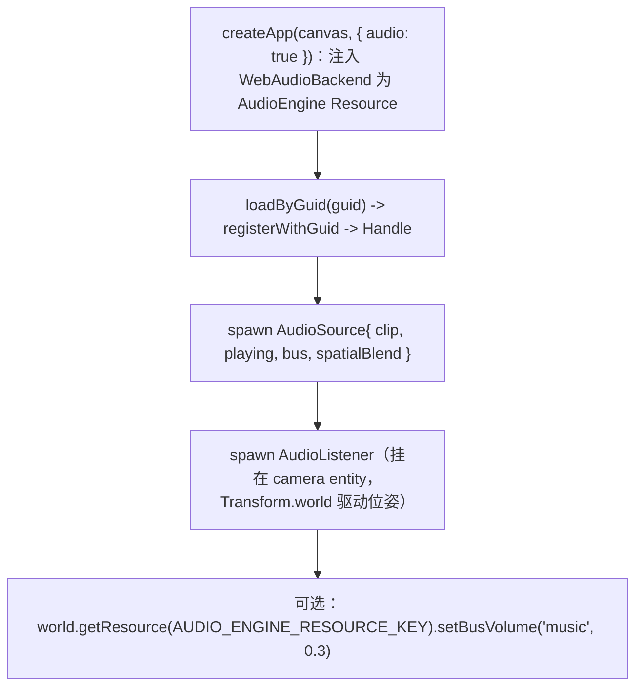

# forgeax-engine-audio

> **音频 = 给 entity 挂 `AudioSource`，把 `playing` 从 false 翻到 true 就出声**。`@forgeax/engine-audio` 是**接口层**：定义 ECS 组件（`AudioSource` / `AudioListener`）、`AudioBackend` 协议、固定两段 bus 拓扑（`sfx` + `music` -> Master）、`AudioError` 族。实现是 `@forgeax/engine-audio-webaudio`（Web Audio API 浏览器后端：AudioContext 生命周期 + bus 拓扑 + tick 系统 + clip loader）。开音频只需 `createApp(canvas, { audio: true })`——它建一个 `WebAudioBackend` 并注册为 `AudioEngine` World Resource。3D 空间音靠 `AudioSource.spatialBlend: 1` + 一个 `AudioListener`（其 `Transform.world` 世界矩阵每帧驱动 Web Audio 监听者位姿）。聚合 `@forgeax/engine-audio`（接口）+ `@forgeax/engine-audio-webaudio`（后端）。

## 心智模型

三层渐进式（charter P1）：

1. **立即播放**：spawn 一个 `AudioSource`，`playing: true`。`playing` 是**边沿检测**——false->true 起播，true->false 停。
2. **混音**：经 `AudioEngine` Resource（即注入的 `AudioBackend`）调 `setBusVolume` / `setBusMute`，作用于 `sfx` / `music` 两条固定 bus。
3. **3D 空间音**：`AudioSource.spatialBlend: 1`（PannerNode）+ 给监听 entity 挂 `AudioListener` 标记组件。World 里**只有第一个** `AudioListener` entity 被每帧同步，sync 系统读它的 `Transform.world` mat4（16 float 列主序）驱动 Web Audio listener 位姿。

`AudioBackend` 是协议接口，`createApp({ audio: true })` 注入 `WebAudioBackend` 实现并存为 `AudioEngine` Resource（key 常量 `AUDIO_ENGINE_RESOURCE_KEY`）。clip 经资产系统 `loadByGuid` / `registerWithGuid` 拿到 `Handle<'AudioClipAsset','unmanaged'>` 再装到 `AudioSource.clip`。

## 核心 API / 组件速查

| 名字 | 来源包 | 形态 | 用途 |
|:--|:--|:--|:--|
| `AudioSource` | audio | 组件（6 字段） | `clip` / `playing`(边沿) / `loop` / `volume` / `spatialBlend` / `bus` |
| `AudioListener` | audio | 组件（marker） | 挂在监听 entity；其 `Transform.world` 驱动 listener 位姿；只第一个生效 |
| `AudioBackend` | audio | 协议接口 | `setVolume` / `setBusVolume` / `setBusMute` / `getState` |
| `AUDIO_ENGINE_RESOURCE_KEY` | audio | 常量（`'AudioEngine'`） | 取 backend Resource 的 key |
| `BusName` | audio | `'sfx' \| 'music'` | 固定两段 bus 名 |
| `AudioClipAsset` | audio（types SSOT） | POD | 音频 clip 资产；`loadByGuid<AudioClipAsset>` 取 |
| `WebAudioEngine` / `createWebAudioBackend` | audio-webaudio | class / fn | Web Audio 后端实现（`createApp` 内部建） |
| `AudioErrorCode` | audio（types SSOT） | 闭集 union（勿抄） | 结构化失败码 |

> [!IMPORTANT]
> `playing` 是**边沿触发**不是电平——要重播一次性音必须先写回 false 再翻 true（re-arm）。`AudioListener` 是无字段 marker，靠它所在 entity 的 `Transform.world` 取位姿（不要找 `GlobalTransform`，已删）。`AudioErrorCode` 全集 + `.code/.expected/.hint/.detail` 结构见 `packages/audio/README.md` §Error model + `packages/types/src/index.ts`，**勿抄**。

## 规范调用顺序



## idiom 代码骨架

```ts
import { createApp } from '@forgeax/engine-app';
import { AUDIO_ENGINE_RESOURCE_KEY, AudioListener, AudioSource } from '@forgeax/engine-audio';
import type { AudioBackend, AudioClipAsset } from '@forgeax/engine-audio';
import { Camera, MeshFilter, MeshRenderer, Transform, HANDLE_CUBE } from '@forgeax/engine-runtime';

const app = await createApp(canvas, { audio: true });
const world = app.world;
const assets = app.renderer.assets;
if (assets === null) throw new Error('backend not initialized');

// 1) load a clip by GUID -> Handle (async, Result)
const clipRes = await assets.loadByGuid<AudioClipAsset>(bgmGuid);
if (!clipRes.ok) throw new Error(clipRes.error.code);

// 2) spawn an emitter; playing:false->true edge starts playback
world
  .spawn(
    { component: Transform, data: { posX: 0, posY: 0, posZ: 0 } },
    { component: MeshFilter, data: { assetHandle: HANDLE_CUBE } },
    { component: MeshRenderer, data: {} },
    { component: AudioSource, data: { clip: clipRes.value, playing: true, loop: true, volume: 0.8, bus: 'music' } },
  )
  .unwrap();

// 3) listener on the camera entity (its Transform.world drives listener pose)
world.spawn(
  { component: Transform, data: {} },
  { component: Camera, data: {} },
  { component: AudioListener, data: {} },
);

// 4) bus mix via the AudioEngine Resource
const audioBackend = world.getResource<AudioBackend>(AUDIO_ENGINE_RESOURCE_KEY);
audioBackend.setBusVolume('music', 0.3);

app.start();
```

## 踩坑

- **`playing: true` 但没声**：(a) `playing` 是边沿——若一开始就 true 且从未翻过 false 可能错过沿；一次性音需 re-arm（true->false->true）。(b) AudioContext 被浏览器 suspend，必须在用户手势（click/keydown）后才能 resume（错误码 `context-suspended`）。
- **3D 音不空间化**：`spatialBlend` 默认 0（2D，直连 bus）；要 PannerNode 空间化必须设 1，且 World 里要有 `AudioListener`。
- **多个 `AudioListener` 只有一个生效**：sync 系统只同步 World 中第一个 `AudioListener` entity 的 `Transform.world`。
- **bus 名写错**：只有 `'sfx'` / `'music'` 两条（固定拓扑，不支持自定义 bus），越界报 `bus-not-found`。
- **clip handle 悬空**：把 GUID 字符串直接塞 `clip` 而非 `loadByGuid` 解析后的 `Handle`，报 `invalid-clip-handle`。资产链路见 [`forgeax-engine-assets`](../forgeax-engine-assets/SKILL.md)。

## 深入

- 3-symbol core surface / 最小 BGM 播放 / bus 控制示例：见 `packages/audio/README.md` §Minimal BGM playback / §Bus control via AudioEngine Resource
- `AudioSource` 6 字段 / `AudioListener` marker schema：见 `packages/audio/README.md` §ECS component schema
- `AudioBackend` 协议（`setVolume` / `setBusVolume` / `setBusMute` / `getState`）：源码 `packages/audio/src/audio-backend.ts`
- Web Audio 后端实现（AudioContext 生命周期 / bus 拓扑 / tick 系统）：源码 `packages/audio-webaudio/src/web-audio-engine.ts`
- 监听者世界矩阵同步（`Transform.world` mat4 -> Web Audio listener）：源码 `packages/audio-webaudio/src/audio-listener-sync-system.ts`
- `AudioErrorCode` 闭集 + 结构化失败（**勿抄**）：`packages/audio/README.md` §Error model + `packages/types/src/index.ts`
- `createApp` 音频 auto-attach 入口：源码 `packages/app/src/create-app.ts`；app 引导见 [`forgeax-engine-app`](../forgeax-engine-app/SKILL.md)
- clip 经资产系统 `loadByGuid` / `registerWithGuid`：见 [`forgeax-engine-assets`](../forgeax-engine-assets/SKILL.md)
