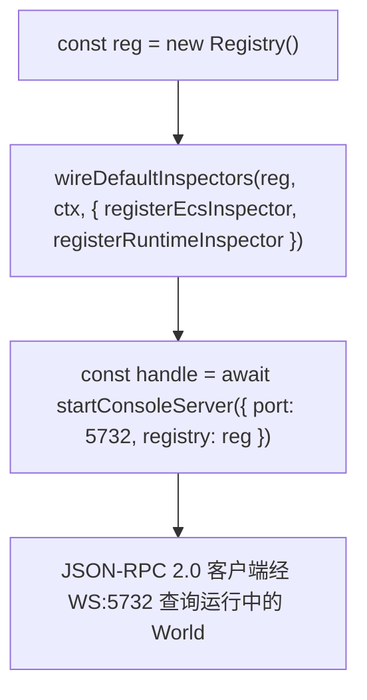

# forgeax-engine-cli

> **控制台 = 一个 inspector 基座 + 四条 plugin bin**。`@forgeax/engine-console` 物理零导入 `@forgeax/engine-{runtime,ecs,pack,gltf,image}`——能力不靠基座 import，而是从外向内注入：CLI 侧用各包自带的 plugin bin（kubectl 第四路），in-process 侧用 `register*Inspector` 纯函数挂进 `Registry`。Host 端三步装配：`new Registry()` → `wireDefaultInspectors(...)` → `await startConsoleServer({ port: 5732, registry })`，随后任何 JSON-RPC 2.0 客户端经 WS:5732 查询运行中的 World。聚合 `@forgeax/engine-console`（基座 + base CLI）+ 4 个 plugin bin（`@forgeax/engine-{pack,gltf,ecs,font}` 各自 owner）。

## 心智模型

console 是**基座**，不是全家桶——它只懂 JSON-RPC 路由（`Registry` 的 `registerRoot` / `registerMethod`）与 base CLI 框架，对引擎其余包一无所知。要让它能查 ECS / runtime / asset，得把能力**注入**进去，有两条正交通道：

- **in-process Inspector**：host 自己 `import { registerEcsInspector }` / `registerRuntimeInspector`，经 `wireDefaultInspectors` 挂进 `Registry`；console 自身从不 value-import 它们（P1 渐进式披露——能力由 host 决定）。
- **CLI plugin bin**：每个能力包发布一个独立可执行（`forgeax-engine-console-asset` 等），是 kubectl 式的"第四路"子命令入口，进程外调用，不进 runtime bundle。

同名 `registerRoot` / `registerMethod` **fail-fast**（不覆盖）——一个 `Registry` 实例只能挂一次同名 inspector，重载时 `new Registry()`。

## 核心 API / bin 速查

| 名字 | 来源 | 形态 | 用途 |
|:--|:--|:--|:--|
| `Registry` | console | class | JSON-RPC root/method 路由表；`registerRoot` / `registerMethod` 同名 fail-fast |
| `wireDefaultInspectors` | console | fn | 把传入的 `register*Inspector` 批量挂进 `Registry`（host 注入点） |
| `startConsoleServer` | `console/server` | `async fn` | 起 WS:5732 JSON-RPC 服务，返回 server handle |
| `registerEcsInspector` | ecs | fn | 注册 ECS inspector root（entities / components / systems / resources / world） |
| `registerRuntimeInspector` | runtime | fn | 注册 runtime inspector root（engine / assets） |
| `forgeax-engine-console-asset` | pack | plugin bin | `scan` / `lookup` / `verify` / `atlas` |
| `forgeax-engine-console-gltf` | gltf | plugin bin | `import` |
| `forgeax-engine-console-ecs` | ecs | plugin bin | `entities` / `components` / `systems` / `resources` / `world` |
| `forgeax-engine-console-font` | font | plugin bin | `bake` |

> [!IMPORTANT]
> base CLI 是 `forgeax-engine-console`（基座自带，连 WS host 跑 JSON-RPC）；上表后四行是各能力包发布的**独立** plugin bin，进程外直接调用，**不**经 base CLI 转发。`InspectorErrorCode`（6 成员，勿抄）见 `packages/types/src/index.ts` + `packages/console/src/errors.ts`。

## 规范装配顺序（host 端 in-process inspector）



## idiom 代码骨架

```ts
import { Registry, wireDefaultInspectors } from '@forgeax/engine-console';
import { startConsoleServer } from '@forgeax/engine-console/server';
import { registerEcsInspector } from '@forgeax/engine-ecs';
import { registerRuntimeInspector } from '@forgeax/engine-runtime';

const reg = new Registry();
wireDefaultInspectors(
  reg,
  { world, engine: renderer, assets: renderer.assets },
  { registerEcsInspector, registerRuntimeInspector },
);
const handle = await startConsoleServer({ port: 5732, registry: reg });
```

CLI plugin bin 进程外直接调用，**不造新脚本**——子命令名见上表 plugin bin 行。`asset verify` 跑 6 步 fail-fast（schema / GUID / collision / orphan / cycle / subasset-index）。

## 踩坑

- **`registerRoot` / `registerMethod` 报重复**：一个 `Registry` 实例同名只能挂一次（fail-fast，不覆盖）；热重载 / 复用时 `new Registry()` 重建，别想着二次注册同名 root。
- **console 找不到 ECS / runtime 能力**：基座物理零导入引擎包——能力必须由 host 经 `wireDefaultInspectors` 注入；忘了传 `register*Inspector` 就只有空路由表。
- **base CLI vs plugin bin 混淆**：`forgeax-engine-console` 是 JSON-RPC 客户端入口；`forgeax-engine-console-asset` 等是独立可执行的离线工具。查运行中的 World 用前者（WS:5732），扫磁盘资产用后者。
- **asset / gltf / font 链路细节**：见 [`forgeax-engine-assets`](../forgeax-engine-assets/SKILL.md)；ECS 查询语义见 [`forgeax-engine-ecs`](../forgeax-engine-ecs/SKILL.md)。

## 深入

- console 包定位 / Inspector 主入口索引 / Plugin contract / 统一抽象（CLI plugin + script raw 通道）：见 `packages/console/README.md` §Plugin contract / §CLI 子命令；源码 `packages/console/src/registry.ts` · `wire-default-inspectors.ts` · `server.ts`
- host 装配代码块（与本 skill idiom 同源）：AGENTS.md §Inspector / Console
- 4 个 plugin bin 的 owner 包与子命令表：AGENTS.md §Inspector / Console（plugin-bin 表）
- ECS plugin bin（`entities` / `components` / `systems` / `resources` / `world`）源码：`packages/ecs/src/cli-ecs.ts`；register inspector `packages/ecs/src/register-inspector.ts`
- runtime inspector：源码 `packages/runtime/src/register-inspector.ts`
- `InspectorErrorCode`（6 成员，勿抄）：`packages/types/src/index.ts` + `packages/console/src/errors.ts`

## RHI 录帧 CLI（capture-frame / inspect-at）

> `@forgeax/engine-rhi-debug` 的 `capture-frame` / `inspect-at` 子命令走本 skill 的 JSON-RPC WS:5732 通道（`debug.captureFrame` / `debug.inspectAt` / `debug.replayDispose`），但 flag 表、输出 schema、`debugRhi` injector 装配与症状定位工作流全在 [`forgeax-engine-rhi-debug`](../forgeax-engine-rhi-debug/SKILL.md)（SSOT）。host 端把 debug adapter 接进 `wireDefaultInspectors` 的范式同那里。
