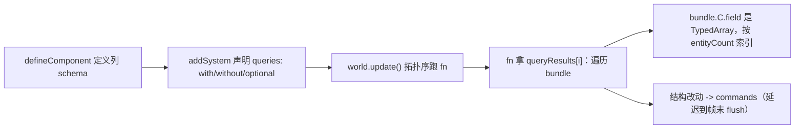

# forgeax-engine-ecs

> archetype ECS：组件是 SoA 列、系统按 query 拿列、结构改动走 Commands。聚合 `@forgeax/engine-ecs`（World / Entity / Component / Query / System / Schedule / Commands / Resource / Relationship / Reflection）。

## 心智模型

组件不是对象，是**列**：`defineComponent` 一次定义一个 schema（字段 → 类型），引擎把每个字段存成一条紧凑 TypedArray（Struct-of-Arrays）。系统拿到的不是实例数组，而是 `bundle.ComponentName.fieldName`（一条 `Float32Array`），按 `bundle.entityCount` 索引。`defineComponent` **本身**就让组件全局可用——没有 per-World 注册步骤。`Entity` 是 id=0 的内建组件（实体身份本身就是一列）；它的存在被引擎在 barrel 里强制初始化，你不用手动定义。结构性改动（spawn / despawn / add / remove component）在系统里要走 `Commands` 延迟到帧末，避免迭代中改 archetype。

## 核心 API 速查

| 入口 | 形态 | 用途 |
|:--|:--|:--|
| `defineComponent(name, fields, options?)` | `=> Component` | 定义组件 schema；单 field-descriptor 签名，定义即全局可用 |
| `new World()` | 构造 | 实体 / 组件 / 系统 / 资源容器 |
| `world.spawn(...componentDatas)` | `=> Result<EntityHandle, EcsError>` | 创建实体 + 初始组件 |
| `world.get(e, C)` | `=> Result<bundle, EcsError>` | 读单实体某组件（也是 liveness 探针，despawned 回 `err('stale-entity')`） |
| `world.addComponent(e, C, data) / removeComponent(e, C)` | `=> Result<...>` | 增删组件（即时路径） |
| `world.addSystem({ name, queries, fn })` | 注册系统 | `fn(queryResults, commands)`；DAG 拓扑序跑 |
| `world.update()` | 跑一帧 schedule | 按依赖拓扑序执行全部系统 + flush commands |
| `createQueryState(...) + queryRun(state, world, cb)` | 临时查询 | 系统外的一次性遍历 |
| `world.getResource<T>(key) / insertResource<T>(key, value)` | 全局态 | 单例资源（如 InputSnapshot） |
| `world.addChild(parent, child, ChildOf) / reparent(...) / removeChild(...)` | 层级 | relationship 同步维护反向 mirror 列 |
| `C.id / C.fields[f] / C.meta / TYPE_METADATA` | 反射 | 三层只读自省 |

> [!CAUTION]
> 这些 API 在近期已被删除/重塑——**别用**：`world.registerComponent` / `world.registerComponentChecked`（删，`defineComponent` 即可用）、`world.isAlive`（删，用 `world.get(e, Entity)` 探活）、`world.getComponentId(C)`（删，用 `C.id`）、独立的 `GlobalTransform` 组件（删）。

## 系统 / 查询：SoA 列读法



## idiom 代码骨架

```ts
import { defineComponent, World } from '@forgeax/engine-ecs';

const Position = defineComponent('Position', { x: 'f32', y: 'f32' });
const Velocity = defineComponent('Velocity', {
  dx: { type: 'f32', default: 0 },
  dy: { type: 'f32', default: 0 },
});

const world = new World();
world.spawn(
  { component: Position, data: { x: 0, y: 0 } },
  { component: Velocity, data: { dx: 1, dy: 0 } },
);

world.addSystem({
  name: 'integrate',
  queries: [{ with: [Position, Velocity] }],
  fn: (queryResults, commands) => {
    for (const bundle of queryResults[0]) {
      const xs = bundle.Position.x;
      const dxs = bundle.Velocity.dx;
      for (let i = 0; i < bundle.entityCount; i++) xs[i] = (xs[i] ?? 0) + (dxs[i] ?? 0);
    }
    // commands.spawn(...) / commands.despawn(e) — deferred, flushed at frame end
  },
});

world.update();
```

关系（层级）用 `relationship` 元数据声明，反向 mirror 列由引擎自动维护：

```ts
const ChildOf = defineComponent('ChildOf', { parent: { type: 'entity' } }, {
  relationship: { mirror: 'Children', field: 'entities', exclusive: true, linkedSpawn: false },
});
world.addChild(parent, child, ChildOf); // child gains ChildOf; parent.Children.entities auto-updated
```

## 踩坑

- **query 字段名拼写错 / 漏 column**：组件被链式 `addComponent` 加进 archetype 时曾有列错位 bug（已修），但若 `bundle.C.field` 为 `undefined`，先确认 query 的 `with` 真包含该组件、字段名与 schema 完全一致。
- **spawn-data 字段名拼写错 → fail-fast**（bug-20260615）：`world.spawn` / `world.addComponent` / `SceneAsset.instantiate` 现在对 `data` 里出现的未声明字段返回 `err({ code: 'spawn-data-unknown-field', detail: { component, field, knownFields } })`；`commands.spawn` / `commands.addComponent` 走 throw（无 Result 通道，throw 时栈帧指向调用系统）。这条规则覆盖了一类历史"看起来像渲染 bug 实则 typo"——比如 `MeshRenderer { material: h }`（旧名单数）静默落入 `materials: []` 默认路径并产生隐形/灰白实体。
- **系统里直接结构改动会破迭代**：在 `fn` 里 spawn/despawn/add/remove 要走 `commands`，引擎帧末统一 flush；即时路径（`world.spawn`）留给系统外。
- **Result 不 unwrap 就静默丢错**：`world.get` 等返回 `Result`；系统体内显式 `if (!r.ok) return r;` 或 `.unwrap()`（TS 无 `?` 运算符）。其余渲染/测试症状见 [`forgeax-engine-debug`](../forgeax-engine-debug/SKILL.md)。

## SceneInstance（feat-20260608 ECS-fication）

`SceneAsset` 不再走单独的 container，而是 ECS 化：`world.instantiateScene(handle)` 返回**合成根 Entity**，根上挂两个组件——`SceneInstance{source, mapping, state}` + 单位 `Transform`（D-V-0：`propagateTransforms` 沿 ChildOf 走时根必须有 Transform，否则每帧 `RhiError(hierarchy-broken)`）。`SceneAsset.mounts[]` 让一个 SceneAsset 嵌入另一个；mount entity 也自动挂 Transform（R2/B-1）。

### 8 个 World 方法（全在 `world.<TAB>` 自动补全）

| 方法 | 作用 |
|:--|:--|
| `instantiateScene(handle, parent?)` | 物化 SceneAsset，返回合成根 Entity |
| `despawnScene(root, opts?)` | `despawnDescendants(root) + world.despawn(root)`；返回销毁数 `Result<number>` |
| `despawnDescendants(root, opts?)` | 沿 ChildOf 销毁子树，根保留；返回销毁数 `Result<number>` |
| `setSceneOverride<S>(root, member, component, field, value)` | Layer-0 override（写入 + 记录 diff）；`member` 是活 Entity，`component`/`field` 走 schema 类型 |
| `removeSceneOverride<S>(root, member, component, field)` | 撤销 diff，重放 Layer 1->2->3 |
| `detachSceneMember(root, member)` | 软 tombstone（不 despawn） |
| `reattachSceneMember(root, member)` | 清 tombstone |
| `getSceneAssetForInstance(root)` | 读源 SceneAsset 句柄 |

读路径：`world.queryRun([SceneInstance], ...)` 扫活实例 / `world.get(root, SceneInstance)` 单实例 / `world.getSceneInstanceState(root)` 拿完整 state ref（overrides / detachedLocalIds / rootEntities）。

### 4 个 mount-* fail-fast 错误码（SSOT 在 `packages/types/src/index.ts` PackErrorCode）

| code | 触发 |
|:--|:--|
| `pack-mount-localid-overlap` | `entities[].localId` 与 mount 槽位重叠 |
| `pack-mount-count-mismatch` | `mount.memberCount !== child SceneAsset totalSlots` |
| `pack-mount-override-localid-out-of-range` | `override.localId` 不在 `[memberFirst, memberFirst+memberCount)`（**parent namespace** 寻址） |
| `pack-mount-override-unknown-field` | `override.field` 不在已注册组件 schema |

> [!NOTE]
> mount.overrides[].localId 在**父 SceneAsset 的命名空间**里（即 `memberFirst + offset`，不是子 SceneAsset 的局部 id）。R2/F-8 cement。

### 踩坑

- **resolver 挂错地方**：`engine.assets.instantiate(...)` 自动 wire 内部 SceneAsset resolver；只有 unit test 才走 `world._setSceneAssetResolver`（`@internal`，前缀 `_`）。demo 不要写 `if (world.setSceneAssetResolver)` 防御逻辑——这教坏下个 AI。

## skinned animation (feat-20260612)

挂三件套即可让 glTF skinned mesh 真动起来：

```ts
import { Skin, AnimationPlayer, Transform, MeshFilter, MeshRenderer } from '@forgeax/engine-runtime';

world.spawn(
  { component: Transform, data: {} },
  { component: MeshFilter, data: { assetHandle: foxMesh } },
  { component: MeshRenderer, data: { materials: [foxMat] } },
  { component: Skin, data: { skeleton: foxSkeleton } },                          // joints 由 sceneInstances.instantiate auto-resolve
  { component: AnimationPlayer, data: { clip: walkClip, speed: 1, looping: true } },
).unwrap();
```

零 setup —— `createApp` 自动注册 `advanceAnimationPlayer`（`createRenderer` 直用方手动调 `registerAdvanceAnimationPlayer(world, animResolver)`）；`propagateTransforms` 把 joint TRS 烘成 `Transform.world`；`extractFrame` 的 `hasSkin` 段读 joint `Transform.world` × `SkeletonAsset.inverseBindMatrices` 上传到 per-frame palette UBO（feat-20260612 兑付，详见 [`forgeax-engine-render-pipeline`](../forgeax-engine-render-pipeline/SKILL.md) §skin palette per-frame upload）。

**3 个 closed-union errorCode** 反查模式（exhaustive `switch` 无 default，TS 守完整性 / charter P3 显式失败）：

| code | 触发 | 修法 |
|:--|:--|:--|
| `skeleton-resolve-failed` | `assets.get<SkeletonAsset>(skin.skeleton)` 返回 null/undefined | 检查 `registerWithGuid` 顺序、`SceneAsset` mount 是否带上 SkeletonAsset |
| `joint-count-mismatch` | `Skin.joints.length !== SkeletonAsset.jointCount` | 检查 `SkinAsset.jointPaths` 与 `SkeletonAsset.jointCount` 是否同源、`sceneInstances.instantiate` 的 Name lookup 是否全命中 |
| `joint-entity-dangling` | `Skin.joints[i]` Entity 已 despawn → `Transform.world` view 拿不到 | 检查 joint entity 生命周期（不要在播放时 despawn skeleton 子树） |

SSOT：`SkinExtractErrorCode` 在 `packages/runtime/src/errors.ts`；与 `SkinPaletteOverflowError`（buffer 容量超限）共享同一 `RhiError` discriminated-union surface。

## 深入

- 组件 schema vocab / `array<T,N>` / `buffer<N>` 字段 / `world.push|pop|capacity`：见 `packages/ecs/README.md` §Schema vocabulary quick-ref · §Array / buffer field access；源码 `packages/ecs/src/component.ts`
- query `optional` 逐 archetype 列暴露：见 `packages/ecs/README.md` §Query；源码 `packages/ecs/src/query.ts`
- relationship 双向 mirror / 环检测 / `iterDescendants`：见 `packages/ecs/README.md` §Relationship；源码 `packages/ecs/src/world.ts`
- 三层反射（`component.meta` / `component.fields[f]` / `TYPE_METADATA`）：见 `packages/ecs/README.md` §Component reflection；源码 `packages/ecs/src/component.ts`
- SceneInstance 完整 surface（4-layer fallback / despawn destroy set / runtime-facing reference）：`packages/ecs/README.md` §SceneInstance lifecycle + `packages/runtime/README.md` §SceneInstance；源码 `packages/ecs/src/world.ts` `_instantiateSceneAsset`
- `EcsErrorCode` 全集（SSOT 在源码，勿抄）：`packages/ecs/src/errors.ts`；反向锚点 `packages/ecs/README.md` §Error code reverse anchors
- `PackErrorCode` 4 个 mount-* 全集：`packages/types/src/index.ts`；hint 字符串 SSOT 同文件 PACK_ERROR_HINTS
