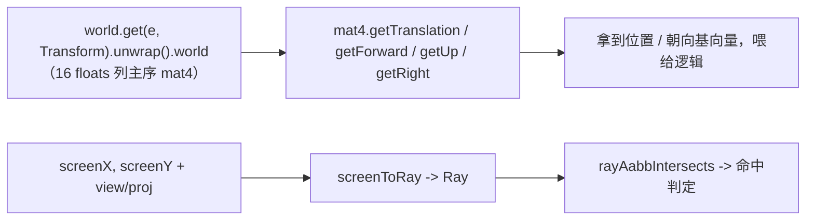

# forgeax-engine-math

> 纯函数、out-param 优先、SoA 友好的数学库。所有函数第一参是 `out`（复用 buffer，零分配热路径）。聚合 `@forgeax/engine-math`。

## 心智模型

数学库按 namespace 组织（`vec3` / `mat4` / `quat` / `color` …），全是**纯函数**且**第一参为 `out`**：`vec3.add(out, a, b)` 写进 `out` 并返回它。这是为了让热路径复用 buffer、零 GC。最常见的 AI 任务不是手算矩阵，而是**从一个实体的世界变换里读出 pose**：`Transform.world` 是引擎每帧派生的 16 floats 列主序 mat4（你写 local TRS，引擎写 world），用 `mat4.getTranslation/getForward/getUp/getRight` 把位置 / 朝向基向量拽出来，别自己拆矩阵。屏幕拾取则反过来：`screenToRay` 从屏幕坐标 + view/proj 造一条世界射线。

## 核心 API 速查

| Namespace / 函数 | 形态 | 用途 |
|:--|:--|:--|
| `vec3.add/sub/scale/dot/cross/normalize/lerp(out, ...)` | out-param | 向量运算（`vec2`/`vec4` 同构） |
| `mat4.multiply/invert/lookAt/perspective/compose(out, ...)` | out-param | 矩阵运算 |
| `mat4.getTranslation(out, m)` | `=> Vec3` | 从 world mat4 取位置（col 3） |
| `mat4.getForward/getUp/getRight(out, m)` | `=> Vec3` | 取朝向基向量（forward = -Z） |
| `mat4.unproject(out, ndcPoint, invVP)` | `=> Vec3` | NDC → 世界坐标 |
| `quat.fromEuler/slerp/multiply/transformVec3(out, ...)` | out-param | 旋转 |
| `color.srgbToLinear/linearToSrgb/fromHex/toHex` | out-param / 值 | 颜色空间转换 |
| `screenToRay(out, sx, sy, vpW, vpH, view, proj, kind)` | `=> Ray` | 屏幕坐标 → 世界射线 |
| `rayAabbIntersects(ray, aabb)` | `=> RayAabbResult` | 射线 / 包围盒求交 |

> [!NOTE]
> 没有独立 `GlobalTransform` 组件（已删）。世界变换的唯一来源是 `Transform.world`，由引擎 `propagateTransforms` 每帧写；你只写 local TRS，读 world。

## 规范用法：从实体读 pose



## idiom 代码骨架

```ts
import { mat4, vec3 } from '@forgeax/engine-math';
import { Transform } from '@forgeax/engine-runtime';

// read world-space pose off Transform.world (a live 16-float column-major Float32Array)
const worldMat = world.get(entity, Transform).unwrap().world;
const pos = mat4.getTranslation(vec3.create(), worldMat); // m[12..14]
const fwd = mat4.getForward(vec3.create(), worldMat);     // -Z basis
const up = mat4.getUp(vec3.create(), worldMat);           // +Y basis

// out-param idiom: allocate once, reuse across frames
const tmp = vec3.create();
vec3.scale(tmp, fwd, 5);          // tmp = fwd * 5
vec3.add(pos, pos, tmp);          // pos = pos + tmp (writes into pos, returns it)
```

```ts
import { screenToRay, rayAabbIntersects, ray as rayNs } from '@forgeax/engine-math';

const r = screenToRay(rayNs.create(), mouseX, mouseY, vpW, vpH, viewMat, projMat, 'perspective');
const hit = rayAabbIntersects(r, entityAabb); // hit.hit -> boolean
```

## 踩坑

- **out-param 不是返回新值**：`vec3.add(out, a, b)` 把结果写进 `out`（并返回它）。`const c = vec3.add(a, a, b)` 会覆盖 `a`——想保留 `a` 就分配独立 `out`。
- **列主序约定**：`Transform.world` 是列主序（GPU / WGSL `mat4x4<f32>` 布局），平移在 col 3（`world[12..14]`）。第一帧 propagate 前刚 spawn 的 `Transform`（`data: {}`）是单位阵，不是 stale 垃圾。
- **退化静默回退**：库内非法输入（零长度归一化、`w'=0` 透视除）静默回退到安全值（如 `(0,0,0)`），不 throw——调用方需自带守卫判断（charter P3 在 thin 数学层让位于性能）。见 README 退化策略表。
- 渲染 / 拾取相关的更高层症状见 [`forgeax-engine-debug`](../forgeax-engine-debug/SKILL.md)。

## 深入

- 8 namespace × 119 函数 quick-ref / 命名风格 / 退化策略表 / 三档 NDC 投影：见 `packages/math/README.md` §quick-ref · §退化策略 · §三档 NDC 投影示例
- pose 读取助手（`getTranslation/getForward/getUp/getRight`）：源码 SSOT `packages/math/src/mat4.ts`
- 拾取（`screenToRay` / `rayAabbIntersects` / `mat4.unproject`）：源码 `packages/math/src/ray.ts` + `packages/math/src/mat4.ts`；runtime 侧封装 `pick(...)` 见 `packages/runtime/README.md` §Picking
- `Transform.world` 派生契约：见 `packages/runtime/README.md` §Transform: local TRS + world mat4
