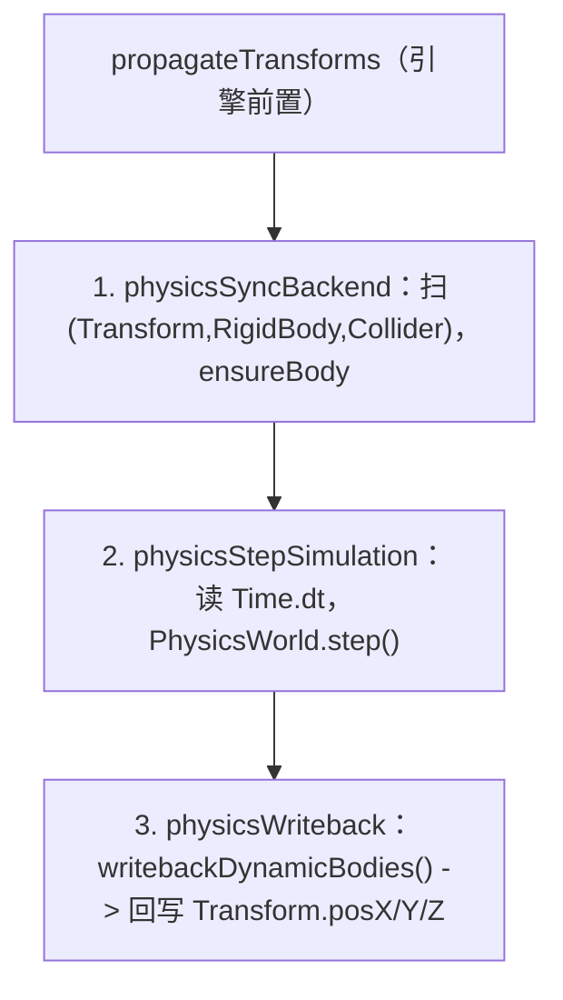

# forgeax-engine-physics

> **物理 = 给 entity 挂三件套（Transform + RigidBody + Collider），引擎每帧把模拟结果写回 `Transform`**。`@forgeax/engine-physics` 是**接口层**：定义 ECS 组件 schema（`RigidBody` / `Collider` / `CollidingEntities`）、`PhysicsWorld` / `PhysicsWorld2D` Resource 接口、`PhysicsErrorCode` 闭集，但不含实现。实现是两个 WASM 后端：`@forgeax/engine-physics-rapier2d` 与 `@forgeax/engine-physics-rapier3d`。开物理只需 `createApp(canvas, { physics: 'rapier-3d' })`——它 dynamic-import 对应 rapier 包、注册 `PhysicsWorld` Resource、装好三段式 tick 系统。聚合 `@forgeax/engine-physics`（接口）+ `physics-rapier2d` + `physics-rapier3d`（后端）。

## 心智模型

物理是**组件驱动**的：你不调"创建刚体"API，而是给 entity 挂上组件，`physicsSyncBackend` 系统每帧扫描 `(Transform, RigidBody, Collider)` 原型、为新 entity 在 Rapier 侧 `ensureBody`，`physicsStepSimulation` 推进模拟，`physicsWriteback` 把刚体新位置写回 `Transform.posX/Y/Z`。后端选择经 `createApp` 的 `physics` 选项（`'rapier-2d' | 'rapier-3d'`），它把 `PhysicsWorld`（3D）/ `PhysicsWorld2D`（2D 接口）作为 World Resource 注入。`PhysicsWorld` Resource 未就绪时（WASM fire-and-forget 加载），三个系统都安全 early-return——不 fail，等下一帧。碰撞对经只读组件 `CollidingEntities` 读取。

## 核心 API / 组件速查

| 名字 | 来源包 | 形态 | 用途 |
|:--|:--|:--|:--|
| `RigidBody` | physics | 组件 | 刚体；`type`（`RigidBodyTypeValue.{dynamic,static,kinematic}`）+ `mass` 等 |
| `Collider` | physics | 组件 | 碰撞体；`shape`（`ColliderShapeValue.{sphere,cuboid,capsule}`）+ 形状参数 |
| `CollidingEntities` | physics | 组件（只读） | 当前帧与本 entity 接触的 entity 列表 |
| `PhysicsWorld` | physics | Resource 接口（3D） | `step()` / `ensureBody` / `writebackDynamicBodies()` 等；后端实现 |
| `PhysicsWorld2D` | physics | Resource 接口（2D） | 2D 版同形接口 |
| `RigidBodyTypeValue` / `ColliderShapeValue` | physics | 枚举常量 + `*FromF32` 窄化助手 | 写组件字段时的类型安全枚举 |
| `createRapier3DPhysicsWorld` | rapier3d | `async fn` | 手动建 3D PhysicsWorld（`createApp` 内部用） |
| `createRapier2DPhysicsWorld` | rapier2d | `async fn` | 手动建 2D PhysicsWorld |
| `PhysicsErrorCode` | physics（types SSOT） | 闭集 union（8 成员，勿抄） | 结构化失败码 |

> [!IMPORTANT]
> 写 `RigidBody.type` / `Collider.shape` 用枚举常量（`RigidBodyTypeValue.dynamic` / `ColliderShapeValue.sphere`），不要塞裸数字。组件字段全集 + 默认值见 `packages/physics/README.md` §Component Schemas；`PhysicsErrorCode` 8 成员 SSOT 在 `packages/types/src/index.ts`，**勿抄**。

## 三段式 tick 顺序



> 三系统由 `createApp`（`physics` 选项已设）自动注册并按此序排；`PhysicsWorld` Resource 未就绪时全部安全 early-return。

## idiom 代码骨架

```ts
import { createApp } from '@forgeax/engine-app';
import { Collider, ColliderShapeValue, RigidBody, RigidBodyTypeValue } from '@forgeax/engine-physics';
import { Transform } from '@forgeax/engine-runtime';

const app = await createApp(canvas, { physics: 'rapier-3d' });
const world = app.world;

// dynamic body: falls under gravity
world.spawn(
  { component: Transform, data: { posX: 0, posY: 5, posZ: 0 } },
  { component: RigidBody, data: { type: RigidBodyTypeValue.dynamic, mass: 1 } },
  { component: Collider, data: { shape: ColliderShapeValue.sphere, radius: 0.5 } },
);

// static ground: immovable collision target
world.spawn(
  { component: Transform, data: { posX: 0, posY: 0, posZ: 0 } },
  { component: RigidBody, data: { type: RigidBodyTypeValue.static } },
  { component: Collider, data: { shape: ColliderShapeValue.cuboid, halfExtentsX: 5, halfExtentsY: 1, halfExtentsZ: 5 } },
);

app.start();
```

## 踩坑

- **挂了组件但 entity 不动**：缺 `Transform`（写回目标）或缺 `createApp({ physics })`（没装 tick 系统）。三件套必须齐：`Transform` + `RigidBody` + `Collider`。
- **前几帧没物理反应**：`PhysicsWorld` Resource 是 WASM fire-and-forget 异步加载，未就绪时系统 early-return；这是正常的，不是错误。
- **dt 过大被跳过**：`physicsStepSimulation` 在 `dt <= 0` 或 `> 0.1s` 时跳过（防大步穿透）——切后台再回来的首帧大 dt 不会模拟。
- **2D / 3D 后端选错**：`physics: 'rapier-2d'` 用 `PhysicsWorld2D` 接口，`'rapier-3d'` 用 `PhysicsWorld`；组件 schema 共用但坐标维度不同，别混。

## 深入

- 组件字段全集 / 默认值（`RigidBody` / `Collider` / `CollidingEntities`）+ 枚举常量与窄化助手：见 `packages/physics/README.md` §Component Schemas / §Enum Constants
- 三段式 tick pipeline 细节（系统名 / 排序 / early-return）：见 `packages/physics/README.md` §Three-Phase Tick Pipeline；源码 `packages/physics-rapier3d/src/rapier-physics-world-3d.ts`
- `PhysicsWorld` / `PhysicsWorld2D` Resource 接口（`step` / `ensureBody` / raycast）：源码 `packages/physics/src/physics-world.ts`
- 碰撞事件（`CollisionEvent` / `CollisionEventPayload`）：源码 `packages/physics/src/collision-event.ts`
- `PhysicsErrorCode` 8 成员闭集（**勿抄**）：`packages/types/src/index.ts`；详见 AGENTS.md §Error model
- rapier WASM 后端实现：源码 `packages/physics-rapier2d/src/` · `packages/physics-rapier3d/src/`
- `createApp` 物理 auto-attach 入口：源码 `packages/app/src/create-app.ts`；app 引导见 [`forgeax-engine-app`](../forgeax-engine-app/SKILL.md)
