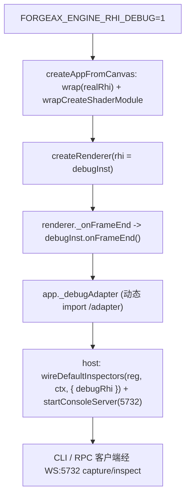

# forgeax-engine-rhi-debug

> **录帧 = proxy 拦截全部 RHI 调用写进 tape，tape 可在 fresh device 上确定性 replay，再在任意 drawIdx 离线 inspect**。`wrap(rhiInstance)` 返回 `DebugRhiInstance`，**不改** `@forgeax/engine-rhi` / `@forgeax/engine-rhi-webgpu`。第一用户是 AI subagent；三条通道暴露：WS:5732 JSON-RPC、CLI、直接 import。`FORGEAX_ENGINE_RHI_DEBUG=1` 开启；`=0`（默认）整包被 tree-shake，不进生产 bundle。

> [!IMPORTANT]
> contract SSOT 在 [`packages/rhi-debug/README.md`](../../packages/rhi-debug/README.md)——API 签名、错误码 hint 全串、tape format、OOS 列表都在那里，本 skill 不复述，只给"怎么用 + 怎么定位渲染 bug"。

## 心智模型

| 概念 | 是什么 |
|:--|:--|
| **wrap** | `wrap(rhi)` 返回 `DebugRhiInstance extends RhiInstance`，proxy 拦截 `createBuffer` / `beginRenderPass` / `setPipeline` / `draw` 等全部调用 |
| **tape** | 录制产出：有序 `RhiCallEvent[]` + hash 去重的二进制 blob pool。文件组合 `frame-0.tape.bin` + `frame-0.report.json` |
| **replay** | tape 在 fresh `RhiDevice` 上按 event 序列重建（caps 匹配为前提）。dawn-node 保证 RT 像素一致 ε≤0.01 |
| **inspectAt** | 在 replay 的指定 drawIdx 抓 bindings / drawCall / RT PNG。`fields` 裁剪避免 context 爆炸；RT 永远是 PNG 路径字符串，**不内联 base64** |

## 开启 + 注入链路

```bash
FORGEAX_ENGINE_RHI_DEBUG=1 pnpm dev                            # 开发模式：recorder 自动注入
FORGEAX_ENGINE_RHI_DEBUG=1 pnpm -F @forgeax/hello-cube smoke   # dawn smoke 也可录
```

`FORGEAX_ENGINE_RHI_DEBUG=1` 时 `createAppFromCanvas`（`@forgeax/engine-app`）在 `createRenderer` **前**自动 `wrap(realRhi)` + `wrapCreateShaderModule(realCsm)` 注入代理；`createRenderer` **后**挂 `_onFrameEnd` 回调并动态 import `/adapter` 建出 `app._debugAdapter`。



> [!IMPORTANT]
> **createApp 只产 `_debugAdapter`，不自动接 console**——host 必须自己把 adapter 经 `wireDefaultInspectors` 的 `debugRhi` injector 挂进 `Registry` 再 `startConsoleServer`。范本：`apps/learn-render/3.model-loading/1.model-loading/src/index.ts`（demo host wiring）。console 装配机制本身见 [`forgeax-engine-cli`](../forgeax-engine-cli/SKILL.md)。

## 三连工作流：capture -> inspect -> dispose

两条对等通道，RPC（in-process / WS 客户端）与 CLI（进程外）：

| 动作 | RPC method (WS:5732) | CLI | 产出 |
|:--|:--|:--|:--|
| 录 N 帧 | `debug.captureFrame({ frames, label? })` | `capture-frame [--frames=N] [--label=STR] [--target=WS]` | `{ tapes: [{ frameIdx, runId, tapePath, reportPath }] }` |
| 查 drawIdx | `debug.inspectAt({ tapePath, drawIdx, fields? })` | `inspect-at <tapePath> <drawIdx> [--fields=LIST] [--target=WS]` | `InspectReport`（JSON；RT 是 PNG 路径） |
| 释放 replay | `debug.replayDispose({ tapePath })` | — | `{ ok: true }`（LRU cache 清退） |

- 输出落 `.forgeax-debug/<runId>/frame-0.tape.bin` + `frame-0.report.json`。
- `--target` 默认 `ws://localhost:5732`；`--frames` 默认 `1`；`--label` 默认空。
- `fields` 未传 = **全字段**（bindings + drawCall + rt）；传 `--fields=bindings` 跳过 RT readback（省 `copyTextureToBuffer`）；传 `--fields=rt` 只要 PNG。

> [!NOTE]
> CLI 当前调用形态是 `node packages/rhi-debug/dist/cli.mjs <subcommand>`（需先 `pnpm -F @forgeax/engine-rhi-debug build`）。README 表里的 `forgeax-engine-console capture-frame` 是 end-state（plugin-bin 未落地，follow-up tweak）。未落地前 WS:5732 RPC 是 canonical 端到端通道。

## 症状 -> tape -> inspect 决策流

遇 black-screen / grey-screen / wrong-texture / wrong-binding 渲染症状：

1. **capture 1 帧** — `debug.captureFrame({ frames: 1 })` 录下当前帧全部 RHI 调用。
2. **读 `report.json`** — 找 pass 起止 drawIdx，定位"哪个 pass 之后 RT 开始崩"。
3. **inspectAt pass 边界** — `inspectAt(tapePath, passEndDrawIdx, ['rt'])` 看 RT PNG，确认错位发生在哪个 pass。
4. **inspectAt per-draw** — 缩窄到出错 draw，`['bindings']` 对比 bind group entries 与预期（贴图 GUID 未解析 / UBO 值不对 / sampler 类型错）。
5. **falsification check** — 在 tape 里 swap 一个 binding index，confirm 像素变化，证明定位正确。

## 错误码速查

`DebugErrorCode` 12 成员闭并集，**完全独立**于 `RhiErrorCode`；`switch (err.code)` 穷尽，TS 编译期抓漏分支。

| code | 触发 |
|:--|:--|
| `recorder-not-attached` | RPC `debug.captureFrame` 但 bootstrap 时 `FORGEAX_ENGINE_RHI_DEBUG !== '1'` |
| `recorder-already-armed` | 上次 arm 未完成又 arm；先 `disposeError()` 或等 capture 收尾 |
| `frame-end-hook-missing` | `_onFrameEnd` 注入点缺失（理论不可达） |
| `tape-format-version-mismatch` | tape `formatVersion` 与 runtime 不一致 |
| `tape-handle-graph-broken` | event 引用未声明的 handleId |
| `caps-mismatch` | replay 设备 caps 不足（`.detail.missingCaps` 列缺失项） |
| `replay-step-out-of-range` | `stepTo(N)` 超界或回溯 |
| `replay-deterministic-violation` | replay RT 与原帧像素超阈（test-only） |
| `rt-readback-failed` | `copyTextureToBuffer` / `mapAsync` 链失败 |
| `png-encode-failed` | PNG 编码失败 |
| `rpc-target-not-wired` | `wireDefaultInspectors` 没传 `debugRhi` injector |
| `replay-dispose-busy` | `dispose()` 时存在未完成的 in-flight inspect（`.detail.inFlightDrawIndices`）|

## 跨后端注意

| 后端 | replay 像素确定性 | capture |
|:--|:--|:--|
| dawn-node (WebGPU native) | ε≤0.01（最强保证） | yes |
| chromium WebGPU | 非零像素 + structural 一致，不保证像素精确 | yes |
| wgpu-wasm (WebGL2 fallback) | v1 不测（OOS-7） | peerDep 存在但未验证 |

> dawn-node smoke 走 `gltfDocToSceneAsset -> register(handle)`，绕过 dev-server pack-body 序列化与整条 WebGPU validation；typed-array survival / BGL shape mismatch / vertex-attribute presence 类 bug 只在 browser 路径暴露。dawn smoke 全绿不足以证明 browser 正确——视觉 SSOT 是 `Read(RT PNG)`。

## 踩坑

- **`recorder-not-attached`**：忘设 `FORGEAX_ENGINE_RHI_DEBUG=1`，或在 bootstrap 之后才设——必须 bootstrap 时已 `=1`，否则 wrap 注入跳过。
- **console 查不到 `debug.*` root**：host 没把 `debugRhi` injector 传给 `wireDefaultInspectors`（→ `rpc-target-not-wired`）。createApp 只产 `_debugAdapter`，wiring 是 host 的活。
- **import 找不到 inspector / cli**：barrel（`@forgeax/engine-rhi-debug`）只导出 recorder/replayer/tape-format/errors；inspector 走 `/inspector`、CLI 走 `/cli`、adapter 走 `/adapter` 子路径（pngjs / WS 是 Node-only，刻意不进 barrel 以保 tree-shake）。
- **`replay-dispose-busy`**：还有 in-flight `inspectAt` 时 dispose；先 `await` 完所有 inspect 再 dispose。

## 深入

- 包全貌 / API 签名 / 错误码 hint 全串 / tape format 常量 / OOS 列表：[`packages/rhi-debug/README.md`](../../packages/rhi-debug/README.md)（contract SSOT）
- recorder 状态机 / blob pool / replayer / inspector LRU cache 源码：`packages/rhi-debug/src/`
- `FORGEAX_ENGINE_RHI_DEBUG=1` 注入点：`packages/app/src/create-app.ts`（wrap + `_onFrameEnd` + `_debugAdapter`）
- demo host wiring 范本：`apps/learn-render/3.model-loading/1.model-loading/src/index.ts`（`debugRhi` injector + `startConsoleServer`）
- console / inspector 装配基座（`Registry` / `wireDefaultInspectors` / `startConsoleServer`）：[`forgeax-engine-cli`](../forgeax-engine-cli/SKILL.md)
- tree-shake grep gate：`FORGEAX_ENGINE_RHI_DEBUG !== '1'` 时 `grep -L 'engine-rhi-debug' apps/hello/*/dist/assets/*.mjs` 全 demo 集合无残留
