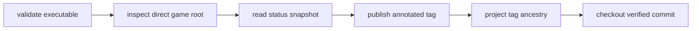

# forgeax-platform-io

> **一次 mutation 全成或全不成。** `@forgeax/platform-io` 为一个逻辑 root 提供业务无关的 opaque bytes、revision、trash、observer 和结构化错误事实。

## Version-control evidence index

`version-control/**` is the single local Git owner for the current game root. Hosts
provide the root authority; this package owns executable validation, direct-root
identity, status parsing, tag ancestry, publish journal/CAS recovery, and detached
checkout. Browser payloads never provide `cwd`, `argv`, or a shell command.



| Evidence | Owner test | Contract proved |
|:--|:--|:--|
| AC-03/19 | `test/version-control-executable.test.ts`, `test/version-control-security.test.ts` | absolute executable, no shell, bounded process contract |
| AC-04/05/06/07 | `test/version-control-root.test.ts`, `test/version-control-init.test.ts`, `test/version-control-status.test.ts` | direct root, idempotent init, NUL-safe status and snapshot CAS |
| AC-08/09/11/12 | `test/version-control-publish.test.ts`, `test/version-control-graph.test.ts`, `test/version-control-recovery.test.ts` | tag, ancestry, latest reachability, partial publish recovery |
| AC-13/14/20 | `test/game-version-control-security.test.ts`, `test/game-version-control.test.ts`, `test/game-host-router.test.ts` | clean detached checkout, host-scoped owner, end-to-end game path |

The M5 regression matrix is the shortest reproducible owner path:

```text
initialize -> preview -> publish -> graph -> switch -> verify file/ref identity
```

The 1k scale fixture checks 1,000 NUL-delimited status records and a 1,000-node
canonical ancestry projection three times. Its timing is diagnostic only; correctness
comes from record counts, stable paths, node identity, and edge identity.

> [!WARNING]
> A `tag-failed` result retains the commit identity for recovery. Consumers must
> retry only tag creation with a new request id; they must never create a second
> commit or infer policy from Git stderr.

## 最小成功流程

```ts
import { openResourceRoot, type ResourceStore } from '@forgeax/platform-io';

declare const store: ResourceStore;
const opened = await openResourceRoot({ rootId: 'game-main', store });
if (!opened.ok) throw opened.error;

const before = await opened.value.readSnapshot();
if (!before.ok) throw before.error;

const committed = await opened.value.commit({
  identity: 'save-001',
  expectedRevision: before.value.revision,
  changes: [
    { kind: 'put', resourceId: 'scenes/main.pack', bytes: Uint8Array.from([1, 2]) },
  ],
});
if (!committed.ok) {
  // Branch on committed.error.code and follow committed.error.hint.
  throw committed.error;
}
```

先从包公共入口发现 `RESOURCE_SUBSTRATE_CAPABILITY_INDEX`，再按
[`docs/resource-substrate.md`](docs/resource-substrate.md) 的稳定标题读取详细行为。

**后端 IO 基座**：提供 files / assets / projects / fs / logs / prefs / version / changelog / boot-splash 等纯 IO router，以及 `safe-path` / `io` / `asset-root` 工具。

## 依赖边界

`@forgeax/platform-io` 是可复用的后端 IO 基座。生产源码只允许依赖 Node 内建、第三方库和 `@forgeax/extension-host/contracts`；它不能依赖 CLI、Server、Editor 或其他产品实现。该边界由 `.dependency-cruiser.cjs` 和测试锁定，CLI、Server、Editor 均可直接复用。

> 历史:此前物理上嵌在 `forgeax-kernel` 子模块的 `platform-io/` 子目录里(容器名 `kernel` 与真内核 `@forgeax/cli` 打架)。现已提为独立仓,诚实命名。

## 形态

- **全裸 TS，无 build**: bun 直跑源码。
- 仓根即 `@forgeax/platform-io` 包(flat repo)。

## 独立验证

```bash
bun install
bun run typecheck
bun run test
bun run lint:boundaries
```
