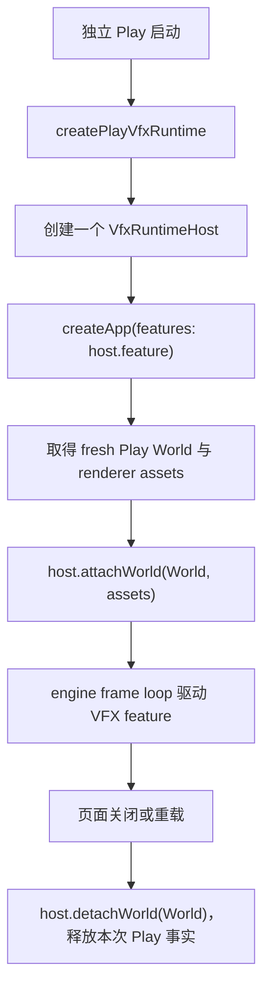

# `@forgeax/editor-play-runtime`

> ForgeaX 独立 Play 模式厚 host：负责一个 active game runtime realm 的输入、physics gate、scoped Pack 资产、加载/诊断遮罩、VAG 协议桥接，以及引擎拥有的 VFX 粒子运行时接入。

## 功能

| 能力 | 契约 |
|:--|:--|
| FPS 鼠标捕获 | 根据 `forge.json` 的 `pointerLock` / `input` opt-in，通过 `window.parent.postMessage({ type: 'fx-pointer-capture' })` 与 Tauri 壳通信 |
| Physics gate | 根据 `forge.json` 的 `physics` opt-in（`rapier-3d` / `rapier-2d`）在 `createApp` 时装配 |
| 单 realm 资产 | 只接收一个 exact `FORGEAX_GAME_DIR`，catalog/import/package 共用 `scopeId + generation` |
| 加载遮罩 | 冷启动渐变遮罩在首帧渲染后淡出 |
| 诊断遮罩 | WebGPU 不可用或 `createApp` 失败时展示带 `code`、`expected`、`hint` 的结构化诊断 |
| VAG_CONSOLE 桥接 | 劫持 console、展示 `Error.detail`，并转发 Vite HMR build error |
| 预览控制 | 通过 `VAG_PREVIEW_PAUSE` / `VAG_PREVIEW_PLAY` / `VAG_PREVIEW_RELOAD` postMessage 控制 |
| VFX runtime | 通过 `@forgeax/engine-vfx-render` public API 创建一个 `VfxRuntimeHost`，绑定独立 Play World 与 renderer assets |
| Thick Worker execution | 游戏显式声明 `forge.json.executionEntry` 后，World、Renderer、AssetRegistry、audio、physics、VFX、game plugins 与帧循环由 Engine 在同一个 Host/Worker realm 内装配；未声明的游戏继续诚实报告 `main-serial` |

## Thick execution 入口

`executionEntry` 是显式 opt-in，不是浏览器 capability 猜测。模块默认导出 Engine
`ExecutionBootstrapEntry`；可选的具名 `host` 只运行 DOM/UI，二者通过一个
`MessagePort` 交换游戏自定义消息。`World`、Renderer、Registry、函数闭包和 DOM
节点不跨 realm。

```ts
import type { ExecutionBootstrapEntry } from '@forgeax/engine-app';

const execution: ExecutionBootstrapEntry = async () => ({
  run: async ({ world, assets }) => {
    // Realm-safe gameplay only. The Editor wrapper owns common audio/VFX/physics/plugins.
  },
});

export default execution;
```

`tier: auto` 的结果必须从 `app.execution.report()` 读取：Worker WebGPU 可用时为
`engine-worker` 或 `shared`；能力不足时只允许 Engine 诚实回退到
`main-serial`。`games/sample` 是仓库内首个真实 adopter，同一份 `runSample`
逻辑同时被 legacy Host bootstrap 与 thick entry 调用，因此没有测试专用的第二套玩法。

## 导入示例

```ts
import type { GameContext } from '@forgeax/editor-play-runtime';
```

> [!NOTE]
> Play runtime 是 iframe 内的独立 Vite 应用（开发端口通常为 `15173`；`bun fx` 编排时为 `15273`）。Host 通过 `/preview` 代理嵌入 iframe；active game 由 server-authoritative binding 选择，`?game=<slug>` 只能作为与 binding 比对的预期身份，不能选择磁盘目录或绕过 scope。

> [!IMPORTANT]
> 运行时不接受 games parent directory，不枚举 sibling games，也不提供无 scope 的 catalog、lazy-import 或 DDC route。未绑定、错误 scope/generation 以及 degraded catalog 均 fail closed。

## VFX 运行时边界

独立 Play 在所选执行 realm 内创建 `createPlayVfxRuntime`，把同一个 `host.feature` 传入 `createApp`；拿到引擎创建的 fresh World 和 renderer assets 后，再调用 host 的 `attachWorld`。VFX runtime 只负责 host 装配和 camera 只读适配，不实现粒子模拟、asset cooking 或 VAG transport。



### 编译期与运行时依赖

| 依赖 | 允许位置 | 运行时约束 |
|:--|:--|:--|
| `@forgeax/engine-vfx-render` | `src/vfx-runtime.ts`、`src/main.ts` | 运行时唯一的 VFX public host 入口 |
| `@forgeax/engine-vfx-compiler` | `vite.config.ts` 的 importer / catalog 构建插件 | 仅 build-time；不得从 `src/` 运行时代码导入 |
| `@forgeax/editor-core/protocol` | `src/main.ts` | 只用于 VAG_* iframe 协议；VFX host 不新增第二套消息协议 |
| renderer `AssetRegistry` | 引擎 `createApp` | 由引擎提供并传给 host；Play runtime 不复制资产 registry |

> [!IMPORTANT]
> `compiler` 发现 `.vfx.wgsl` 并在构建期生成 GPU program artifact；`VfxRuntimeHost` 只负责已解析资产的运行时接入。两者不能通过“运行时再 import compiler”拼接，否则独立 Play 的 bundle 边界和 `clone 即跑` 契约都会失效。

### World 与 handle 契约

Play World 是本次独立 Play 的唯一运行时 World。它不接受 Edit World 的 `EntityHandle`，也不把 Play handle 交回 Edit；同一数字 handle 在不同 World 中可能碰巧相同，调用方必须依赖 world-bound locator 和 core 的 `world-mismatch` / `stale-entity-handle` 结构化错误，而不是依赖数字值判断身份。

## VAG 协议边界

所有跨 iframe 的控制、console、网络、FPS、设备丢失和 carrier handshake 都使用 `@forgeax/editor-core/protocol` 中的 VAG schema。`@forgeax/engine-vfx-render` 只在当前 Play realm 内通过 `createApp` feature 工作，不直接发送 VAG 消息；如果需要把 readiness 展示给宿主，必须由已有 VAG carrier/diagnostics 投影负责。

## exports 子入口

| 入口 | 说明 |
|:--|:--|
| `.` | `GameContext` 类型 |
| `./package.json` | 包元信息 |

## troubleshooting

| 症状 | 原因 | 解决 |
|:--|:--|:--|
| `/preview/?game=<slug>` 白屏 | WebGPU 不可用或 `createApp` 失败 | 在浏览器 DevTools 或诊断遮罩中查看结构化错误的 `code` / `expected` / `hint` |
| VFX readiness 显示不可用 | host 没有 attach fresh Play World，或 assets 尚未就绪 | 检查 `createApp(features)` 后的 `attachWorld` 结果；不要在运行时导入 compiler |
| VAG 消息没有到达宿主 | 使用了非 SSOT 的自定义消息名或绕过协议 schema | 复用 `@forgeax/editor-core/protocol` 的 VAG schema 和 `sendVagMessage` |
| HMR 不生效 | 文件事件未传到 engine-src 的 Vite watcher | 确认 `usePolling: true` 且 `run.sh` 的 symlink 有效 |
| play-runtime 端口被占用 | 另一个 engine Vite 实例未停止 | 使用对应 host 的 stop 命令停止服务后重试；不要结束其他 workspace 的 Play 进程 |
