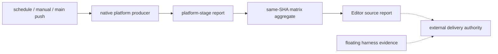
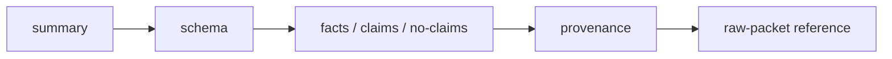

# Editor CI portability contract

> [!IMPORTANT]
> **Editor CI only proves Editor source evidence.** Its report binds the exact `workflow_run.head_sha`, run/attempt, remote `main` ancestry, required contexts, producer identity, and live admission. A green Editor report is not a harness delivery, merge, release, or overall delivery conclusion.

> [!NOTE]
> **Harness commit, push, and reachability are owned by the harness.** Cross-repository join is performed by an external delivery authority; it is not a post-merge monitor input or terminal state.

本目录的 portability 能力是现有 Editor CI contract 的非 required 投影。机器消费者先读取 `editor-ci-contract.json`，再按报告 artifact 读取平台和阶段证据；不需要解析 workflow 日志，也不需要创建第二套 portability failure schema。

## 快速入口

| 入口 | 平台集合 | required 边界 | 报告 artifacts |
|:--|:--|:--|:--|
| `schedule` | Linux / Windows / macOS | 非 required | 每个平台：`editor-portability-report.json`；矩阵汇总：`editor-portability-aggregate.json` |
| `workflow_dispatch` | Linux / Windows / macOS | 非 required | 每个平台：`editor-portability-report.json`；矩阵汇总：`editor-portability-aggregate.json` |
| `push` to `main` | Linux / Windows / macOS | 非 required | 同一 `CI` run 中分别读取 platform report 与 `editor-portability-aggregate.json` |

`editor-portability-report.json` 是单个 matrix cell 的 platform-stage report；`editor-portability-aggregate.json` 是同一 run、同一 source SHA 的 matrix aggregate。机器消费者以 [`editor-ci-contract.json`](./editor-ci-contract.json) 的 `portability.artifact` 为 aggregate artifact SSOT，不把两者当作同一文件。

Required-context roster remains the SSOT in [`editor-ci-contract.json`](./editor-ci-contract.json); this README does not repeat the roster. Portability results do not enter that roster.



## 阶段与终态

每个平台按固定顺序产生 `checkout`、`install`、`setup`、`wasm`、`zero-binary`、`type-static`、`capability-probe` 和 `smoke` 报告。

| 阶段 | 允许的终态 | 说明 |
|:--|:--|:--|
| `checkout` / `install` / `setup` / `wasm` / `zero-binary` / `type-static` | `pass` 或 `failure` | 缺 submodule、lockfile、工具链、生成物或静态检查失败时必须显式 failure。 |
| `capability-probe` | `pass`、`failure` 或 bounded `skipped` | `skipped` 必须记录 capability 事实、边界和恢复 hint。 |
| `smoke` | `pass`、`failure` 或 bounded `skipped` | 优先真实 headed，其次真实 headless；不可用时不能伪造 pass。 |

> [!CAUTION]
> `skipped` 不是 required stage 的降级通道。checkout/install/wasm/toolchain/build 等 required 阶段只能 pass 或 failure；只有 capability-probe/smoke 可以表达 bounded non-applicable。

## 报告字段

公开 declaration 位于 [`editor-ci-report.d.mts`](./editor-ci-report.d.mts)，实现位于 [`editor-ci-report.mjs`](./editor-ci-report.mjs)。所有消费者使用字段，不解析日志。

| 字段 | 用途 |
|:--|:--|
| `sourceSha` | 把 producer、aggregate、landed run 绑定到同一源码 SHA。 |
| `platform` | 记录 OS、架构、runner image 和工具链身份。 |
| `stage` | 标识当前逻辑阶段。 |
| `capability` | 记录 browser mode、channel、GPU backend 或 bounded boundary。 |
| `terminalStatus` | 共享 `pass` / `failure` / `skipped` 词汇。 |
| `failureClass` / `code` | 结构化失败分类与稳定错误码。 |
| `expected` / `observed` / `hint` | 让 AI 直接判断差异和下一条恢复动作。 |
| `firstFailure` / `attempts` | 保留首个失败和有限重试历史。 |
| `matrix` | 以 source SHA 聚合平台-stage terminal result；每个单元只能出现一次。 |

## 恢复路径

1. 先读取 aggregate，再按 `platform` 和 `stage` 定位单平台报告。
2. 读取 `failureClass`、`code`、`expected`、`observed`、`hint` 和 `firstFailure`，不从日志字符串猜测。
3. 仅 `external-transport` 且具有 transient evidence 的失败可按既有策略最多重试一次。
4. 修复 source、environment、admission 或 capability 原因后，以同一 source SHA 重新产生完整链路。

缓存只作为同 OS、架构、工具链和 lockfile 上下文中的加速输入；它不是 provenance，也不能替代目标平台的 checkout、install、wasm 生成或消费。

## Ownership boundary

Portability report is Editor CI evidence, not a product runtime API. Editor CI owns only the source-side facts:

- the same `CI` push/main run and source SHA across the platform reports;
- the landed SHA and its explicit remote `main` ancestry proof;
- the producer, required-context, and admission evidence for that source SHA.

The harness owns its own commit, push, and remote reachability evidence. An external delivery authority may join those facts by target SHA, but that join is outside Editor CI and is not an input or terminal state of the post-merge monitor.

本说明不扩展到 Studio、产品 UI、`frc-13 portability home` 或 scorecard。

## smoke-play shard 运行证据

九个 heavy shard（`scriptable`、`broad-core`、`template`、`broad-play`、`broad-assets`、`vfx`、`editor`、`create`、`repro`）都必须经 `scripts/ci/smoke-shard-runtime.mjs` 执行。workflow 中的 `--shard`、`--ports` 和 `--` 后原始命令共同构成该 shard 的可重放契约；不得改变测试文件顺序、headed/WebGPU 参数、`workers=1`、`retries=0` 或 `max-parallel: 2`。

每个 shard 的 `.ci/smoke-shard-runtime/<shard>/runtime.json` 是 `forgeax-smoke-shard-runtime/v1` 运行报告，包含 identity、lock、端口、资源快照、子进程命令和 `classification`。`lifecycle.jsonl` 由 `FORGEAX_DEV_STACK_EVENT_LOG` 接收 host 的 started、exited、restart 和 shutdown 事件。runtime evidence 无论成功或失败都上传；失败时另上传 lifecycle 与 Playwright `test-results`。

### Runner 工具与端口检查能力

`flock` 是 heavy shard 的 host-local lock 必要工具；端口占用检查是一个能力契约，按以下优先级选择可用的只读工具：

| 能力 | 选择顺序 | 证据边界 |
|:--|:--|:--|
| 端口监听检查 | `lsof` → `fuser` → `ss` | 只能读取声明端口的监听状态；发现占用者或无法可靠解析时，命令不得启动并保持 fail-closed。 |
| 占用者 cwd | Linux 先受控读取 `/proc/<pid>/cwd`，再回退 `lsof` | 读取受限时记录 `unknown`；不因此扩大进程所有权，也不执行外部终止。 |

因此，runner 缺少 `lsof` 但存在 `fuser` 或 `ss` 时不属于 admission failure；三种端口检查工具全部缺失时仍必须以 `smoke-shard-admission-invalid` fail closed。端口探测和 cwd 证据始终保持只读，不改变进程组所有权、teardown 边界或失败分类。

恢复时先读取 `classification.code`、`expected`、`observed`、`hint` 和 `evidenceRefs`。`smoke-play` aggregate 仍检查全部 matrix shard 的成功结果并 fail closed；wrapper 或 artifacts 不会把产品断言、`device-lost`、连接拒绝或预览超时改写为通过。

## CI baseline evidence discovery

> [!IMPORTANT]
> **Current attempt boundary.** A baseline result can expose diagnostic facts only when it carries the exact `sourceSha`, `runId`, `runAttempt`, accepted topology, and workflow identity. A local command passing, a copied fixture, a pull-request result, or an old main run cannot prove live runner, browser, budget, or merge acceptance.

The producer-owned entrypoint is [`editor-ci-contract.json`](./editor-ci-contract.json). The baseline facts owner remains `scripts/ci/ci-baseline.mjs`; `scripts/ci/collect-ci-baseline.mjs` is the read-only collector. Contract and CLI layers project these facts and never become a second packet or facts producer.

### Integration index short path

From baseline discovery, follow [integrationIndex](./editor-ci-contract.json) in `baselineEvidence.topIndex.fields` before opening workflow YAML:

1. Run `bun fx ci contract --json`.
2. Follow `integrationIndex.browser.command`: `bun run ci:browser-release -- project-topology`.
3. Supply `--admission`, `--measurements`, and `--output`, plus the current `--baseline-evidence` or `--shared-fact-reference` input; keep `admission`, `parentCheck`, `population`, and `claim` as independent browser boundaries.
4. Read the same index for portability: portability is disabled, `required=false`, and `no-claim`; do not start a Windows/macOS runner or infer platform evidence.

This short path preserves the existing contract owner: browser consumes baseline shared references, while its admission and claim remain its own projection.

### Progressive disclosure

Use the existing CI front door to read the collector-owned `ci-baseline.json` output:

```sh
bun fx ci baseline --json --input PATH
bun fx ci contract --json
bun fx --help
```

The public JSON layers are stable and ordered:



The same vocabulary is available in the contract top index and the baseline JSON:

### Capacity admission envelope

`collect-ci-baseline.mjs` derives the optional `capacityAdmission` block from the same exact run
attempt packet. For a direct exact-source probe, use:

```sh
bun scripts/ci/collect-ci-capacity-admission.mjs \
  --run-id RUN_ID \
  --attempt ATTEMPT \
  --baseline-commit SOURCE_SHA \
  --output artifacts/ci-capacity-admission
```

The collector selects one workflow file, expands declared matrix names to GitHub's live job names,
and records a content-addressed signature over the envelope. Every non-skipped job must retain the
same run ID, attempt, source SHA, runner ID/name, runner labels, and complete timestamp boundaries.
The per-job phase catalog is:

`workflow-created` → `dependency-ready` → `matrix-throttle` → `runner-assigned` → `setup-active` →
`task-active` → `aggregate` → `terminal` → `artifact-ready`.

`matrix-throttle` is an upper-bound observation only when the declared matrix cap is saturated;
runner contention remains explicitly unseparated. Active-duration sums are occupancy inputs and never
become an SLO claim. Mixed attempts, missing runner identity, source mismatch, reversed timestamps,
and cross-attempt artifacts remain structured no-claim evidence.

| Layer | Public fields | Boundary |
|:--|:--|:--|
| `summary` | `status`, `schema`, `provenance` | Says what this input can expose; it does not upgrade missing external evidence. |
| `schema` | `version`, `fields`, `layers`, `errorFields` | Mirrors `baselineEvidence` in the contract; no second schema is introduced. |
| `facts` | `attemptProvenance`, `criticalPath`, `requiredContexts`, `costFacts`, `readiness` | Diagnostics remain tied to one attempt and accepted topology. |
| `claims` | `budgetClaim` | Non-null only after the baseline owner validates at least 20 successful exact stable-roster samples. |
| `no-claims` | `noClaim` / `noClaims` | Keeps `code`, `expected`, `observed`, `hint`, and `affectedProvenance` machine-readable. |
| `raw-packet` | `rawPacket` | Points to the final evidence layer; it is not replaced by an artifact name or a local report. |

The shared fact identity is the contract's `baselineEvidence.sharedFactReference`: `sourceSha`, `runId`, `runAttempt`, `topologyId`, `graphDigest`, `rosterKey`, and `workflow`. Browser release projection may reference this identity, but its own admission, `smoke-play` parent, population, measurement digest, and claim remain independent.

The collector's accepted topology includes jobs whose workflow condition is statically guarded by `always()` (including a deterministic conjunction). Disabled jobs such as the portability matrix remain in `source.acceptedTopology` inventory and are never added to the expected attempt roster. Each accepted packet keeps `rawPages.jobs`, embedded `steps`/`runner` references, artifact pages, and cache pages; an unavailable artifact or cache API is represented by an endpoint and structured error instead of being silently discarded.

The browser shared reference adds a digest-backed `factReferences` entry for each of `criticalPath`, `costFacts`, and `readiness`, plus `artifactIdentity` from `costFacts.artifact.identity`. These are verifiable references to the current baseline fact blocks, not copies of browser admission, population, or budget state.

### Facts, claims, and no-claims

`criticalPath` describes the accepted workflow DAG. `requiredContexts` is the separate cloud gate projection; it is not a replacement for the DAG. `costFacts` may include admission, queue, active, wall-clock, archive/expanded byte observations, and cache `hit` / `miss` / `unknown`. `readiness` requires both producer-ready and consumer-observed-start identities from the same attempt. Missing or mismatched inputs remain no-claim; unknown bytes are not zero and cache hit is not a saving amount.

`budgetClaim` is owner-bound and auditable. It must point back to the exact successful sample provenance set, stable roster, accepted topology, and success condition. Fewer than 20 successful exact stable-roster attempts, a mixed failure, retry, source, roster, or topology, or a missing prerequisite keeps the claim null. No local fixture or repeated sample can satisfy this external evidence threshold.

### Error recovery

| Error family | Recovery action |
|:--|:--|
| `baseline-input-unreadable` / `baseline-evidence-invalid` / `attempt-provenance-missing` | Pass the current collector-produced JSON and preserve its exact attempt provenance. A packet-less collector output must carry an explicit `attempt-packet-missing` no-claim; do not pass `{}` as provenance or pass `editor-ci-report`. |
| `api-read-failed` | Re-run the collector against the exact endpoint, `runId`, and `runAttempt`; preserve its structured `expected`, `observed`, `hint`, and `affectedProvenance` fields, and do not substitute an empty packet. |
| `workflow-needs-missing` / `workflow-cycle` / `topology-not-admitted` | Recollect the workflow source, ruleset, and complete job packet for one accepted topology. |
| `readiness-missing-side` / `readiness-provenance-mismatch` / `readiness-time-reversed` | Collect both producer-ready and consumer-observed-start observations from the same artifact identity and attempt. |
| `budget-population-insufficient` or population mismatch | Narrow to one source, roster, and topology; collect independent successful attempts until the 20-sample gate is actually met. |
| `provider-billing-unsupported` | Use an external billing authority. This contract exposes observable timing/bytes/cache facts, not currency or runner-minute price. |

### Raw packet and external acceptance

Read the raw paginated jobs/steps, artifact, cache, ruleset, workflow-source, runner, and browser packet only after the summary and structured errors identify the missing proof. A local contract, CLI, or browser projection test proves deterministic projection behavior only. It does not prove a current GitHub run, external runner queue/active observation, browser terminal evidence, 20 independent attempts, required checks, merged SHA reachability, or remote-main acceptance.

## CI baseline evidence status

The M2 local packet, timing, artifact, cache, readiness, and capacity checks are deterministic evidence only.
They do not prove a live GitHub Actions attempt, runner observation, provider billing, pull request status, or
remote-main acceptance.

On 2026-08-15 the read-only external probe found ruleset `18438292` and main run `31865119979` attempt `1`,
but that run has source SHA `172ef0d538bb0beacf8a9613ae9a233f80789db2`, is a failed historical main run, and is
not the current implementation SHA. The collector produced only workflow/ruleset intermediate files and did not
produce a complete auditable jobs/steps/artifact/cache/runner packet for the current implementation. Therefore
the external evidence result is `no-claim`.

Next collection action: run the collector against one current source SHA and one exact `runId/runAttempt`, retain
the raw paginated jobs, steps, artifacts, cache, and runner responses, then verify source/ruleset digests and all
artifact and consumer identities before marking any fact observed. Do not substitute a fixture, workflow name,
artifact name, old run, pull request green result, or unmerged branch for that packet.
