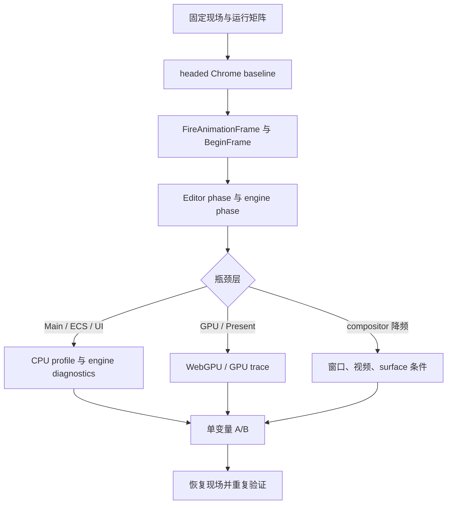

# forgeax-editor-performance

> [!IMPORTANT]
> 性能结论必须来自真实 Editor 页面和可重复的定量样本。静态代码只解释 trace 已经指向的调用链；未经过 A/B 的函数名只是线索。

## 入口

Editor standalone 默认使用 `15290`；`18920` 是 Studio host，不是本 skill 的目标页面。

```bash
# 已有 game-backed stack 时复用现场；否则启动独立 Editor
bun fx start --game=/absolute/path/to/game

# 先确认 Gateway 与目标页面
node skills/forgeax-editor-gateway/scripts/gateway.mjs --health

# 单表面真实 headed trace
FORGEAX_CHROMIUM='/Applications/Google Chrome.app/Contents/MacOS/Google Chrome' \
bun scripts/chrome-performance.mjs \
  --headed --surface edit --warmup 10000 --duration 12000 \
  --url http://localhost:15290/ \
  --out /tmp/forgeax-chrome-performance/<sample>

# 只测浏览器/GPU/Present，不建立 User Timing phase marks；用于量化诊断标记的增量
bun scripts/chrome-performance.mjs \
  --headed --no-diagnostics --surface edit --duration 5000 \
  --out /tmp/forgeax-chrome-performance/<sample>-no-diagnostics

# owner 已锁定后，短时间打开调用层级；nested 不是 FPS 样本
bun scripts/chrome-performance.mjs \
  --headed --nested --surface edit --duration 1500 --max-trace-mb 512 \
  --out /tmp/forgeax-chrome-performance/<sample>-nested
```

`--headed` 样本必须可见且聚焦；固定窗口 `1280×720`、DPR `1`、Chrome 版本、游戏、commit、运行阶段和启动参数。原始 trace 只放 `/tmp/forgeax-chrome-performance/`。

## Scripts

从 editor 根目录运行。脚本只通过 Gateway 切换测量表面、停止/启动 Play 或设置编辑相机；不得修改 authored scene。RHI 探针只 patch 自己的 disposable Playwright page，并在退出前恢复。

| 脚本 | 用途 | 产物 |
|:--|:--|:--|
| `skills/forgeax-editor-performance/scripts/inspect-runtime.mjs` | 读取 active world、renderer diagnostics，并用短时 `requestAnimationFrame` probe 记录页面实际帧数 | `runtime-diagnostics.json` |
| `skills/forgeax-editor-performance/scripts/inspect-shared-assets.mjs` | 一次性审计 MeshRenderer 材质 slot、handle 与 payload 对象身份；不安装逐帧探针 | `shared-assets.json` |
| `skills/forgeax-editor-performance/scripts/inspect-glb-complexity.mjs` | 离线统计 GLB primitive、vertex 与 index 复杂度 | JSON |
| `skills/forgeax-editor-performance/scripts/capture-cpu-profile.mjs` | 简单 bounded Chrome CPU sampling | `cpu-profile.cpuprofile`、`metadata.json` |
| `skills/forgeax-editor-performance/scripts/profile-cpu.mjs` | 按测量表面采样 CPU，并汇总 self/total 热点 | `profile.json`、`summary.json` |
| `skills/forgeax-editor-performance/scripts/profile-allocations.mjs` | 外部 V8 allocation sampling；按目标 surface frame 归因分配调用栈 | `profile.raw.json`、`profile.json`、`summary.json` |
| `skills/forgeax-editor-performance/scripts/probe-render-commands.mjs` | bounded RHI 命令量、material slot 与真实 rAF 工作量探针 | `report.json` |
| `skills/forgeax-editor-performance/scripts/profile-rhi-ablation.mjs` | 外部单变量 RHI command ablation；只用于确诊 owner | trace、summary |
| `scripts/chrome-performance.mjs` | headed Chrome trace，支持 `edit` / `play-scene` / `play-game` 与 GPU/Present 摘要 | `trace.json`、`summary.json` |
| `scripts/chrome-performance-benchmark.mjs` | 固定调度、多次独立浏览器样本 | `benchmark-manifest.json` 与各次 trace |
| `scripts/chrome-performance-compare.mjs` | 校验契约后比较 baseline/candidate manifest | comparison JSON |

常用短探针：

```bash
bun skills/forgeax-editor-performance/scripts/inspect-runtime.mjs \
  --headed --duration 3000 \
  --out /tmp/forgeax-chrome-performance/<sample>-runtime

bun skills/forgeax-editor-performance/scripts/capture-cpu-profile.mjs \
  --headed --warmup 3000 --duration 5000 --interval 1000 \
  --out /tmp/forgeax-chrome-performance/<sample>-cpu
```

有标题页的游戏必须声明真实 gameplay 就绪条件；Prism City 使用：

```bash
bun scripts/chrome-performance.mjs \
  --headed --surface play-game \
  --play-click-text '开始游戏' \
  --play-ready-selector '#tps-hud-root' \
  --play-blocking-selector '[data-forgeax-loading]' \
  --out /tmp/forgeax-chrome-performance/<sample>-play
```

短探针只回答“当前页面正在跑什么”和“JS 调用链在哪里”；FPS、BeginFrame、GPU/Present 仍以 Chrome trace 为准。`inspect-runtime` 的 `frameProbe.fps` 是 rAF 计数，不替代 Editor/Play UI 的正 FPS smoke 断言。

## 运行矩阵

| 表面 | 进入方式 | 用途 | 结论边界 |
|:--|:--|:--|:--|
| `edit` | `gateway.dispatch({kind:'stop'})` | 编辑器世界、面板、编辑相机 | 编辑态根因 |
| `play-scene` | Play 后 `setDisplay('scene')` | 编辑器世界 + 游戏世界合成 | 多世界 / 编辑器叠加 |
| `play-game` | Play 后 `setDisplay('game')` | 单游戏世界 | 游戏本身与嵌入层隔离 |

每个表面单独 warm-up 和录制；不得把 `play-scene` 的结论套到 `edit`。Play 失败、缺相机、持续 RHI error 或 render phase 缺失的样本只能记录为阻塞证据，不能进入性能比较。

推荐使用固定调度 benchmark，并只比较 `VALID`、运行契约一致的 manifest：

```bash
bun scripts/chrome-performance-benchmark.mjs \
  --headed --surface edit --repeat 3 \
  --warmup 20000 --duration 20000 \
  --variant baseline --out /tmp/forgeax-chrome-performance/<baseline>

bun scripts/chrome-performance-compare.mjs \
  --baseline /tmp/forgeax-chrome-performance/<baseline>/benchmark-manifest.json \
  --candidate /tmp/forgeax-chrome-performance/<candidate>/benchmark-manifest.json \
  --surface edit \
  --out /tmp/forgeax-chrome-performance/<comparison>.json
```

## 证据顺序



按以下顺序读取 summary/trace：

1. `FireAnimationFrame` 间隔：先按 CDP frame tree 归属到 `/editor/` 或 `/preview/` carrier，再把同一显示 tick 内的多个 rAF callback 合并；禁止把父 Editor 与 Play child 或同帧多个 callback 相加成 FPS。
2. `BeginFrameArgs.interval_us` 与 `unthrottled_interval_us`：浏览器调度是否降频。
3. `frame-total`、`world-update-primary`、`world-update-injected`、`renderer-draw`：Editor app 预算。
4. `extract`、`record` 和 renderer 子阶段：engine 预算。
5. GPU/WebGPU、Swap/Present：确认是否是 GPU 或显示提交等待。
6. JS CPU profile：定位调用链；工具必须记录目标 frame/target，并在同 renderer target 时按 script execution context 过滤样本，不能把 host 与 runtime 混算；不把 inclusive duration 当独占时间。

Trace 工具的阶段名由 `scripts/chrome-performance.mjs` 和 engine profiler 的 phase catalog 共同定义；新增阶段必须先改 owner，再改解析器/文档。

所有 duration event 都按 capture begin/end 的交集截断；跨边界 `RunTask`、GPU 或 Present 事件只计窗口内部分。CPU profile 同时保留原始 target profile 和归属后的 surface profile，summary 中的 `ownership` 是结论成立的必要证据。

## Engine / Editor 诊断

Engine 的 bounded profiler 是测量 SSOT：

```ts
const capture = profiler.startCapture({
  frameLimit: 120,
  eventLimit: 20000,
  detail: 'owner',
});
// 读取 capture.value.finish() 或 profiler.latestCapture()
```

`detail: 'owner'` 用于稳定定位 app/render 阶段；只有 owner 阶段已锁定且调用层级必要时才使用 `nested`。采集必须有 frame/event 上限。

Editor raw scope 仅用于开发诊断：通过 `forgeax-editor-gateway` 连接当前页面后读取 `world`、`renderer`、`assets` 的快照和 renderer diagnostics。不得通过 raw scope 写 authored state；写入仍走 EditGateway。

优先采集这些同一帧指标：

| 域 | 最小指标 |
|:--|:--|
| World | entity/table 数、系统数、缺失组件与 stale handle 计数 |
| Extract | render candidate、culled、visible、material snapshot/cache hit/miss |
| Material | parent-chain resolve 次数、cache hit/miss、chain depth、shader variant lookup |
| Record | draw/dispatch、bind-group cache hit/miss、pipeline lookup |
| Renderer | per-frame pass、shadow cascade、bloom、visibility |
| Browser | frame interval、BeginFrame、long task、GPU/Present |

默认关闭 User Timing 时，engine profiler 不调用 `performance.mark`。Editor 的 VFX 状态通过 renderer 的 render-feature 事件订阅更新，不依赖 profiler phase observer；`--no-diagnostics` 只关闭 marks，不改变这条业务事件订阅。关闭 marks 后，application FPS 仍必须由 CDP frame id 归属，不能退回浏览器全局 rAF；Editor 工具栏 FPS 来自 renderer 成功完成 `draw()` 后的 frame-end 信号，不得创建独立 rAF 计数器。若要证明测量关闭路径，结合 engine package 的 profiler default-off 单测和微基准，不要只看 trace。

User Timing 是有扰动的诊断模式，不是免费的生产计数器。Prism City 实测同一真实 gameplay：owner marks 开启时平均约 `113 FPS`，关闭后 child application 与 compositor 都约 `120 FPS`。因此 phase histogram 用于定位层级，最终帧率验收使用 diagnostics-off；普通运行的 adapter 在 app 创建时直接返回 `undefined`。

复用检测也必须单独量化：稳定命中路径只允许标量/epoch/固定长度矩阵比较，不得 clone World 或重建 material/mesh snapshot；慢路径才复制 token。当前 directional-shadow cache 的 nested phase 低于 `0.01ms`，而 nested trace 的 per-draw marks 会带来数量级更大的扰动。任何检测 phase 如果进入毫秒级，应先检查是否误把诊断采集放进热路径。

## Material 优化规则

Material 内部优化的边界是“对外 asset / ECS / render snapshot 逻辑不变”。按以下顺序验证：

> [!IMPORTANT]
> 不得为基础管线固定开销新增 shader/material variant axis。已有 authored contract 明确区分能力时可测现有变体；否则继续优化 CPU 路径、资源生命周期、重复计算和数据布局。

1. 先确认 trace/CPU profile 指向 `extract`、material resolver、shader contract 或 record。
2. 先做同一 extract frame 内的缓存；缓存 key 使用稳定 handle，生命周期不超过本帧，默认不需要全局失效协议。
3. 只有确认资产不可变或拥有 revision/identity 失效信号后，才提升到跨帧/跨 World 缓存。
4. parent chain、参数线性化、texture/video handle 和已有 shader 选择结果必须和原路径保持一致。
5. 改动后验证 material asset mutation、parent override、cycle/error、multi-submesh、sprite override 和 Play/Stop 世界边界。
6. A/B 必须只改变一个变量；实验开关和临时 patch 在样本结束后立即恢复。

## A/B 判定

| 实验 | 唯一变量 | 支持的结论 |
|:--|:--|:--|
| material snapshot cache | 仅开启/关闭本帧 cache | `extract`、resolver 次数和帧预算同向改善 |
| shader contract cache | 仅缓存相同 shader source 的 binding contract | `record`/renderer draw 降低且 shader 替换仍失效 |
| hierarchy publisher | 仅暂停每帧 selector publish | `world-update` 或 React 栈同步改善 |
| shadow/post-process | 仅改 cascade/bloom preset | 只有 renderer/record 同步改善才支持 render-state 根因 |
| diagnostics | 仅开启/关闭 bounded profiler/marks | 量化诊断开销，不把诊断状态当优化；`--no-diagnostics` 不提供 phase histogram |

每个实验保存：baseline、candidate、变量、预期、判定阈值、恢复确认和原始证据路径。

## 结论格式

```markdown
## Finding

- 观察：`<surface>` 稳态 `FireAnimationFrame` p50/p95 = `<...>`；`BeginFrameArgs` = `<...>`。
- 相关：只改变 `<variable>` 后，`<phase/counter>` 从 `<before>` 变为 `<after>`。
- 根因：仅在相同契约下重复 A/B 同方向成立后填写；否则写“未证实”。
- 未解释项：列出仍缺少证据的层，不用猜测填空。
- 下一实验：只改变 `<variable>`；预期 `<...>`；判定阈值 `<...>`。
- 证据：`/tmp/forgeax-chrome-performance/<sample>/...`。
```

## 收尾

- [ ] `edit` / `play-scene` / `play-game` 分开记录。
- [ ] headed、可见、聚焦、Chrome、窗口、DPR、游戏、commit 和 warm-up 已记录。
- [ ] 同时读取 frame、BeginFrame、Main、engine、GPU/Present。
- [ ] 至少有一个单变量 A/B；失败或无效样本已标注。
- [ ] 大 trace 未进入 git；临时 runtime 开关已恢复。
- [ ] 代码改动通过所属 package 的 test/typecheck；对外协议未变。
