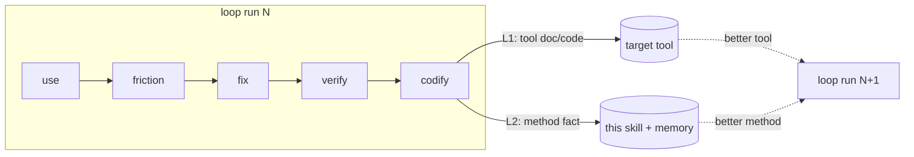

# forgeax-editor-solo — Design Notes

> Why a *solo self-evolution loop* exists as its own skill, separate from `forgeax-closed-loop`, and what
> "self-evolution" buys over plain iteration. SKILL.md is the how; this is the why.

## Core proposition

**An AI-first tool's quality is bounded by how well its primary user (an AI) can actually use it — so the
fastest way to improve it is to have that AI use it and fix what hurts.** The loop makes that disciplined:
the friction an AI hits *is* the spec for the next fix, and the act of using produces the evidence.

## What the loop optimizes — the fix-priority ladder

The target being improved is a **stack**: `engine → editor → skill/doc`. The engine is the widest
SSOT (every editor and game derives from it); the editor is a narrower authoring surface over it; the
skill/doc is the narrowest layer — a *projection* of the code for one reader (an AI). A friction can
almost always be "addressed" at more than one layer, and the layers are **not** equal:

> **Fix at the deepest layer where the root cause actually lives, in the most systematic form.**
> Deeper = wider blast radius = the friction disappears for *every* downstream consumer, not just the
> one reader who happens to find the doc.

| Priority | Layer | Fix here when… | Blast radius |
|:--|:--|:--|:--|
| **1 (highest)** | **engine** | root cause is an engine primitive — a missing export, a wrong contract, an absent capability | every editor + every game |
| **2** | **editor** | engine is right, but the authoring surface doesn't project it — a missing gateway op / read facade, a wrong seam, an async contract | every editor user (human + AI) |
| **3 (lowest)** | **skill / doc** | the code is **correct and complete**; the *only* gap is discoverability — the AI couldn't find or understand a capability that already works right | one docs-reading AI |

**The razor that decides layer 3 vs. deeper:**

> *"If I fixed the code, would this doc still need to exist?"*
> - **Yes** — the doc teaches a genuine, correct capability the AI just couldn't discover → a legitimate
>   layer-3 fix (doc is the right primary fix).
> - **No** — the doc only *describes a code wart* ("you can't observe X, so watch the viewport instead";
>   "mode flips async, so poll it") → the doc is a **band-aid mis-filed as documentation**. The real fix is
>   a code change at layer 1 or 2 (make X observable; make the contract synchronous). Write the code fix;
>   the doc then shrinks to describing correct behavior, or vanishes.

This exists because an AI's **default reflex is to reach for the doc** — it's the cheapest, most local
edit, and it always "closes" the friction on paper. But a doc that narrates a limitation is negative work:
it adds a concept every future reader must hold, *instead of* removing the concept by fixing the code
(compression, `architecture-principles §1-7`). The ladder forces the question the reflex skips: **can this
friction be designed *out* of the code so no doc is needed?** Only when the honest answer is "the code is
already right, it's just invisible" does documentation become the primary fix.

**Systematic over instance-local, at every layer.** Whichever layer you land on, prefer the fix that makes
the friction *structurally impossible* (a type, an invariant, a single-door, a symmetric introspection leg)
over one that patches just this instance. A one-off trades a small edit now for the same friction recurring
in the next shape. This is why "minimal" in the loop means *minimal blast-radius-correct*, never *minimal
diff*: a two-line doc that hides a design flaw is smaller than the right refactor and strictly worse.

Escalation still applies (design decision below): a deep fix that spans subsystems is *more* likely to
exceed the solo loop's budget — when it does, hand it to `forgeax-closed-loop` rather than retreating to a
doc band-aid to keep the fix small. **"Too big for solo" routes up to closed-loop; it never routes down to
a doc.**

## Why solo, not closed-loop

`forgeax-closed-loop` is the right tool when work needs decomposition, adversarial review, and a
requirements→verify audit trail across many files. It pays for that with 7 steps, subagents, and a state
machine — overhead that is pure friction for *exploratory dogfooding*, where:

- one agent already holds all the context (it just used the tool),
- the fix is small and local (one API, one doc),
- the bottleneck is *noticing* the friction, not coordinating a team.

Forcing exploration through the heavy loop would front-load requirements the explorer doesn't have yet —
you can't write requirements for a friction you haven't felt. So this skill deliberately drops subagents
and state, and keeps a single instrument: the rolling report. The escape hatch (SKILL.md step 3 / the
route table) sends genuinely large fixes *back* to closed-loop rather than growing this loop.

## The self-evolution axiom

Plain iteration improves the **tool** (L1). Self-evolution also improves the **process** (L2): each run
feeds a reusable method-fact back into the skill and memory, so the *next* run is cheaper or catches more.

Without L2, the skill is static scaffolding and every run re-derives the same environment gotchas and
verify tricks. With L2, the skill's anti-pattern list and the project memory are the accumulated residue
of every prior run — the loop literally teaches itself. This is why step 7 makes the L2 write a gate, not
a suggestion: an AI defaults to *add code* (L1) and skip the *reflect-and-record* (L2); the gate forces
the anti-entropy write the AI won't self-generate.

## Design decisions with no other home

### 1. Docs-only dogfooding is a hard rule, not a preference

The experiment measures **docs-vs-reality drift**. If the driver reads source to figure out how to call
the tool, it silently compensates for every doc gap — the exact thing being measured. So step 1 forbids
reading source *to drive*. Reading source is allowed (and needed) in step 4 *to design the fix*. The two
phases have opposite rules on purpose.

### 2. Friction is logged live because memory lies

By the end of a session the driver has rationalized around every rough edge ("oh that's fine once you
know…"). The rolling report is an instrument that captures the *felt* friction before it's normalized. A
final write-up would be a reconstruction, missing exactly the entries that matter most. Hence the report
is the primary artifact and the gate checks it was updated *between* steps.

### 3. Contract errors outrank cosmetics in prioritization

A doc that disagrees with the implementation (a documented signature missing a param) breaks a
docs-following user *silently and correctly-looking* — worse than an obvious gap that fails loudly. The
prioritization razor weights "how badly does this mislead a docs-only user", not just raw severity, so
these float to the top.

### 4. Fix by symmetry, verify by execution

Two razors that recur (both subordinate to the fix-priority ladder above — first pick the *layer*, then
apply these *within* it):

- **Symmetry over parallel mechanism** — the best fix usually makes the new surface *mirror* an existing
  sibling (a third introspection leg beside two existing ones), or shows a runtime query already covers it.
  A new parallel copy is an SSOT violation wearing a feature costume.
- **Execution over green tests** — the finish line is the friction's *behavior* gone in the live tool, not
  a passing unit. The loop's evidence is an end-to-end run, with repo gates as necessary-but-not-sufficient
  backup.

### 5. The frontier is monotone — runs climb, they don't circle

The dated experiments notebook is not just an archive; it's the **input to the next goal**. Left ungoverned,
an AI re-picks a goal near the last easy success (it's the cheapest to reason about), so N runs produce N
near-duplicates and the tool's harder surface — composed workflows, cross-boundary flows, the frictions a
prior run *deferred* — never gets stressed. So step 0 makes surveying the notebook a gate: the new goal must
differ from every prior one and move *up* the ambition ladder (probe → authoring → composed workflow → real
end-user task), ideally reaching a deferred friction the notebook already named. This is the L2 axiom applied
to *goal selection* itself — each run doesn't just leave a better tool and better method, it leaves a higher
floor for the next run's ambition. Without it, self-evolution plateaus at the easy goals.

### 6. Every fix lands in a worktree, never on the primary checkout

The loop *mutates a running tool* (dispatches ops, saves docs, restarts stacks) and *edits its source* in
the same session — a combination that makes the working tree a hazard: a half-landed fix, a scratch scene
write, or an aborted refactor can strand the primary checkout in a dirty state mid-dogfood. So the implement
step (step 5) is gated on working **inside a git worktree** (`EnterWorktree`), leaving the primary checkout
pinned to `main`. This buys three things the ladder needs:

- **Isolation** — deep (layer-1/2 code) fixes touch real engine/editor source; a worktree quarantines that
  blast radius from the checkout the user may be reading or running.
- **Cheap abandonment** — the ladder pushes toward the *correct* fix, which sometimes means discarding a
  first attempt. A worktree makes "throw it away" a one-liner, lowering the cost of aiming deep.
- **Clean PR boundary** — each loop's fix is one branch/PR from its worktree; the dated experiments notebook
  (gitignored) never bleeds into it, and `main` stays releasable throughout.

This is *not* the closed-loop's per-milestone worktree machinery — it's one worktree per loop run, entered at
implement time and exited (kept or removed) after the human gate.

## SSOT topology (where each fact lives)

| Fact | SSOT |
|:--|:--|
| The loop, its gates, report sections | `SKILL.md` |
| Why solo / why L2 / the razors' rationale | this file |
| Editor driver scripts (`gateway-live`/`gateway-eval`) | `forgeax-editor-gateway` skill (reused, never copied) |
| Per-run findings, friction table, evidence, driving code, captured output | that run's self-contained dir (`<target>/experiments/<YYYY-MM-DD>-<goal-slug>/` — `report.md` + `snippets/` + `out/`) |
| Reusable method facts (verify recipes, env gotchas) | project memory + SKILL.md anti-pattern list (L2 sink) |
| Target-repo architecture razors | `forgeax-harness/rules/architecture-principles.md` |

## Borrowed & bounded

Borrows from `forgeax-closed-loop`: human-as-final-authority gate, evidence-before-assertion, the SSOT
discipline. Drops: subagents, state machine, requirements/plan artifacts, adversarial review. The
boundary is deliberate — the moment a fix needs any of what was dropped, the work belongs in closed-loop,
not here.
