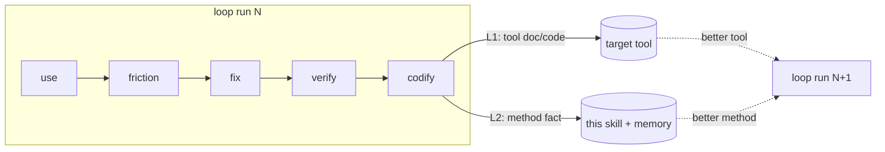

# forgeax-editor-solo — Design Notes

> Why a *solo self-evolution loop* exists as its own skill, separate from `forgeax-closed-loop`, and what
> "self-evolution" buys over plain iteration. SKILL.md is the how; this is the why.

## Core proposition

**An AI-first tool's quality is bounded by how well its primary user (an AI) can actually use it — so the
fastest way to improve it is to have that AI use it and fix what hurts.** The loop makes that disciplined:
the friction an AI hits *is* the spec for the next fix, and the act of using produces the evidence.

## Why solo, not closed-loop

`forgeax-closed-loop` is the right tool when work needs decomposition, adversarial review, and a
requirements→verify audit trail across many files. It pays for that with 7 steps, subagents, and a state
machine — overhead that is pure friction for *exploratory dogfooding*, where:

- one agent already holds all the context (it just used the tool),
- the fix is small and local (one API, one doc),
- the bottleneck is *noticing* the friction, not coordinating a team.

Forcing exploration through the heavy loop would front-load requirements the explorer doesn't have yet —
you can't write requirements for a friction you haven't felt. So this skill deliberately drops subagents
and state, and keeps a single instrument: the rolling report. The escape hatch (SKILL.md step 3 / the
route table) sends genuinely large fixes *back* to closed-loop rather than growing this loop.

## The self-evolution axiom

Plain iteration improves the **tool** (L1). Self-evolution also improves the **process** (L2): each run
feeds a reusable method-fact back into the skill and memory, so the *next* run is cheaper or catches more.

Without L2, the skill is static scaffolding and every run re-derives the same environment gotchas and
verify tricks. With L2, the skill's anti-pattern list and the project memory are the accumulated residue
of every prior run — the loop literally teaches itself. This is why step 7 makes the L2 write a gate, not
a suggestion: an AI defaults to *add code* (L1) and skip the *reflect-and-record* (L2); the gate forces
the anti-entropy write the AI won't self-generate.

## Design decisions with no other home

### 1. Docs-only dogfooding is a hard rule, not a preference

The experiment measures **docs-vs-reality drift**. If the driver reads source to figure out how to call
the tool, it silently compensates for every doc gap — the exact thing being measured. So step 1 forbids
reading source *to drive*. Reading source is allowed (and needed) in step 4 *to design the fix*. The two
phases have opposite rules on purpose.

### 2. Friction is logged live because memory lies

By the end of a session the driver has rationalized around every rough edge ("oh that's fine once you
know…"). The rolling report is an instrument that captures the *felt* friction before it's normalized. A
final write-up would be a reconstruction, missing exactly the entries that matter most. Hence the report
is the primary artifact and the gate checks it was updated *between* steps.

### 3. Contract errors outrank cosmetics in prioritization

A doc that disagrees with the implementation (a documented signature missing a param) breaks a
docs-following user *silently and correctly-looking* — worse than an obvious gap that fails loudly. The
prioritization razor weights "how badly does this mislead a docs-only user", not just raw severity, so
these float to the top.

### 4. Fix by symmetry, verify by execution

Two razors that recur:

- **Symmetry over parallel mechanism** — the best fix usually makes the new surface *mirror* an existing
  sibling (a third introspection leg beside two existing ones), or shows a runtime query already covers it.
  A new parallel copy is an SSOT violation wearing a feature costume.
- **Execution over green tests** — the finish line is the friction's *behavior* gone in the live tool, not
  a passing unit. The loop's evidence is an end-to-end run, with repo gates as necessary-but-not-sufficient
  backup.

## SSOT topology (where each fact lives)

| Fact | SSOT |
|:--|:--|
| The loop, its gates, report sections | `SKILL.md` |
| Why solo / why L2 / the razors' rationale | this file |
| Editor driver scripts (`gateway-live`/`gateway-eval`) | `forgeax-editor-gateway` skill (reused, never copied) |
| Per-run findings, friction table, evidence | that run's experiment report |
| Reusable method facts (verify recipes, env gotchas) | project memory + SKILL.md anti-pattern list (L2 sink) |
| Target-repo architecture razors | `forgeax-harness/rules/architecture-principles.md` |

## Borrowed & bounded

Borrows from `forgeax-closed-loop`: human-as-final-authority gate, evidence-before-assertion, the SSOT
discipline. Drops: subagents, state machine, requirements/plan artifacts, adversarial review. The
boundary is deliberate — the moment a fix needs any of what was dropped, the work belongs in closed-loop,
not here.
