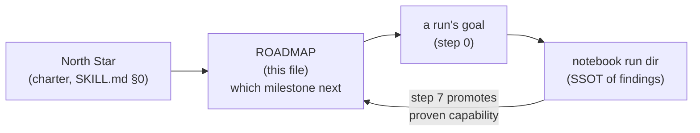

# forgeax-editor-solo — ROADMAP to the North Star

> The **route** from where the editor is today to the charter: *author and ship a 3A-grade game*
> (`SKILL.md` step 0). `SKILL.md` says *aim at the North Star*; this file says *which milestone is the next
> step toward it*. Read it in step 0 to pick a goal; update it in step 7 when a run moves a pillar.

## How this file relates to the rest of the loop

- **SSOT boundary.** The per-run findings, friction, and evidence live in the notebook
  (`.forgeax-harness/solo/experiments/<run>/`) — that is their single source of truth. This ROADMAP is a
  *derived, current-state view*: it says **how far each pillar is** and **points at the run that proved it**;
  it never restates a run's contents (Derive, don't Duplicate — `architecture-principles §2`).
- **It is a living map, overwritten in place** (current-state artifact, `architecture-principles §6`), not an
  append-only log. The append-only history is the dated notebook plus the run ledger
  (`.forgeax-harness/solo/roadmap-progress.md`, where each run registers at step 0 and closes at step 7); this
  file is their current-state synthesis.
- **Practice may correct it mid-run.** 实践是检验真理的唯一标准 — if a run *observes* the map is wrong (a 🟢
  pillar has a round-trip gap; a "blocker" is gone), fix the status here immediately and note the correction
  in that run's ledger row. The trigger is an observed result, never a hunch (SKILL.md step 2).
- **Not a promise of order.** A blocked-but-deep pillar can jump the queue over an easy one. The ladder is a
  *default* dependency order, not a schedule — step 0 still picks "the deepest **reachable-now** milestone."

## The pillars of "3A-grade" — the axes a shipped game needs

A 3A game is not one capability; it's every pillar taken **end-to-end** (author in Edit → persist → equal in
Play → ship). The North Star is reached only when all are green. Status legend:

| Mark | Meaning |
|:--|:--|
| 🟢 **proven** | a run drove this end-to-end through the front door; capability + round-trip confirmed |
| 🟡 **partial** | some legs land, but a gap blocks full end-to-end (named in "gap") |
| 🔴 **blocked** | a deferred/escalated friction gates it; the notebook already named the blocker |
| ⚪ **untouched** | no run has stressed it yet — a frontier waiting for a goal |

> [!IMPORTANT]
> Keep the status honest — "works in Edit" is **not** proven; the litmus is **Edit = Play** and a full
> round-trip (`AGENTS.md` anti-pattern #2). Downgrade a pillar the moment a run shows a round-trip gap.

## Pillar status (seeded 2026-07-12 — update in step 7)

| # | Pillar | Status | Proven by / blocked by | The gap to "shippable" |
|:--|:--|:--|:--|:--|
| P1 | **Scene authoring** — spawn, hierarchy, transforms, reparent | 🟢 proven | `20260712-010637-hierarchy-authoring` | frame-derived `Transform.world` read (deferred #2) — ergonomic, not blocking |
| P2 | **Command surface** — composed/reusable ops, undo, self-introspection | 🟢 proven | `20260712-032908-defineop-authoring`, `20260712-032207-composed-op-authoring` | argsSchema now enforced (#158); broad op library still thin |
| P3 | **Asset pipeline** — import (GLB/FBX) → catalog → instantiate → **persist round-trip** | 🟢 proven | `20260712-204914-material-texture-round-trip` (BoxTextured.glb import→place→save→**reopen**: material params + `baseColorTexture` binding survive byte-identical, `roundTripIdentical:true`; earlier: `20260712-153333-skinned-glb-asset-import` import+place legs) | large-asset streaming still unproven; `AnimationPlayer` clip playback undriven (→ P6). Material/texture round-trip now **proven** — plus a `describeAssetByGuid` read leg so an AI can inspect a bound texture without a multi-MB pixel dump |
| P4 | **Gameplay logic** — plugin components, systems, Play behavior | 🟢 proven | `20260712-191320-play-logic-live-query` — full chain driven end-to-end: `Rotator` plugin → ▶ Play → front-door `query()` reads the live play world (#164) → BlueBall `Transform.quat` confirmed changing frame-over-frame → clean Stop. Also landed `playPhase`/`lastPlayError` so a failed async assemble is observable (was the round-3/5 misdiagnosis root) | proven for one plugin/system; broader gameplay (input-driven logic, inter-entity systems, save/restore of play-authored state) still thin — but Edit=Play for logic is now demonstrated |
| P5 | **Production rendering** — PBR materials, lighting, shadows, post | ⚪ untouched | inspection proven only (`…-rhi-debug-capture`) | no run has *authored* a material/light/post chain end-to-end |
| P6 | **Animation & skinning** — clip playback, blending, state | ⚪ untouched | skinned asset *imports* (P3) but playback undriven | drive an `AnimationPlayer` clip in Play and confirm it plays |
| P7 | **Physics & interaction** — colliders, rigidbodies, triggers | ⚪ untouched | — | author a collider/body, confirm simulation in Play |
| P8 | **Audio** — sources, listeners, triggers | ⚪ untouched | — | author a sound source, confirm it fires in Play |
| P9 | **Scale & streaming** — many entities, level load/stream | ⚪ untouched | — | a level big enough to force streaming, authored + loaded |
| P10 | **HUD & UI** — in-game UI, overlays | ⚪ untouched | — | author a HUD element that renders in Play |
| P11 | **Shipping build** — package a playable, distributable game | ⚪ untouched | — | one command produces a runnable build of an authored game |

## Choosing the next milestone (feeds step 0)

Run this in order; the first that yields a reachable goal is the round's target:

1. **Unblock the deepest 🔴 first.** A blocked pillar gates everything above it and the notebook already named
   the blocker — that is the highest-value, best-specified goal available. *No 🔴 today.* If a future 🔴's fix
   exceeds solo's reach, the goal is "specify it for `forgeax-closed-loop`," not "pick something easier"
   (SKILL.md escalation).
2. **Close a 🟡 to 🟢.** A partial pillar is one gap from proven — cheaper than opening a new pillar and it
   raises the floor. *No 🟡 today* — P3 closed to 🟢 this round (material/texture round-trip proven), P4 last
   round. The floor is now P1–P4 all 🟢.
3. **Open the most-blocking ⚪.** Among untouched pillars, prefer the one the most other pillars depend on
   (rendering P5 and animation P6 gate "looks/plays like a game" more than audio P8 or shipping P11 do this
   early). A playable slice needs P5–P7 long before P11.
4. **Never** pick an easy novel probe that moves no pillar — that is the *Timid goals* anti-pattern
   (SKILL.md). If steps 1–3 all point at something too big for solo, escalate; do not down-scope to stay busy.

> [!TIP]
> The honest next target is **P6 → P5**: P1–P4 are all 🟢 (author, command, asset-pipeline round-trip, and
> gameplay-logic all proven end-to-end). With no 🟡 left, step 2 is exhausted — open the most-blocking ⚪.
> The gap to "looks/plays like a game" is **animation (P6)** — a skinned asset already imports *and*
> round-trips (P3), so drive an `AnimationPlayer` clip in Play and confirm it plays; then **production
> rendering (P5)** — *author* a material/light chain, not just inspect one (round-4 only inspected; round-9
> proved material *persistence* but not *authoring a new material from scratch*). A "playable vertical slice"
> (one level + one mechanic + real materials + one animation) is the first *composite* milestone spanning
> P1–P6 — the half-way mark to the North Star, and now only P5/P6 stand between here and it.

## Updating this file (step 7 discipline)

When a run moves a pillar, edit the status table **in place** (overwrite — this is current state):

- Flip the pillar's mark, fill "proven by" with the **run dir slug**, and rewrite its "gap" to what's *still*
  missing (a 🟢 with a non-empty gap is fine — proven ≠ complete).
- If a run *reveals* a new pillar or splits one, add a row; renumber only if it clarifies the dependency order.
- If a proven pillar regresses (a later run finds a round-trip gap), **downgrade it** — a stale 🟢 is worse
  than an honest 🟡, because step 0 would skip a real blocker.
- Do **not** paste the run's findings here — link the run dir; the notebook stays the SSOT (Derive §2).

This is the L2 axiom (`DESIGN.md` §5) made concrete: each run leaves not just a better tool but a **more
accurate map**, so the next run's step-0 aim is sharper than the last.
