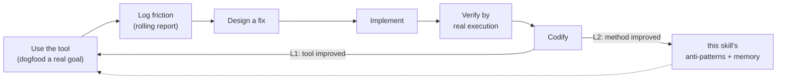
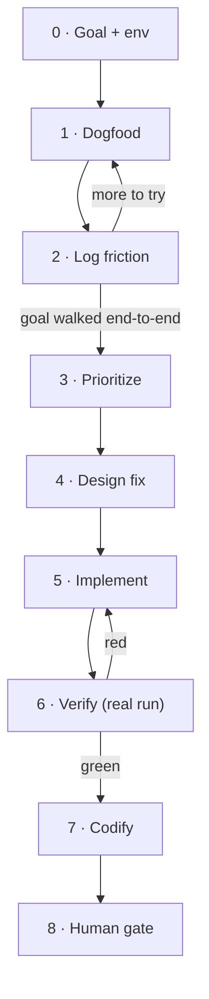

> [!IMPORTANT]
> **Read `DESIGN.md`** for *why* this loop exists (solo vs closed-loop, the self-evolution axiom) before
> asking "why not just fix it directly". This SKILL.md is the *how* — the loop, its gates, the report
> discipline. Load `rich-markdown` before writing the report. When the target is the editor gateway,
> the driver scripts live in the sibling `forgeax-editor-gateway` skill — this skill orchestrates, it
> does **not** re-derive the boot dance.

## What this is

A single AI runs a tight **dogfood → friction → fix → verify → codify** loop against a running tool it
is the primary user of. Two feedback layers make it *self-evolution*, not just iteration:

| Layer | Feedback | Example (editor-gateway instance) |
|:--|:--|:--|
| **L1 tool** | friction → fix the tool | `describeComponent`/`listComponents` added after "can't see a component's fields before spawn" friction |
| **L2 method** | new friction-pattern / verify-trick → back into skill + memory | headless-verify-via-playwright-core recipe saved to memory; new anti-pattern appended here |

L2 is the point: the skill improves *itself* by being used. A loop that only does L1 is plain iteration.

## When to run vs when to route to closed-loop

| Signal | Route |
|:--|:--|
| Exploratory "let me use it and see what's awkward"; fix is small + local; one agent holds all context | **this skill** |
| Feature spans many files / needs adversarial review / requires requirements→plan→verify rigor | `forgeax-closed-loop` |
| Direct one-line fix, no discovery needed | neither — just edit + run gates |

Escalate mid-loop: if a friction's fix turns out to span subsystems, stop and hand the finding to
`forgeax-closed-loop` as a requirement. Don't grow this loop into a multi-agent one.

## The loop

> Each step has a **gate** — do not advance until it holds. The report is written *during*, not after.

### 0 · Goal + env

State a concrete end-to-end goal a real user would have (not "test the API" — *"an AI builds a small
scene arrangement"*). Confirm the tool is running and reachable; note ports/health in the report's env
line. Never assume — probe (`curl`, a health script) and record the result.

**Gate:** goal is a user story with an explicit success criterion ("each step doable by an AI that reads
docs only, not source"); env probe recorded.

### 1 · Dogfood

Walk the goal as the tool's *intended user* would — reading only the tool's public docs, not its source.
Reading source to *drive* the tool defeats the experiment (you'd paper over doc gaps the real user hits).

**Gate:** you invoked the real surface (script/API/CLI), not a mock.

### 2 · Log friction (rolling)

Every stumble is a **friction point** logged *the moment you hit it* — not batched at the end. Each entry
classifies: is this a **doc/contract** gap, an **API ergonomics** gap, an **environment** gap, or a
**semantic trap**? and a severity. Also log *positives* (things that worked well) — they tell you what
not to break.

**Gate:** report has a rolling friction table with ≥ {step, class, severity, one-liner} per entry, and it
was updated between steps (check timestamps/order, not a final dump).

### 3 · Prioritize

Rank friction by severity × how badly it misleads a docs-only user. A **contract error** (docs disagree
with implementation) outranks a cosmetic gap — it silently breaks correctness.

**Gate:** top finding chosen with a stated reason.

### 4 · Design fix

For the top finding, investigate *why* it exists before proposing a fix. Prefer the **minimal, symmetric**
change that fits existing patterns (mirror a sibling API) over a new parallel mechanism. Run it against the
target repo's architecture razors (for forgeax: SSOT / Derive-don't-Duplicate / one-door). Widen the lens:
don't only fix the literal friction — ask what *class* it belongs to (one missing introspection leg, not
one missing method).

**Gate:** fix named, its SSOT identified, alternatives (incl. "don't fix, document instead") weighed in
the report.

### 5 · Implement

Land the change. Add a test that would have caught the friction. Match surrounding code density/anchors.

**Gate:** code + test written; test file runs.

### 6 · Verify by real execution

Not "tests pass" alone — **drive the fixed capability end-to-end through the real running tool** and observe
the behavior the friction was about. Prove the closed loop (e.g. discover→spawn succeeds on first try where
it used to fail). Run the repo's own gates (typecheck / unit / lint / surface-freeze). Restore any state you
mutated in the live tool.

**Gate:** live end-to-end evidence captured in the report **and** repo gates green — both, with output
quoted. Evidence before assertion (see `verification-before-completion`).

### 7 · Codify (the self-evolution step)

Two writes, both required:

1. **L1** — update the tool's own docs (the doc gap that caused the friction is now closed).
2. **L2** — if the loop surfaced a reusable *method* fact (a verify recipe, an environment gotcha, a new
   friction-pattern), write it: a durable one to **memory**, a loop-method one to **this skill's
   anti-pattern list** below.

**Gate:** L1 doc updated; L2 fact written or an explicit "nothing reusable this round" noted.

### 8 · Human gate

Present the finished loop for verdict. AI completes all internal iterations first; the human sees mature
output and holds veto (architecture-principles §8). Do not re-enter the loop after approval without a new
goal.

**Gate:** human approves, or names the next friction to chase.

## The rolling report

One markdown file per loop, living beside the target (editor instance:
`skills/forgeax-editor-gateway/EXPERIMENT-REPORT.md`). Written *during* the loop.

| Section | Holds |
|:--|:--|
| Goal + success criterion | the user story, the "docs-only AI can do each step" bar |
| Env line | ports / health / driver, probed not assumed |
| Friction table (rolling) | `# · step · class · severity · one-liner`, updated between steps |
| Positives | what worked — the don't-break list |
| Design | top finding → investigation → fix → alternatives → acceptance criteria |
| Results | live end-to-end evidence + gate output, quoted |

> [!TIP]
> The single most useful discipline: **log friction the instant you feel it.** By the end you've
> rationalized around every rough edge and forgotten it was rough. The report is an instrument, not a
> write-up.

## Anti-patterns (L2 — grown by the loop itself)

> Each entry was learned by running this loop. Append new ones in step 7.

- **Reading the tool's source to drive it.** You then can't see the doc gaps the real user hits — the
  whole experiment measures docs-vs-reality. Drive from public docs only; reading source is for the *fix*,
  not the *dogfood*.
- **Batching friction into a final write-up.** Rationalization erodes the rough edges; the rolling log is
  the primary artifact, the summary is derived.
- **"Tests pass" as the finish line.** Unit-green with a broken end-to-end is the classic false done. Drive
  the real tool and observe the friction's behavior gone.
- **Fixing the literal friction, missing the class.** "Add one method" when the real gap is "a whole
  introspection leg is missing" — widen before you cut.
- **Adding a parallel mechanism instead of mirroring a sibling.** A second copy (a `listMethods()` beside
  `listOps()`, a static schema beside a dynamic registry) violates SSOT. Prefer the change that makes the
  new surface *symmetric* with what exists, or that a runtime query already covers (Derive, don't
  Duplicate).
- **Contract errors ranked below cosmetics.** When docs disagree with the implementation (a missing param
  in a documented signature), that silently breaks a docs-following user — it outranks any "nice to have".
- **A whole method family missing from the reference is a contract error, not an omission.** When an
  API doc table lists most of a surface but silently drops a related family (undo/redo/canUndo beside
  dispatch/commit), a docs-only user assumes the missing calls follow the table's dominant convention.
  If they don't — e.g. `undo()` returns a bare `boolean` while every tabled method returns `{ok,…}` —
  the user writes `undo().ok` and it silently no-ops. The fix is doc-only (mirror the real signature +
  flag the shape difference); prove it by adding the family's name as a required anchor in the skill's
  own validator, so the gap can't recur. Ranks with contract errors, above cosmetics.
- **Deferring a fix to "docs will cover it" and never writing the docs.** A prior loop can *decline* a
  code fix for the right reason (SSOT) and hand the burden to documentation — then never write it, leaving
  the gap fully open. When you defer to docs, the doc write IS the fix; it is not optional follow-up.
- **Unbounded loops inside an eval snippet.** `while(gateway.canRedo()) gateway.redo()` freezes the host
  page forever if the predicate misbehaves (eval has no timeout — SKILL.md "Dead loop no interrupt").
  Bound every eval loop (`&& steps<50`) even when you "know" it terminates.
- **Skipping the L2 write.** If the loop taught you a verify recipe or an env gotcha and you don't record
  it, the next loop re-derives it. The codify step is not optional.
- **Growing this loop into a multi-agent one.** When a fix spans subsystems, escalate to
  `forgeax-closed-loop` — don't bolt reviewers/state onto the solo loop.

## Driving the editor instance

The target's driver scripts are owned by `forgeax-editor-gateway` — reuse, don't re-implement.

| Need | Use |
|:--|:--|
| Editor already open (live window) | `node skills/forgeax-editor-gateway/scripts/gateway-live.mjs --file <snippet>` (needs the bridge; `--health` first) |
| No editor / page disconnected | `node skills/forgeax-editor-gateway/scripts/gateway-eval.mjs --file <snippet>` (boots its own headless browser at :15290) |
| Full playwright absent | point `FORGEAX_PLAYWRIGHT` at a `playwright-core` index + `FORGEAX_CHROMIUM` at a cached chromium binary (memory: `gateway-headless-verify-playwright-core`) |
| Repo gates | `bun -F @forgeax/editor-core test` · `bun -F @forgeax/editor-core typecheck` (needs engine `.d.ts` — `tsc -b` first) · `bun run lint` · `bun run lint:dep` |

For any *other* tool instance, substitute its own driver + gates — the loop and report discipline are
unchanged.
