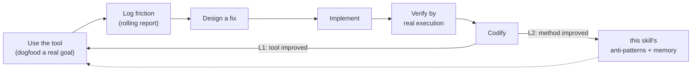
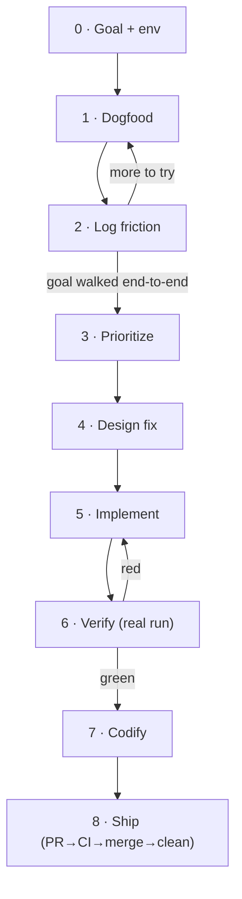

> [!IMPORTANT]
> **Read `DESIGN.md`** for *why* this loop exists (solo vs closed-loop, the self-evolution axiom) before
> asking "why not just fix it directly". This SKILL.md is the *how* — the loop, its gates, the report
> discipline. Load `rich-markdown` before writing the report. When the target is the editor, dogfood it
> **through the `forgeax-editor-gateway` front door** (its documented `dispatch` / `begin…commit` / `eval`
> scope① surface) — that skill owns the API and driver scripts; this one orchestrates the loop and never
> re-derives the boot dance or routes around the gateway.

## What this is

A single AI runs a tight **dogfood → friction → fix → verify → codify** loop against a running tool it
is the primary user of. Two feedback layers make it *self-evolution*, not just iteration:

| Layer | Feedback | Example (editor-gateway instance) |
|:--|:--|:--|
| **L1 tool** | friction → fix the tool | `describeComponent`/`listComponents` added after "can't see a component's fields before spawn" friction |
| **L2 method** | new friction-pattern / verify-trick → back into skill + memory | headless-verify-via-playwright-core recipe saved to memory; new anti-pattern appended here |

L2 is the point: the skill improves *itself* by being used. A loop that only does L1 is plain iteration.

## What you're improving — fix the deepest layer, not the nearest

The target is a stack; a friction is fixed at the **deepest layer where its root cause lives**, in the
**most systematic form**. Prefer code over docs — a doc that narrates a limitation is a band-aid, not a fix.

| Priority | Layer | Land the fix here when… |
|:--|:--|:--|
| **1 — engine** | engine primitive | root cause is a missing/wrong engine capability (export, contract, primitive) |
| **2 — editor** | authoring surface | engine is right but the editor doesn't project it (missing gateway op / read facade, wrong seam, async contract) |
| **3 — skill/doc** | AI-facing projection | the code is **correct and complete**; the *only* gap is that the AI couldn't discover it |

**Decision razor (run every candidate fix through it):** *"If I fixed the code, would this doc still need to
exist?"* — **Yes** → the doc teaches a real capability, layer-3 is right. **No** → the doc only describes a
code wart ("watch the viewport since you can't query it"; "poll because mode flips async") → that's a
disguised code fix; land it at layer 1/2 instead. Why this matters: `DESIGN.md` §fix-priority ladder.

> [!CAUTION]
> An AI's default reflex is the doc — cheapest edit, always "closes" the friction on paper. That reflex is
> the anti-pattern this ladder exists to break. "Too big for solo" routes **up** to `forgeax-closed-loop`,
> never **down** to a doc band-aid to keep the diff small.

## When to run vs when to route to closed-loop

| Signal | Route |
|:--|:--|
| Exploratory "let me use it and see what's awkward"; fix is small + local; one agent holds all context | **this skill** |
| Feature spans many files / needs adversarial review / requires requirements→plan→verify rigor | `forgeax-closed-loop` |
| Direct one-line fix, no discovery needed | neither — just edit + run gates |

Escalate mid-loop: if a friction's fix turns out to span subsystems, stop and hand the finding to
`forgeax-closed-loop` as a requirement. Don't grow this loop into a multi-agent one.

## The loop

> Each step has a **gate** — do not advance until it holds. The report is written *during*, not after.

### 0 · Goal + env

> [!IMPORTANT]
> **The standing charter — the North Star every goal serves.** This loop does not polish an API for its own
> sake; it exists to make the editor able to **author and ship a 3A-grade game**. That is the *fixed
> destination*, not a round-local target — every run's goal is chosen as *the next capability the tool still
> lacks on the path there*, and is justified against it. Be concrete about "3A-grade" so goals derive from
> it, not from whatever is easiest to reason about: a real playable level (many interacting entities +
> gameplay logic), production rendering (PBR materials, lighting, post), animation & skinning, physics &
> interaction, audio, scene scale / streaming, HUD & UI, and a build that actually ships. Each round ask:
> **which of these pillars can the tool not yet take end-to-end, and which is the deepest / most blocking one
> I can reach now?** — then dogfood *that*. A goal that moves no pillar toward shippable is off-charter,
> however novel it looks. Aim at the ceiling, not one inch above the floor.
>
> **Don't answer "which pillar next?" from memory — read `ROADMAP.md`.** It holds the current per-pillar
> status (proven / partial / blocked / untouched) and a *choose-the-next-milestone* procedure (unblock the
> deepest 🔴 → close a 🟡 → open the most-blocking ⚪). It is the living map from today's tool to the North
> Star; step 0 consults it, step 7 updates it. Pick your goal *from* it.
>
> **Then register the task before you start.** Once the goal is chosen, append a row to
> `.forgeax-harness/solo/roadmap-progress.md` (the append-only progress ledger) with status `registered` —
> date, run-dir slug, target pillar id, one-line goal. Register *before* dogfooding, update the same row at
> step 7 with the outcome. The ledger is the history of progress toward the North Star; `ROADMAP.md` is the
> current-state map derived from it.

**First read the experiments dir** (`.forgeax-harness/solo/experiments/*/report.md`) — the dated notebook of
every prior run. Skim each report's goal + its still-open friction (findings logged but deferred, e.g. "left for a
later round"); the run's `snippets/` show exactly how it drove the tool. The new goal must **advance the
frontier toward the charter**, not re-tread it:

- **Different** from every prior goal — a fresh capability or user story, not a paraphrase.
- **More meaningful — measured against the charter, not just against last round.** Climb *toward the North
  Star* (probe → authoring → composed workflow → a real slice of a shippable game), not merely "one rung
  above the previous goal." The ambition ceiling is the 3A game itself, so a goal is *more meaningful* when
  it closes more of the gap between what the tool does today and what shipping that game demands — not when
  it is simply locally novel. Prefer the **most blocking missing pillar** over the **easiest novel probe**.
  Don't circle the simplest proven goals; each run should stress a pillar the notebook hasn't taken
  end-to-end.
- **Building on prior findings** — prefer a goal that reaches a *deferred* friction from an earlier run
  (the notebook literally hands you the next target) over one invented from nothing.

Then state it as a concrete end-to-end goal a real user would have (not "test the API" — *"an AI builds a
small scene arrangement"*), and name **which 3A pillar it advances and why it's the most blocking one you
can reach now**. Confirm the tool is running and reachable; note ports/health in the report's env line.
Never assume — probe (`curl`, a health script) and record the result.

**Gate:** goal is a user story with an explicit success criterion ("each step doable by an AI that reads
docs only, not source"); env probe recorded; **the report's "Charter" line names the 3A pillar this goal
advances (by its `ROADMAP.md` id, e.g. P4) and argues it's the deepest/most-blocking one reachable now, per
the ROADMAP's choose-the-next-milestone procedure**; **a `registered` row for this run exists in
`roadmap-progress.md`**; **the "Prior runs" line names the surveyed reports and states how this goal advances
beyond them** (new surface and/or a deferred friction it now reaches). A goal that is novel but moves no
pillar toward shippable fails this gate — pick a more ambitious one.

### 1 · Dogfood

Walk the goal as the tool's *intended user* would — reading only the tool's public docs, not its source.
Reading source to *drive* the tool defeats the experiment (you'd paper over doc gaps the real user hits).

**Drive through the tool's own front door — for the editor, that is the `forgeax-editor-gateway` surface**
(`dispatch` / `begin…commit` / `defineOp` / `eval` scope①). The point of dogfooding is to measure *that*
surface; reaching around it (raw `world`/`renderer` via `unlockRawScope`/`--raw`, a hand-rolled ECS write,
a direct `store/` setter) makes the friction you'd have felt disappear silently — you'd log "worked fine"
about a door you never used. If the goal seems to *need* the back door, that gap **is** the finding: log it
as friction (a missing gateway op / read leg) and fix it at layer 1/2, don't satisfy the goal by bypassing.

**Gate:** you invoked the real front-door surface (gateway `dispatch`/`eval` for the editor), not a mock and
not a raw-scope bypass; any use of the back door is logged as a friction, not used to complete the goal.

### 2 · Log friction (rolling)

Every stumble is a **friction point** logged *the moment you hit it* — not batched at the end. Each entry
classifies: is this a **doc/contract** gap, an **API ergonomics** gap, an **environment** gap, or a
**semantic trap**? and a severity. Also log *positives* (things that worked well) — they tell you what
not to break.

> **Practice checks the map — correct it the moment reality contradicts it (实践是检验真理的唯一标准).**
> If dogfooding shows `ROADMAP.md` was wrong — a pillar marked 🟢 has a round-trip gap, a milestone is deeper
> than it looked, a "blocker" is actually gone — **fix `ROADMAP.md` right then** (it's overwrite-in-place) and
> note the correction in this run's `roadmap-progress.md` row (`practice-correction: …`). The trigger is a
> real result you just observed, never a hunch; that's what keeps the map earned by evidence, not guessed.
> This is a legitimate mid-run map edit — distinct from the step-7 status flip, which records what the *fix*
> moved.

**Gate:** report has a rolling friction table with ≥ {step, class, severity, one-liner} per entry, and it
was updated between steps (check timestamps/order, not a final dump); any map/reality contradiction found
while dogfooding is reflected in `ROADMAP.md` + noted in the ledger row, not left stale.

### 3 · Prioritize

Rank friction by severity × how badly it misleads a docs-only user. A **contract error** (docs disagree
with implementation) outranks a cosmetic gap — it silently breaks correctness.

**Gate:** top finding chosen with a stated reason.

### 4 · Design fix

For the top finding, investigate *why* it exists before proposing a fix. Then, in order:

1. **Pick the layer** (see "What you're improving" above). Trace the root cause down: is it an engine
   primitive (layer 1), an editor authoring-surface gap (layer 2), or a pure discoverability gap over
   correct code (layer 3)? Run the razor — *"if I fixed the code, would this doc still need to exist?"* — to
   reject a doc band-aid masquerading as the fix. **Land at the deepest layer the root cause reaches.**
2. **Pick the form, systematically.** Prefer the **symmetric** change that fits existing patterns (mirror a
   sibling API, add the missing introspection leg) over a new parallel mechanism, and the change that makes
   the friction *structurally impossible* (a type / invariant / single-door) over an instance-local patch.
   Run it against the repo's architecture razors (for forgeax: SSOT / Derive-don't-Duplicate / one-door).
3. **Widen the lens** — fix the *class*, not the literal instance (one missing introspection leg, not one
   missing method).

If the correct (deep + systematic) fix spans subsystems and exceeds one agent's reach, **escalate to
`forgeax-closed-loop`** — do not down-scope to a doc to stay inside solo.

**Gate:** fix named **with its layer and why that's the deepest correct one**; SSOT identified; alternatives
weighed in the report — and if the chosen fix is a doc, the razor's "yes, code is already correct" answer is
recorded (else the doc is a band-aid and a deeper fix is owed).

### 5 · Implement

**Enter a git worktree first** (`EnterWorktree`) — every fix lands in a worktree, never on the primary
checkout, which stays pinned to `main`. The loop mutates a running tool and edits its source in one session;
the worktree quarantines that blast radius and makes a wrong-direction attempt cheap to discard (why:
`DESIGN.md` §6). A layer-1/2 code fix may live in the engine or editor submodule — make the change there,
inside the worktree.

Then land the change. Add a test that would have caught the friction — at the layer you fixed (an engine/unit
test for layer-1/2 code; the skill's own validator anchor for a layer-3 doc). Match surrounding code
density/anchors.

**Gate:** working inside a worktree (primary checkout still on `main`); code + test written; test file runs.

### 6 · Verify by real execution

Not "tests pass" alone — **drive the fixed capability end-to-end through the real running tool** and observe
the behavior the friction was about. Prove the closed loop (e.g. discover→spawn succeeds on first try where
it used to fail). Run the repo's own gates (typecheck / unit / lint / surface-freeze). Restore any state you
mutated in the live tool.

**Gate:** live end-to-end evidence captured in the report **and** repo gates green — both, with output
quoted. Evidence before assertion (see `verification-before-completion`).

### 7 · Codify (the self-evolution step)

Three writes, all required:

1. **L1** — the fix from steps 4-5 *is* the tool improvement (engine/editor code, or a doc when the razor
   said the code was already correct). Additionally, whenever a **code** fix changes an AI-facing contract,
   update the doc that projects it so the projection stays truthful — a fixed capability the docs still
   describe as broken is a new friction.
2. **L2** — if the loop surfaced a reusable *method* fact (a verify recipe, an environment gotcha, a new
   friction-pattern), write it: a durable one to **memory**, a loop-method one to **this skill's
   anti-pattern list** below.
3. **Roadmap + ledger** — two writes here:
   - **`ROADMAP.md`** (current-state map, overwrite in place): if the run moved a pillar (proved a capability
     end-to-end, closed a gap, unblocked or newly blocked one), flip the mark, point "proven by" at this run's
     dir slug, rewrite the remaining gap — per its own "Updating this file" section.
   - **`roadmap-progress.md`** (append-only ledger): update **this run's registered row** with its terminal
     status (`landed` / `escalated` / `deferred` / `abandoned`) and a one-line result. This is the only
     in-place edit the ledger allows — its own in-flight row; every prior row stays frozen.

   Together these are what make the next run's step-0 aim sharper than this one's — the map current, the
   history intact.

**Gate:** L1 landed (code fix + any doc-projection update, or the justified doc-only fix); L2 fact written
or an explicit "nothing reusable this round" noted; `ROADMAP.md` reflects any pillar this run moved (or an
explicit "no pillar moved this round" noted); **this run's `roadmap-progress.md` row moved off `registered`
to a terminal status**.

### 8 · Ship (self-PR → CI-green → merge → clean up)

**Standing authorization: the human's veto is CI, not a per-round approval prompt.** The human is the
final authority (architecture-principles §8), and they have exercised it *once, durably* by ruling that a
green loop ships itself. So the loop does NOT block on a "please approve" message — it self-integrates:

1. **Open the PR** from the worktree branch (`gh pr create`), body = the round's finding + verify evidence.
2. **Wait for CI green** — this IS the human's delegated gate. Poll the checks; do not merge on red.
3. **Merge** once green (`gh pr merge --squash --delete-branch`).
4. **Clean up** — `ExitWorktree` (remove), stop any hosts the loop started, drop scratch state.

The human still holds real veto: they can reject a merged change after the fact, or set a new goal — but
the loop's *default* terminal state is "shipped", not "awaiting sign-off". Only stop and ask a human
mid-ship if CI is red in a way the loop can't resolve, or the change turned out to need scope it can't
carry alone (→ route to `forgeax-closed-loop`). Do not re-enter the loop for a new goal without one.

**Gate:** PR opened, CI green, merged, worktree + hosts cleaned up — or an explicit blocker recorded for
the human (red CI it can't fix / scope escalation).

## The run directory

Each loop run is **one self-contained directory**, not a lone file, under the harness clone's solo
notebook: `.forgeax-harness/solo/experiments/<YYYY-MM-DD>-<goal-slug>/` (e.g.
`.forgeax-harness/solo/experiments/2026-07-12-hierarchy-authoring/`) — **date + goal name, one dir per
run; never overwrite a prior run's dir**, so the notebook accumulates dated, reproducible runs. It lives in
the harness clone — not the target skill's dir — so the notebook survives a skill re-sync and never bleeds
into the fix's PR. `.forgeax-harness` is a git repo of its own; commit the notebook there, never in the
editor repo.

Everything a run touched lives in its dir — so a later reader (or the next round surveying the frontier)
can re-run it, not just read about it:

| Path in the run dir | Holds |
|:--|:--|
| `report.md` | the rolling report (sections below), written *during* the loop |
| `snippets/*.mjs` (or `.js`) | every eval snippet you drove the tool with — the exact code, not a paraphrase in prose |
| `out/*.json` / `*.log` | captured outputs the report's evidence quotes (redirect here, not to `/tmp` where it's lost) |

> [!TIP]
> Drive the tool by writing a snippet **into `snippets/` first**, then `gateway-eval.mjs --file <that>` →
> redirect to `out/`. Don't paste inline throwaway code: a run whose driving code lives only in shell
> history isn't reproducible, and the next round can't build on it.

`report.md` sections:

| Section | Holds |
|:--|:--|
| Charter | which 3A pillar this goal advances + why it's the deepest/most-blocking one reachable now — the anti-timidity record |
| Prior runs | which run dirs were surveyed + how this goal advances the frontier (new surface / a deferred friction it now reaches) — the anti-circling record |
| Goal + success criterion | the user story, the "docs-only AI can do each step" bar |
| Env line | ports / health / driver, probed not assumed |
| Friction table (rolling) | `# · step · class · severity · one-liner`, updated between steps |
| Positives | what worked — the don't-break list |
| Design | top finding → investigation → fix → alternatives → acceptance criteria |
| Results | live end-to-end evidence + gate output, quoted (pointing at `snippets/` + `out/`) |

> [!TIP]
> The single most useful discipline: **log friction the instant you feel it.** By the end you've
> rationalized around every rough edge and forgotten it was rough. The report is an instrument, not a
> write-up.

## Anti-patterns (L2 — grown by the loop itself)

> Each entry was learned by running this loop. Append new ones in step 7.

- **Documenting a code wart instead of fixing the code (the doc reflex).** The single most common failure of
  this loop: a friction whose root cause is in the engine/editor gets "resolved" with a SKILL.md note that
  *narrates the limitation* — "mode flips async, so poll it"; "you can't query the play world, so watch the
  viewport." That doc is negative work: it adds a concept every future reader must carry instead of removing
  it by fixing the code. Run the razor — *"if I fixed the code, would this doc still need to exist?"* If no,
  the doc is a band-aid and a layer-1/2 fix is owed (make it observable; make the contract synchronous).
  Docs are the *last* resort (layer 3), legitimate only when the code is already correct and the sole gap is
  discoverability. See "What you're improving" + `DESIGN.md` §fix-priority ladder.
- **Skipping the worktree — editing on the primary checkout.** Step 5 requires `EnterWorktree`; the loop
  mutates a running tool *and* its source in one session, so an in-place edit can strand `main` dirty
  mid-dogfood. Every fix lands in a worktree, primary checkout stays on `main`.
- **Assuming the repo is frozen for the loop's duration.** A long loop can span a repo that keeps moving —
  a prior round's PR merges, and a *new rule* can land that retroactively rejudges your in-flight design.
  (Real case: round-4's doc-only fix merged as #157; then #156's fix-priority ladder landed *after* it and
  reclassified that doc as a band-aid — the correct fix was now layer-2 code on top of #157, plus a doc
  correction so #157 stayed truthful.) A background sync can also silently reset your uncommitted edits.
  Before designing and again before verifying, `git log --oneline -5` + `git status` to re-anchor your base;
  never assume the working tree you left is the one you return to. When a rule upgraded under you, re-run
  your chosen fix through the *new* razor, don't defend the old plan.
- **Reading the tool's source to drive it.** You then can't see the doc gaps the real user hits — the
  whole experiment measures docs-vs-reality. Drive from public docs only; reading source is for the *fix*,
  not the *dogfood*.
- **Batching friction into a final write-up.** Rationalization erodes the rough edges; the rolling log is
  the primary artifact, the summary is derived.
- **"Tests pass" as the finish line.** Unit-green with a broken end-to-end is the classic false done. Drive
  the real tool and observe the friction's behavior gone.
- **Fixing the literal friction, missing the class.** "Add one method" when the real gap is "a whole
  introspection leg is missing" — widen before you cut.
- **Adding a parallel mechanism instead of mirroring a sibling.** A second copy (a `listMethods()` beside
  `listOps()`, a static schema beside a dynamic registry) violates SSOT. Prefer the change that makes the
  new surface *symmetric* with what exists, or that a runtime query already covers (Derive, don't
  Duplicate).
- **Contract errors ranked below cosmetics.** When docs disagree with the implementation (a missing param
  in a documented signature), that silently breaks a docs-following user — it outranks any "nice to have".
- **A whole method family missing from the reference is a contract error, not an omission.** When an
  API doc table lists most of a surface but silently drops a related family (undo/redo/canUndo beside
  dispatch/commit), a docs-only user assumes the missing calls follow the table's dominant convention.
  If they don't — e.g. `undo()` returns a bare `boolean` while every tabled method returns `{ok,…}` —
  the user writes `undo().ok` and it silently no-ops. The fix is doc-only (mirror the real signature +
  flag the shape difference); prove it by adding the family's name as a required anchor in the skill's
  own validator, so the gap can't recur. Ranks with contract errors, above cosmetics.
- **Deferring a fix to "docs will cover it" and never writing the docs.** A loop can *legitimately* decline a
  code fix (the razor confirms the code is already correct — SSOT-clean) and hand the burden to
  documentation — then never write it, leaving the gap fully open. When a doc *is* the right fix, the doc
  write IS the fix, not optional follow-up. (But first confirm it's the right layer — if the razor says a
  code fix is owed, "defer to docs" is the doc-reflex anti-pattern above, not a legitimate deferral.)
- **Unbounded loops inside an eval snippet.** `while(gateway.canRedo()) gateway.redo()` freezes the host
  page forever if the predicate misbehaves (eval has no timeout — SKILL.md "Dead loop no interrupt").
  Bound every eval loop (`&& steps<50`) even when you "know" it terminates.
- **Circling the easy goals — not surveying the notebook first.** Each run re-picks a goal near the
  simplest proven one ("spawn + reparent again"), so the notebook fills with near-duplicates and the tool's
  harder surface never gets stressed. Step 0 must *read the experiments dir first* and pick a goal that is
  different from every prior run and climbs toward the charter — ideally one that reaches a friction an
  earlier run explicitly deferred. The dated notebook exists to be built *on*, not beside.
- **Timid goals — measuring "up" against last round instead of against the charter.** The subtler cousin of
  circling: every goal *is* different and *is* one rung above the last, so the anti-circling gate passes —
  yet the notebook is still a chain of small plumbing probes (import a GLB, capture a frame, define an op)
  that never aims at anything a shipped game needs. Root cause: the ambition ladder is *relative* (up from
  last round), so "up" drifts into "locally novel but small." The North Star charter (step 0) is the
  *absolute* destination that fixes this — a goal is ambitious only if it moves a **3A pillar** (playable
  level, production rendering, animation, physics, audio, UI, ship) toward shippable, not if it's merely new.
  Each round, name the most-blocking missing pillar and aim there; reject a novel-but-off-charter goal even
  though it would pass the anti-circling check. Aim at the ceiling, not one inch above the floor.
- **Throwaway driving code — a run that can't be re-run.** Pasting eval snippets inline and redirecting to
  `/tmp` leaves the report's evidence unbacked: the code that produced it is gone, so the next round can't
  reproduce or extend it. The run's driving snippets + captured output are part of the artifact — write
  snippets into the run's `snippets/`, outputs into `out/`, and have the report point at them.
- **"Capability absent" when it's really "wrong server / flag never arrived."** Driving a flag-gated
  capability (`FORGEAX_ENGINE_RHI_DEBUG=1` → `window.__forgeax`) and seeing the entry `undefined`, you're
  tempted to log "the capability doesn't exist" — but a leftover *unflagged* server squatting on the port
  (a `--strictPort` launch that died, an orphaned prior stack) produces the identical symptom. Before
  recording a capability-absent friction, **prove the flag reached the running process** (`ps eww` its env)
  and **probe the capability's own dedicated endpoint** (non-404 = the feature is wired) — `curl :port → 200`
  only proves *a* server answers, not *your* server. Mis-recording env-misconfig as a missing feature sends
  the whole fix down the wrong path. (round-4 rhi-debug friction #5/#6)
- **Skipping the L2 write.** If the loop taught you a verify recipe or an env gotcha and you don't record
  it, the next loop re-derives it. The codify step is not optional.
- **Growing this loop into a multi-agent one.** When a fix spans subsystems, escalate to
  `forgeax-closed-loop` — don't bolt reviewers/state onto the solo loop.
- **A self-introspection surface that shows a contract it doesn't enforce is a bug, not a doc gap —
  and it ranks above every doc friction.** When a runtime query advertises a constraint (an op's
  `argsSchema`, a field's `nullable`, a declared `required`), a docs-only user *reasonably assumes it
  is applied*. If it isn't, the failure is silent AND correct-looking — the worst kind (round-4:
  defined document ops never validated their `argsSchema`, so a missing/wrong-typed arg flowed into the
  plan and wrote `NaN`→`null` into the world with `{ok:true}` + trace `OK`). This is strictly worse than
  a loud gap and worse than round-2's undo-returns-boolean (that only failed to act; this corrupts
  persisted data). Fix by routing the offending path through the *same* validator its siblings already
  use (SSOT — never hand-roll a parallel check), then prove the corruption→error flip end-to-end in the
  live tool, not just in a unit.
- **An anchor/gate test that isn't wired into CI can sit red for rounds.** Round-4 found
  `validate-gateway-skill.test.mjs` had been `14/15` (exit 1) since round-2 — earlier loops added
  keywords to the validator's `REQUIRED_KEYWORDS` but not to its VALID fixture, and because the test is
  invoked by no CI job, nobody noticed. When you add a CI anchor, run its *own* test suite in the same
  loop, and prefer wiring the anchor into `bun run lint`/CI over trusting a manually-run script.
- **The op catalog is a module-global that persists across same-file tests.** A `defineOp` unit that
  reuses an id across `it()` blocks silently gets `OP_ID_CONFLICT` on the 2nd call → `defineOp().ok===false`
  → the test asserts on an op that was never registered. Use a per-call unique id (`foo_${seq++}`).
- **Completing a goal through the back door instead of logging the door as missing.** When a step is
  awkward through the gateway (`dispatch`/`eval` scope①), the tempting shortcut is raw access
  (`unlockRawScope`/`--raw` → `world`/`renderer`, a direct `store/` setter, a hand-rolled ECS write). That
  makes the run "succeed" but measures a door the real AI user can't take — the friction you'd have felt
  vanishes and you log a false positive. Needing the back door *is* the finding: log it as a missing gateway
  op / read leg and fix it at layer 1/2. Drive only through the front door (step 1 gate).
- **"Verified" against a live host that's actually running the *unfixed* code.** The step-6 gate is
  live end-to-end evidence, but a worktree fix only counts if the running host serves *that worktree's*
  source. Two ways the host silently runs old code: (1) a fresh worktree has no `node_modules`, and an
  integral `worktree/node_modules → main/node_modules` symlink resolves `@forgeax/editor-*` back to the
  **main checkout** — the host runs unfixed code and your proof shows the friction *still present*
  (looks like "the fix didn't work"). Rebuild **per-package** `node_modules` so `editor-*`→worktree,
  `engine-*`/deps→main, then clear `.vite` and restart. (2) A leftover host on the port `--strictPort`
  survives; your new host exits "port in use" but `curl :port` is answered by the *old* process (round-4
  rhi-debug #5, same shape). Before trusting a live result, prove the port is serving your code: `curl`
  the worktree `/@fs<abs>/…` module and grep the fix marker, and `lsof -ti :port` should be only your pid.
  A revert-to-red check on the unit test is the cheap cross-check the live host can't fake.
- **Assuming an empty scene can enter Play headless.** In a headless standalone with no viewport/renderer
  and a scene that never finishes loading, `dispatch({kind:'play'})` returns `ok` but `gateway.mode` never
  flips (assemble degrades back to edit) — so an observability probe that *needs* play state stalls. Don't
  log "can't enter play" as the target friction; it's an environment limit. Use the public
  `gateway.enterPlay(new World())` (the same method core tests use) to construct a play world
  deterministically and probe the read surface without depending on the flaky async flip.
- **A capability that exists only as a UI-called closure (no gateway op) is a broken door, not a missing
  feature — and it ranks with contract errors.** A whole workflow can *work perfectly for humans* (the
  Content Browser "Add to Scene" orchestration) while being **structurally unreachable by an AI**, because
  its body lives in a `panel`/`store`/`scene` function the gateway never projects. The tell: a docs-only run
  completes step N-1 (import → catalog has the asset) then dead-ends at step N with *no op to call*, and
  `listOps()` genuinely has none. This is the registry-razor anti-pattern (a UI-bound side-effect never
  turned into a one-door op); it silently breaks human↔AI isomorphism. Fix by **extracting the closure's body
  into a gateway op and routing the UI through that same op** (one door, equal peers) — mirror the nearest
  sibling op's domain/shape (round-6: `addSceneAssetToScene` is a session/async op mirroring `importAsset`,
  because placing a catalogued scene GUID needs an async `loadByGuid` the sync document applier can't host).
  Prove it by driving the *whole* chain (import → place → query the result's components) on a live worktree
  host, not just the unit. (round-6 friction #3)
- **Pre-seeded roadmap rows are predictions — correct them from what you actually observed.** The ledger may
  open your run's row (or the ROADMAP may state a pillar's gap) with a *guessed* outcome before you dogfood.
  When practice contradicts it — round-6's row #7 predicted "import op landed," but the import op already
  existed and the real gap was the *place* leg — update the row with a `practice-correction:` note and fix
  the ROADMAP status in place (SKILL.md step 0's "practice corrects the map" / `ROADMAP.md`). A run that
  quietly ships the predicted-but-wrong story leaves the map lying to the next run.
- **A fresh worktree's unit tests need only main's engine dist symlinked, not a full engine build.** When the
  engine submodule is unchanged (same commit as main), skip `pnpm -r build`: after `git submodule update
  --init` + `bun install` (re-run once past the `simple-git-hooks` exit-1), symlink each
  `packages/engine/packages/*/dist` from main (engine `exports` point at `dist/index.mjs`; the worktree
  submodule ships only `src`), then `bun -F @forgeax/editor-core test` passes. A *live host* end-to-end still
  needs the full per-package `node_modules` + port-ownership check (memory:
  `editor-worktree-unit-test-engine-dist-symlink`, `editor-worktree-live-host-resolution`). (round-6)

## Driving the editor instance

The target's driver scripts are owned by `forgeax-editor-gateway` — reuse, don't re-implement.

| Need | Use |
|:--|:--|
| Editor already open + stable (warm) | `node skills/forgeax-editor-gateway/scripts/gateway-live.mjs --file <snippet>` (needs the bridge; `--health` first) |
| No editor, OR a freshly cold-booted stack | `node skills/forgeax-editor-gateway/scripts/gateway-eval.mjs --file <snippet>` (boots its own headless browser at :15290) |
| Full playwright absent | point `FORGEAX_PLAYWRIGHT` at a `playwright-core` index + `FORGEAX_CHROMIUM` at a cached chromium binary (memory: `gateway-headless-verify-playwright-core`) |
| Repo gates | `bun -F @forgeax/editor-core test` · `bun -F @forgeax/editor-core typecheck` (needs engine `.d.ts` — `tsc -b` first) · `bun run lint` · `bun run lint:dep` |

> [!CAUTION]
> **A cold-booted stack's live bridge flaps — don't dogfood through it.** Right after
> `bun fx start`, vite re-optimizes deps and reloads the page repeatedly, so `gateway-live.mjs
> --health` reports `pageConnected:true` (WS transport) while `eval` still 30s-times-out (the page
> is mid-reload, not eval-ready). `--health` proves transport, not readiness. On a cold boot use
> **headless `gateway-eval.mjs`** (it boots its own clean browser); reserve `gateway-live.mjs` for a
> warm window you're actively watching. (round-3 friction #2)

For any *other* tool instance, substitute its own driver + gates — the loop and report discipline are
unchanged.
