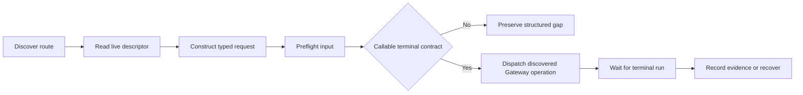

# forgeax-reference-creation

This Skill is a thin public-route consumer over the live Viewport Runtime. The
Gateway remains the operation and mutation SSOT; the Skill does not define a
second operation catalog, scene format, identity space, query adapter, or
journal store.

> [!IMPORTANT]
> A cold caller uses the Skill and the `@forgeax/editor-product` package root.
> It sends typed `reference-creation` requests through the connected transport.
> It does not construct `GatewayCreationPort`, assemble a query adapter, or
> construct a journal store. Those are host-side seams behind the public entry.

## Public route

Discover the connected route with the ordinary product transport:

```text
method: discover
result.methods: ... reference-creation
```

Then request the Skill descriptor:

```text
method: reference-creation
params: { action: discover }
```

The descriptor returned by that request is the live contract. Its `method` is
`reference-creation` for every action, its `shortestRoute` is the action order,
and its `actions` contain the parameter schema, entry method, stage, and
terminal result for each request.

### Action contract

| Stage | Action | Required params | Public result |
|:--|:--|:--|:--|
| discover | `discover` | `action` | `ReferenceCreationSkillDescriptor` |
| preflight | `preflight` | `action`, `input` | `ReferenceCreationPreflightResult` |
| preflight | `start` | `action`, `input` | `ReferenceCreationResult` |
| lifecycle | `resume` | `action`, `creationRunId` | `ReferenceCreationRunResult` |
| lifecycle | `ownerRepairAndResume` | `action`, `creationRunId` | `ReferenceCreationResult` |
| native-creation | `createNativeEntities` | `action`, `creationRunId`, `specs` | `ReferenceCreationResult` |
| correction | `correct` | `action`, `creationRunId`, `correction` | `ReferenceCreationResult` |
| evidence | `recordEvidence` | `action`, `creationRunId`, `event` | `ReferenceCreationResult` |
| visual-review | `appendVisualReview` | `action`, `creationRunId`, `facts` | `ReferenceCreationResult` |
| finalize | `finalize` | `action`, `creationRunId`, `dimensions` | `ReferenceCreationResult` |
| journal | `journal` | `action`, `creationRunId` | `CreationRunJournalRecord[]` |

All action descriptors are terminal at the public request boundary. A
mutation-backed result must still contain a correlated operation run whose
status is one of `accepted`, `running`, `succeeded`, `failed`, or `cancelled`;
only `succeeded`, `failed`, and `cancelled` are terminal operation-run states.
Success projects `ReferenceCreationResult.run`; failure projects
`ReferenceCreationResult.error` with structured recovery fields.

## Typed cold construction

The package root exports `ReferenceCreationTransportRequest`,
`ReferenceCreationInput`, `ReferenceCreationAction`, and the manifest route
constants. A cold caller can construct the complete request vocabulary without
importing an internal runtime module:

```ts
import type {
  ReferenceCreationInput,
  ReferenceCreationTransportRequest,
} from '@forgeax/editor-product';

const input: ReferenceCreationInput = {
  creationRunId: 'reference-run-1',
  referenceFingerprint: 'sha256:reference',
  targetProject: 'games/reference',
  targetScene: 'default',
  originalStage: 'blockout',
  viewSemantics: 'front orthographic reference view',
  visibleFacts: ['root silhouette'],
  inferredFacts: ['hidden back face'],
  unknownFacts: ['occluded underside'],
  fidelityFocus: ['silhouette', 'hierarchy'],
  correctionBudget: { perStage: 3, total: 12 },
};

const request: ReferenceCreationTransportRequest = {
  action: 'preflight',
  input,
};
```

The same union constructs `discover`, `preflight`, `start`, `resume`,
`ownerRepairAndResume`, `createNativeEntities`, `correct`, `recordEvidence`,
`appendVisualReview`, `finalize`, and `journal`. `creationRunId` identifies the
same run across lifecycle, mutation, evidence, correction, finalization, and
journal requests. `originalStage` is part of the required input and remains
the recovery anchor when an owner repair resumes a blocked run.

## Required input and zero-write preflight

The `input` parameter requires all fields below. Facts must retain their source
classification; an unknown fact must not be replaced by a guess.

| Field | Contract |
|:--|:--|
| `creationRunId` | Stable creation-run identity used for recovery and journal correlation. |
| `referenceFingerprint` | Stable source-reference identity. |
| `targetProject` | Bounded game-project path; parent traversal is invalid. |
| `targetScene` | Authored scene receiving native facts. |
| `originalStage` | Stage to which owner repair must return. |
| `viewSemantics` | Camera, projection, and orientation semantics. |
| `visibleFacts` | Facts directly observed from the reference. |
| `inferredFacts` | Working inferences kept separate from observations. |
| `unknownFacts` | Unresolved facts kept visible to the run. |
| `fidelityFocus` | Ordered dimensions for the intended match. |
| `correctionBudget` | Per-stage and total correction limits. |

`preflight` is a zero-write check. It may read live descriptors, parameter
schemas, asset facts, query facts, capability generation, and recovery owner;
it must not dispatch, mutate a World, append a journal record, write a scene
pack, or create a private asset format.



## Lifecycle evidence mapping

Save, reopen, Play, and capture are evidence events on the same public route;
they are not a second action vocabulary or private transport methods.

| Lifecycle fact | Request mapping |
|:--|:--|
| Save | `recordEvidence({ kind: 'save-committed', stage: 'save', requestId })` |
| Reopen | `recordEvidence({ kind: 'stage-advanced', stage: 'edit-after-reopen', evidenceId })` |
| Play | `recordEvidence({ kind: 'stage-advanced', stage: 'play-roundtrip', evidenceId })` |
| Capture | `recordEvidence({ kind: 'capture-committed', stage: 'edit-after-reopen' \| 'play-roundtrip', evidenceId, requestId })` |

Only a successful terminal run can advance evidence. The authored result stays
engine-native: scene, asset, component, hierarchy, transform, and material
facts are written by the connected Gateway owners. Do not substitute a custom
mesh, placeholder cube, manual render loop, direct World write, local identity
map, second scene format, or panel-owned registry when an owner is unavailable.

## Recovery and visual boundary

Branch on structured fields such as `code`, `stage`, `owner`,
`capabilityGeneration`, `recoveryAction`, `retryable`, and
`recoveryActions`. Human-readable `hint` text is diagnostic context, not a
protocol contract. If an owner repair publishes no new capability generation
or the required terminal contract remains unavailable, preserve the original
run and stage; do not start a replacement run or replay a committed mutation.

Verify owns visual acceptance. `appendVisualReview` accepts Verify-authored
`observed`, `verdict`, `confidence`, capture provenance, and renderer facts; it
does not create those facts. Implement may validate and project mechanical
evidence, but must not capture a frame, infer a visual verdict, set observed
values, or turn pending evidence into product acceptance.

The final report keeps input, structure, persistence, Play, visual, and tool
completeness separate. Missing capture or visual-review facts remain unproven.
